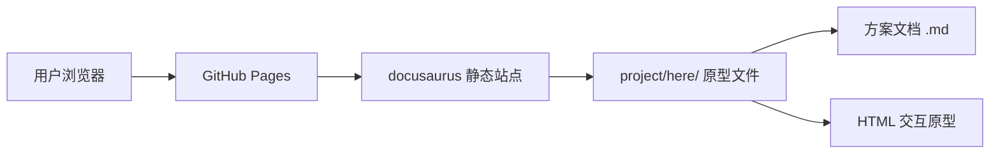
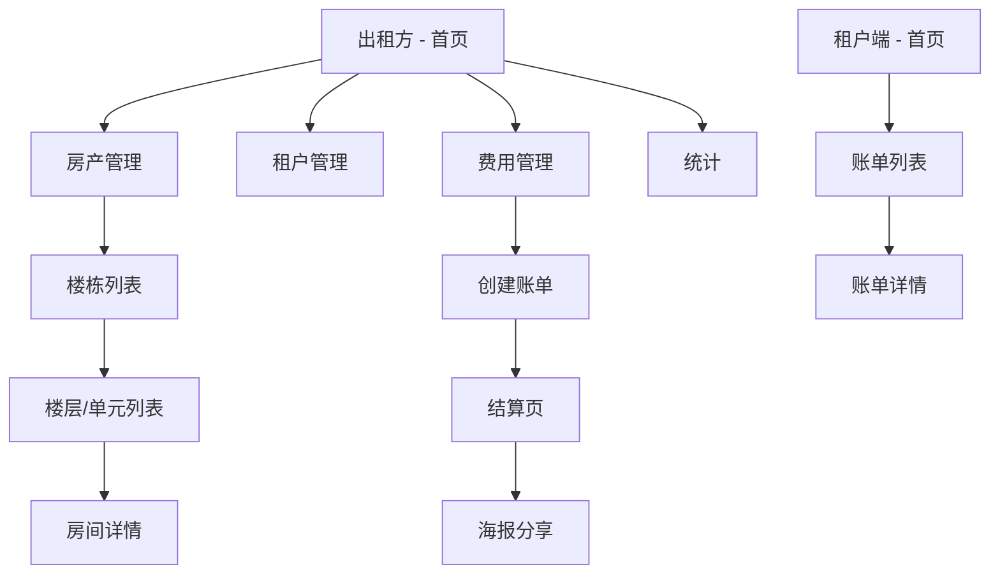

## 产品概述

物业出租管理微信小程序原型方案，面向个人房东和物业公司/二房东两种出租方角色，以及租户角色。原型包含两部分产出：一份文字描述方案文档（页面结构、功能说明、数据模型），一组可点击交互的 HTML 原型页面（模拟微信小程序界面）。

## 核心功能

### 出租方端

- **房产管理**：支持楼栋 > 楼层 > 单元 > 单套房的层级结构管理。个人房东可直接管理单套房，物业公司可管理整栋楼/多栋楼。套房类型包括单间、一房一厅、两房一厅、三房一厅、四房一厅、五房一厅、合租。
- **租户管理**：通过分享链接/二维码绑定租户到对应房间，支持查看租户信息和租约状态。
- **费用管理**：支持押金、租金、物业费、电费、水费、垃圾费、网费等费用项的录入和管理。支持按月、按季、按年三种计费周期。
- **结算与账单**：生成结算页面，支持结算海报分享给租户，展示费用明细。
- **数据统计**：收入统计、空置率统计、费用汇总，按时间维度展示图表。

### 租户端

- **账单查看**：查看当前和历史账单，包含各费用项明细和合计金额，无需在线缴费功能。

### 原型产出

- 文字描述方案：包含完整的页面结构说明、每个页面的功能说明、核心数据模型定义（ER 关系）。
- HTML 可点击交互原型：模拟微信小程序 375px 宽度的手机界面，支持页面间跳转，展示核心交互流程。

## 技术选型

- **原型页面**：纯 HTML + CSS + JavaScript（单文件或少量文件），无需构建工具
- **文字方案**：Markdown 文档
- **部署方式**：直接放置在 `project/here/` 目录下，借助 docusaurus 的 `staticDirectories: ['project']` 配置，可通过 `/here/` 路径直接访问

## 技术架构

### 系统架构

本项目为静态原型方案，不涉及后端和数据库，全部为前端静态文件。



### 模块划分

- **方案文档模块**：Markdown 文件，包含页面结构、功能说明、数据模型描述
- **出租方原型模块**：HTML 页面集合，模拟出租方端小程序界面（首页、房产管理、费用管理、结算、统计）
- **租户原型模块**：HTML 页面，模拟租户端小程序账单查看界面

### 数据流



## 实现细节

### 核心目录结构

```
project/here/
├── readme.md                   # 需求原始说明（已有）
├── design.md                   # 文字描述方案（页面结构+功能说明+数据模型）
├── index.html                  # 原型入口页（导航到出租方/租户端）
├── landlord.html               # 出租方端 - 首页/房产管理/费用管理/结算/统计
└── tenant.html                 # 租户端 - 账单列表/账单详情
```

### 关键数据结构

**方案文档中定义的核心数据模型**：

```
Building（楼栋）: id, name, address, ownerId, floorCount
Floor（楼层）: id, buildingId, floorNumber
Unit（单元）: id, floorId, unitNumber
Room（房间）: id, unitId, roomNumber, type(单间/一房一厅/...), status(空置/已租), area, monthlyRent
Landlord（出租方）: id, name, phone, type(个人/公司)
Tenant（租户）: id, name, phone, roomId
Lease（租约）: id, roomId, tenantId, startDate, endDate, deposit, billingCycle(月/季/年)
Bill（账单）: id, leaseId, period, items[], totalAmount, status(待结算/已结算)
BillItem（费用项）: id, billId, type(租金/电费/水费/...), amount, unitPrice, usage
```

### HTML 原型实现方案

- 采用单 HTML 文件内嵌多页面的方式，通过 JavaScript 切换 div 可见性模拟页面跳转
- 使用 375px 固定宽度 + 居中显示模拟手机屏幕
- CSS 模拟微信小程序风格：顶部状态栏、底部 TabBar、卡片式列表
- 使用 CSS 变量统一主题色，保证风格一致

### 技术实现计划

1. **文字方案文档**

- 编写 design.md，包含页面结构树、每页功能说明、数据模型 ER 描述
- 涵盖个人房东和物业公司两种场景的差异说明

2. **HTML 原型页面**

- 采用纯 HTML/CSS/JS 实现，不依赖任何框架
- 模拟微信小程序交互风格（TabBar 切换、列表点击进入详情、返回按钮）
- 使用 mock 数据填充界面，展示真实感
- 出租方端和租户端分为独立 HTML 文件

## 设计风格

采用微信小程序原生风格，简洁实用，以白色为主背景，搭配微信绿作为主题色。界面以卡片式布局为主，圆角阴影营造层次感。整体视觉干净清爽，符合物业管理工具的专业定位。

## 页面设计

### 入口页（index.html）

- **顶部区域**：项目标题"物业出租管理"，副标题"微信小程序原型"，白色背景渐变到浅灰
- **角色选择区**：两张大卡片纵向排列，分别为"出租方端"和"租户端"，每张卡片包含角色图标、角色名称、简短说明文字，点击跳转对应页面
- **底部链接**：指向 design.md 方案文档的链接

### 出租方端（landlord.html）

- **底部 TabBar**：四个标签页——首页、房产、账单、统计，图标加文字，当前页高亮
- **首页 Tab**：
- 顶部欢迎区：显示出租方名称和角色标签（个人房东/物业公司）
- 数据概览卡片行：总房间数、已出租、空置数、本月收入，四宫格排列
- 快捷操作区：创建账单、添加房间、邀请租户三个操作按钮
- 待处理事项列表：待结算账单条目，卡片样式
- **房产 Tab**：
- 楼栋列表：卡片式展示每栋楼名称、地址、房间数/已租数
- 点击楼栋进入楼层列表：纵向列表展示楼层编号和房间数
- 点击楼层进入房间列表：网格卡片展示房间号、类型、状态色标（绿色已租/灰色空置）
- 点击房间进入详情页：展示房间信息、当前租户、租约信息、费用记录
- **账单 Tab**：
- 月份选择器横向滚动
- 账单列表：每条显示房间号、租户名、金额、状态标签
- 点击进入结算详情页：费用明细表格、合计金额、分享海报按钮
- 海报预览弹窗：模拟生成结算海报卡片
- **统计 Tab**：
- 时间筛选栏：月/季/年切换
- 收入趋势区：简易柱状图展示月度收入
- 费用分类饼图：展示各费用项占比
- 出租率指标：环形进度条展示

### 租户端（tenant.html）

- **顶部区域**：租户姓名、房间号、楼栋地址信息卡片
- **账单列表**：按月份分组，每条展示账单期间、总金额、状态标签（已结算/待确认）
- **账单详情页**：费用明细列表（租金、电费、水费等逐项列出单价、用量、金额），底部合计金额