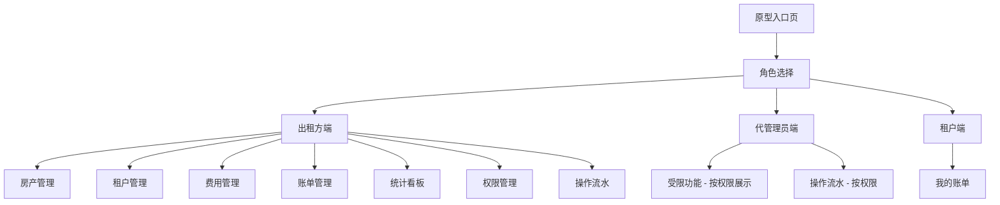
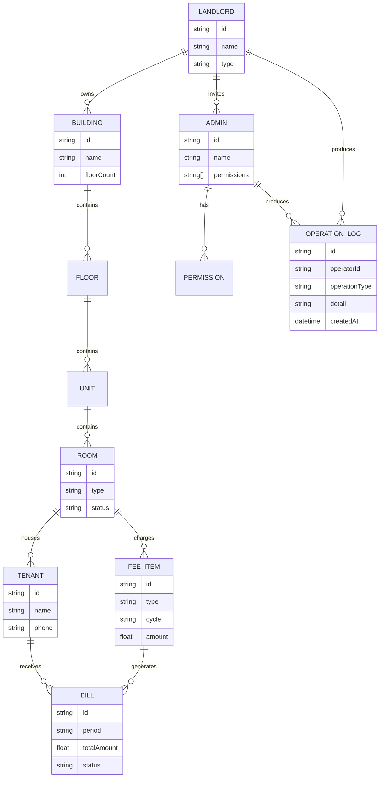

## 产品概述

物业出租管理微信小程序原型方案，面向个人房东、物业公司/二房东等出租方，提供房产管理、租户管理、费用管理、账单生成与分享等核心功能。支持三种角色：出租方（完整管理权限）、代管理员（可自定义权限）、租户（仅查看账单）。同时提供操作流水功能，记录系统内所有关键操作并支持筛选查看。

输出包含两部分：文字描述方案文档（Markdown，含页面结构、功能说明、数据模型）和 HTML 可点击交互原型页面（模拟微信小程序界面，支持页面间跳转和基本交互）。

## 核心功能

### 角色体系

- **出租方**：个人房东或物业公司/二房东，拥有全部管理权限，可管理房产、租户、费用、账单，可邀请代管理员并配置权限
- **代管理员**：由出租方邀请，权限由出租方勾选授予（房产管理、费用录入、账单生成、租户管理等），操作受限于被授予的权限范围
- **租户**：通过出租方分享链接绑定，仅可查看自己的账单明细，无管理功能

### 房产管理

- 支持 楼栋 > 楼层 > 单元 > 单套房 的层级结构
- 套房类型：单间、一房一厅、两房一厅、三房一厅、四房一厅、五房一厅、合租
- 支持单套房独立管理（个人房东场景）和整栋/多栋楼批量管理（物业公司场景）

### 租户管理

- 分享链接绑定租户到具体房间
- 租户入住/退租记录
- 合租场景下同一房间多租户管理

### 费用与账单

- 费用项：押金、租金、物业费、电费、水费、垃圾费、网费
- 计费周期：按月、按季、按年
- 结算页生成与结算海报分享
- 租户端账单查看

### 统计功能

- 收租汇总、空置率、欠费统计等数据看板

### 代管理员权限配置

- 出租方邀请代管理员（生成邀请码/链接）
- 出租方通过勾选方式授予权限：房产管理、费用录入、账单生成、租户管理、统计查看等
- 权限可随时调整或撤销

### 操作流水

- 记录所有关键操作：房产增删改、租户变更、费用操作、分享操作、权限变更等
- 每条流水包含操作人、操作类型、操作时间、操作详情
- 支持按操作人、操作类型筛选查看

## 技术方案

### 输出形式

本项目不涉及后端开发，仅输出原型方案：

1. **方案文档**：Markdown 格式，包含页面结构、功能说明、数据模型设计
2. **HTML 交互原型**：纯 HTML/CSS/JavaScript 单文件或多文件页面，模拟微信小程序 UI 风格，支持页面间点击跳转

### 技术选型

- **HTML5 + CSS3 + JavaScript**：纯前端静态页面，无需构建工具
- **模拟微信小程序 UI**：使用 375px 宽度手机视口，模拟小程序导航栏、TabBar、页面布局
- **页面间导航**：通过 JavaScript 控制页面/视图切换，模拟小程序路由
- **数据模拟**：使用 JavaScript 对象模拟数据，支持原型交互演示

### 系统架构



### 模块划分

| 模块 | 职责 | 页面 |
| --- | --- | --- |
| 角色选择 | 入口页面，选择体验角色 | 入口页 |
| 房产管理 | 楼栋/楼层/单元/套房 CRUD | 房产列表、房产详情、添加/编辑房产 |
| 租户管理 | 租户绑定、入住退租 | 租户列表、租户详情、分享绑定 |
| 费用管理 | 费用项录入、周期设置 | 费用录入、费用明细 |
| 账单管理 | 账单生成、海报分享 | 账单列表、结算页、海报预览 |
| 统计看板 | 数据统计展示 | 统计首页 |
| 权限管理 | 代管理员邀请与权限配置 | 管理员列表、权限配置 |
| 操作流水 | 操作记录查看与筛选 | 流水列表 |
| 租户端 | 账单查看 | 租户账单列表、账单详情 |


### 数据模型



### 核心目录结构

```
project/here/
├── readme.md                   # 需求文档（已有，将更新）
├── design.md                   # 方案文档：页面结构 + 功能说明 + 数据模型
├── index.html                  # 原型入口页（角色选择）
├── landlord.html               # 出租方端原型（含房产/租户/费用/账单/统计/权限/流水）
├── admin.html                  # 代管理员端原型（受限功能视图）
└── tenant.html                 # 租户端原型（账单查看）
```

### 关键代码结构

**页面路由模拟**：每个 HTML 文件内通过 div 切换模拟多页面导航，底部 TabBar 控制主页面切换，内部用 JavaScript 控制子页面堆栈。

**数据模拟**：在 JavaScript 中定义模拟数据对象，支持列表展示、详情查看、筛选等交互演示。

**原型交互要点**：

- 角色切换入口，可分别体验三种角色视角
- 出租方端底部 TabBar：首页、房产、账单、统计、我的
- 房产管理支持层级钻入：楼栋列表 > 楼层列表 > 房间列表 > 房间详情
- 费用录入和账单生成支持表单交互模拟
- 权限配置页使用勾选框展示可授权项
- 操作流水页支持下拉筛选操作人和操作类型
- 租户端仅展示账单列表和账单详情

### 技术实现要点

1. 使用 `<meta name="viewport" content="width=device-width, initial-scale=1.0">` 适配移动端
2. 页面容器固定 375x812 尺寸模拟 iPhone 视口，居中展示
3. 模拟微信小程序顶部导航栏（状态栏 + 标题栏）和底部 TabBar
4. CSS 使用 flexbox 布局，视觉风格贴近微信小程序原生 UI
5. JavaScript 管理视图状态和页面切换动画

## 设计风格

采用微信小程序原生 UI 风格，界面清爽简洁，以白色为主背景，搭配微信绿作为主色调。整体风格参考微信生态设计规范，使用圆角卡片、轻投影、清晰的层级划分，营造熟悉且专业的使用体验。

页面容器固定为 375x812px 的手机模拟框，居中显示在浏览器中，外围使用浅灰色背景衬托，模拟真实手机效果。

## 页面设计

### 页面一：入口页（角色选择）

- **顶部区域**：应用 Logo 和名称「物业出租管家」，下方附一行简短 Slogan
- **角色卡片区**：三张垂直排列的角色卡片，分别为「出租方」「代管理员」「租户」，每张卡片含角色图标、角色名称、简要说明文字，点击进入对应角色视图
- **底部说明**：一行灰色小字「这是交互原型演示」

### 页面二：出租方 - 首页/房产管理

- **顶部导航栏**：模拟微信小程序状态栏 + 标题栏，标题显示「房产管理」
- **搜索栏**：圆角搜索输入框，placeholder「搜索楼栋/房间」
- **房产概览卡片**：横向统计卡片，显示总房间数、已出租、空置、待收租等关键数据，使用不同颜色标识
- **楼栋列表**：卡片式列表，每个楼栋卡片显示楼栋名称、房间数量、出租率进度条，点击可钻入楼层/房间列表
- **底部 TabBar**：五个标签项 - 首页、房产、账单、统计、我的，带图标和文字

### 页面三：出租方 - 账单管理与费用录入

- **顶部导航栏**：标题「账单管理」，右上角「+生成账单」按钮
- **月份切换**：横向月份标签切换栏，可左右滑动选择月份
- **账单列表**：按房间分组的账单卡片，每张卡片显示房间号、租户名、费用明细（租金/水电/物业等）、合计金额、缴费状态标签（已缴/未缴/部分缴）
- **费用录入弹窗**：点击录入按钮弹出底部弹窗，含费用类型选择、金额输入、计费周期选择、备注输入
- **底部 TabBar**：同上

### 页面四：出租方 - 权限管理与操作流水

- **顶部导航栏**：标题「管理中心」，带 Tab 切换「代管理员」和「操作流水」
- **代管理员 Tab**：管理员列表，每条显示头像、姓名、已授权权限标签，右侧有编辑按钮；底部「+邀请管理员」按钮；点击编辑弹出权限配置页，使用勾选框列出所有权限项
- **操作流水 Tab**：顶部两个下拉筛选器（操作人、操作类型），下方为时间线样式的流水列表，每条记录显示操作人头像、操作描述、操作时间，不同操作类型用不同颜色标签区分

### 页面五：租户端 - 账单查看

- **顶部导航栏**：标题「我的账单」
- **房间信息卡片**：显示当前租住的房间信息（楼栋、房间号、入住日期）
- **账单列表**：按月份分组，每张账单卡片显示账单周期、费用明细列表、合计金额、缴费状态
- **账单详情**：点击账单卡片展开详情，显示每项费用的单价、用量、小计等明细信息
- **底部**：简化 TabBar，仅「账单」「我的」两个标签

### 页面六：出租方 - 统计看板

- **顶部导航栏**：标题「数据统计」
- **核心指标行**：横向排列 4 个指标卡片（总收入、已收、待收、空置率），使用大字体数字配小字标签
- **收入趋势图**：模拟折线图区域，展示近 6 个月收入趋势
- **房间状态饼图**：模拟饼图区域，展示已租/空置/维修比例
- **费用构成列表**：各费用项收入占比横向条形图
- **底部 TabBar**：同上