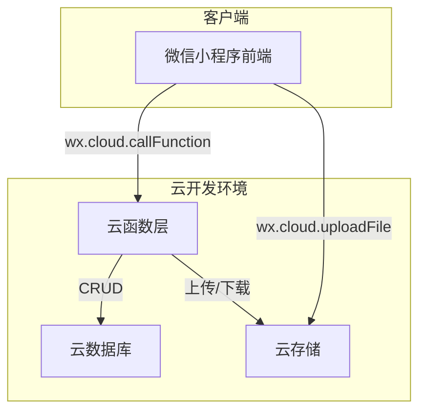
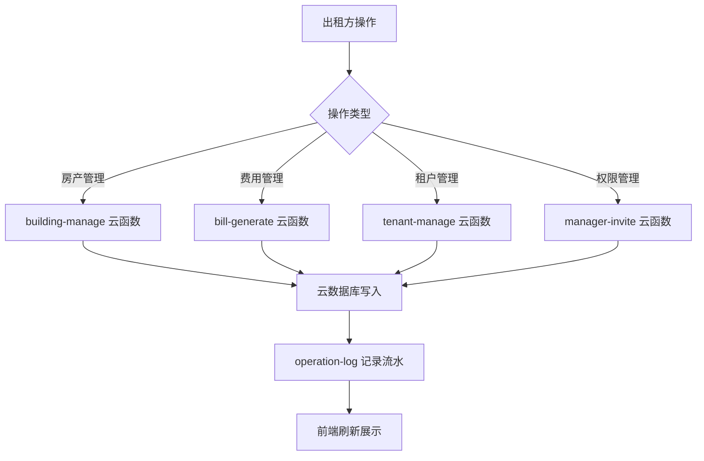

## 产品概述

物业出租管理微信小程序原型方案，面向个人房东、物业公司/二房东等出租方，提供房产管理、租户管理、费用结算、统计分析等一站式出租管理服务。支持出租方、代管理员（可自定义权限）、租户三种角色，并记录完整操作流水。

本次输出包含两部分：

1. **design.md 文字方案文档**：含页面结构、功能说明、数据模型、角色权限矩阵、云开发技术架构（云数据库集合设计 + 云函数列表 + 接口定义 + 调用关系）
2. **HTML 可点击交互原型页面**：模拟小程序各核心页面的交互流程，可在浏览器中点击体验

## 核心功能

### 角色体系

- **出租方**：个人房东或物业公司/二房东，拥有全部管理权限，可邀请代管理员并配置权限
- **代管理员**：由出租方邀请，权限通过勾选方式自定义授予（如仅允许管理某栋楼、仅允许录入费用等）
- **租户**：通过分享链接绑定，可查看自己的账单明细，不涉及在线缴费

### 房产管理

- 支持 楼栋 > 楼层 > 单元 > 单套房 四级结构
- 套房类型：单间、一房一厅、两房一厅、三房一厅、四房一厅、五房一厅、合租
- 支持新增、编辑、删除房产信息，查看房源状态（空置/已租/到期）

### 费用结算

- 费用项：押金、租金、物业费、电费、水费、垃圾费、网费
- 计费周期：按月、按季、按年
- 结算页展示当期账单明细，支持生成结算海报分享给租户

### 租户管理

- 出租方通过小程序分享链接绑定租户到具体房间
- 租户查看自己的账单列表和明细

### 统计功能

- 收入统计（按月/季/年）、空置率统计、费用分类统计
- 可视化图表展示

### 操作流水

- 记录所有用户的操作行为（新增房源、录入费用、绑定租户等）
- 支持按操作人、操作类型筛选查看

### 代管理员权限配置

- 出租方可邀请代管理员，通过勾选方式授予具体权限
- 权限粒度：房产管理、费用管理、租户管理、统计查看、流水查看等

## 技术栈

- 方案文档：Markdown（design.md）
- 交互原型：纯 HTML + CSS + JavaScript（单文件或少量文件，放置在 project/here/ 目录下）
- 目标平台技术架构（文档描述）：微信小程序云开发（云函数 + 云数据库）

## 技术架构

### 系统架构（文档描述用）



### 云数据库集合设计（文档中详述）

| 集合名 | 用途 |
| --- | --- |
| users | 用户信息及角色 |
| buildings | 楼栋信息 |
| floors | 楼层信息 |
| units | 单元信息 |
| rooms | 套房信息 |
| tenants | 租约/租户绑定 |
| fee_items | 费用项配置 |
| bills | 账单记录 |
| payments | 缴费记录 |
| managers | 代管理员及权限 |
| operation_logs | 操作流水 |
| statistics_cache | 统计缓存 |


### 云函数列表（文档中详述）

| 云函数 | 职责 |
| --- | --- |
| user-login | 登录/注册，角色判定 |
| building-manage | 楼栋/楼层/单元/房间 CRUD |
| tenant-bindManage | 租户绑定/解绑 |
| bill-generate | 账单生成与查询 |
| bill-settle | 结算与海报数据 |
| fee-config | 费用项配置管理 |
| manager-invite | 代管理员邀请与权限配置 |
| stats-query | 统计数据查询与汇总 |
| operation-log | 操作流水记录与查询 |


### 模块划分

- **用户与权限模块**：登录、角色识别、代管理员权限 CRUD
- **房产管理模块**：四级房产结构的增删改查、房态管理
- **费用与账单模块**：费用项配置、账单生成、结算页、海报生成
- **租户模块**：分享绑定、账单查看
- **统计模块**：收入/空置率/费用分类统计
- **操作流水模块**：日志记录与筛选查询

### 数据流



## 实现细节

### 目录结构（本次输出文件）

```
project/here/
├── readme.md              # 已有，项目简述
├── design.md              # 新增：完整方案文档
├── index.html             # 新增：原型入口页（导航）
├── prototype.html         # 新增：HTML 可点击交互原型（全部页面）
```

说明：原型采用单 HTML 文件实现多页面模拟（通过 JS 切换视图），便于浏览器直接打开体验，无需构建工具。

### 关键实现方案

#### HTML 原型实现思路

- 使用单 HTML 文件，内嵌 CSS 和 JS
- 模拟小程序页面切换：通过 div 容器显示/隐藏实现多"页面"导航
- 底部 TabBar 模拟小程序导航栏
- 移动端视口（375px 宽度）居中展示，模拟手机屏幕
- 页面包含：登录/角色选择、首页（房产概览）、房产管理、费用管理、租户管理、账单查看（租户视角）、统计页、操作流水、代管理员权限配置、结算页/海报预览

#### design.md 文档结构

1. 产品概述
2. 角色与权限矩阵（表格形式）
3. 页面结构与功能说明（逐页描述）
4. 数据模型设计（每个集合的字段定义）
5. 云开发技术架构

- 云数据库集合设计（含索引建议）
- 云函数列表（含入参/出参/调用关系）
- 接口定义（RESTful 风格描述）
- 调用关系图（Mermaid）

6. 业务流程图

### 技术考量

- 原型文件保持轻量，单文件可直接浏览器打开
- design.md 使用标准 Markdown，可在 GitHub Pages 上直接渲染
- 原型交互重点覆盖核心业务流程，非功能性细节可省略

## 设计风格

采用微信小程序原生风格（WeUI 设计语言），以白色为主背景、绿色为主色调，模拟真实小程序视觉体验。整体设计简洁、清晰、功能导向，符合物业管理场景的专业感。

## 页面规划

### 页面1：登录与角色选择页

- **顶部区域**：应用 Logo 和名称「物业出租管理」，简洁居中展示
- **角色选择区**：三个角色卡片（出租方、代管理员、租户），每个卡片含图标和角色描述，点击进入对应视角
- **底部区域**：版本信息和说明文字

### 页面2：出租方首页（房产概览）

- **顶部导航栏**：显示「我的房产」标题，右侧有消息和设置图标
- **数据概览卡片**：横向排列展示房源总数、已租数、空置数、本月收入，使用彩色圆角卡片
- **快捷操作区**：四宫格图标按钮（添加房产、录入费用、生成账单、查看统计）
- **房产列表区**：卡片式列表展示各楼栋/房源信息，含地址、房间数、出租率进度条
- **底部 TabBar**：首页、房产、账单、统计、我的，五个标签页

### 页面3：房产管理页

- **顶部导航栏**：「房产管理」标题，右侧添加按钮
- **楼栋列表**：可展开折叠的树形结构，楼栋 > 楼层 > 单元 > 房间
- **房间状态标签**：空置（灰色）、已租（绿色）、到期（橙色）
- **房间详情弹窗**：点击房间弹出详情，含房型、面积、当前租户、费用配置
- **新增/编辑表单**：底部滑出式表单，含房型选择（单间到五房一厅、合租）、楼层输入等

### 页面4：费用与账单管理页

- **顶部 Tab 切换**：费用配置 / 账单列表 两个子标签
- **费用配置区**：列表展示各费用项（押金、租金、物业费等），每项可设置金额和计费周期
- **账单列表区**：按月份分组展示账单，每条含房间号、租户名、金额、状态（待结算/已结算）
- **结算详情页**：点击账单进入，展示明细，底部有「生成海报」按钮
- **海报预览弹窗**：模拟生成的结算海报样式，含二维码区域

### 页面5：统计与操作流水页

- **顶部 Tab 切换**：统计 / 操作流水
- **统计区**：收入趋势折线图（模拟）、空置率饼图（模拟）、费用分类柱状图（模拟），使用 CSS 绘制简易图表
- **操作流水区**：顶部筛选栏（操作人下拉、操作类型下拉），下方时间线样式展示操作记录，每条含时间、操作人、操作描述

### 页面6：代管理员权限配置页

- **顶部导航栏**：「代管理员管理」标题
- **已邀请列表**：卡片展示已有代管理员，含头像、昵称、权限标签
- **邀请入口**：底部固定按钮「邀请代管理员」
- **权限配置弹窗**：勾选式权限列表（房产管理、费用管理、租户管理、统计查看、流水查看），每项可独立开关