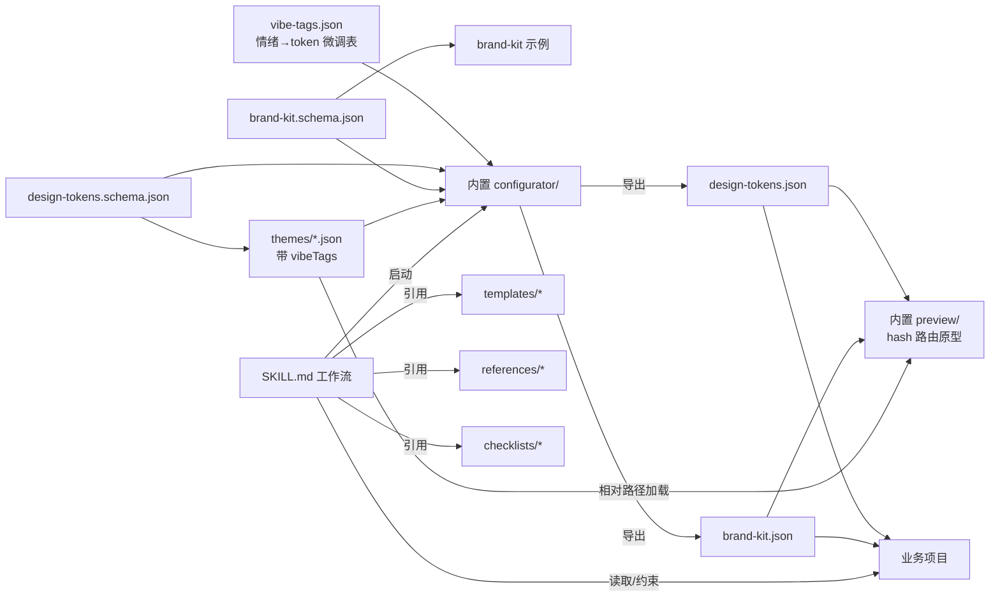

## Product Overview

创建名为 `ui-design-guide` 的自包含 Skill，作为"UI 设计开发约束器"，在已有项目中开发 UI 时约束 AI 生成符合所选设计系统的代码。Skill 内置可视化配置网页（`configurator/`）与可交互原型预览页（`preview/`），整体零构建，可独立分发。整套产物覆盖多端（PC/H5/小程序/UniApp）、多框架（HTML/Vue/React 占位）、多 UI 库（Tailwind/Shadcn/AntD/Arco/TDesign），并参考 Google Stitch、Pixso AI、Figma Make、Lovable、Canva Visual Suite 的最佳实践，引入 Vibe/Mood 入口、Brand Kit 层、多屏页面级联、Magic Resize 适配规则、hash 路由原型五项扩展能力。

## Core Features

- **多端规范**：PC Web / H5 移动端 / 微信小程序 / UniApp，统一断点 768/1024/1440、4/8px 基线网格
- **多框架接入**：首版完整 html-tailwind / wechat-miniprogram / uniapp；vue/react 占位 v2
- **多 UI 库速查**：tailwindcss 首版完整；shadcn / ant-design / arco-design / tdesign 占位 v2
- **双契约设计系统**：`design-tokens.schema.json`（含 breakpoint.scaling）+ `brand-kit.schema.json`，6 套主题预设带 vibeTags
- **Vibe/Mood 风格入口**：configurator 顶部自然语言/标签输入，自动映射到 token 调整建议
- **Brand Kit 层**：Logo SVG / 品牌名 / 品牌语调 / 锁定品牌色 / 文案口吻样例，AI 在生成文案与按钮文字时遵循
- **暗黑模式 / i18n / 可访问性**：双 token 集、文案外置与 RTL、对比度 ≥ AA、键盘可达、ARIA
- **Magic Resize 适配规则**：fluid typography（clamp）、spacing 阶梯随断点缩放、容器宽度策略
- **可视化配置网页（内置）**：顶部 Vibe 输入 + Brand Kit Tab + Tokens Tab + 实时预览 + 双 JSON 导出
- **可交互原型预览页**：hash 路由 + 返回栈、组件状态切换器（hover/active/disabled/loading/error）、多屏页面（登录/主页列表/详情/表单/空态/错误）+ 桌面/移动样机切换 + 明暗与多预设切换
- **补充规范**：图标系统、动效时长/缓动、字号阶梯、三态（loading/empty/error）、组件与 CSS 变量命名约定

## Tech Stack Selection

- **Skill 文件**：Markdown + YAML frontmatter（沿用现有 `.codebuddy/skills/docs-toc-generator/SKILL.md`、`draft-organizer/SKILL.md` 模式：仅 `name` + `description` 两字段）
- **配置网页 & 预览页**：原生 HTML + CSS + 原生 JS，零构建、双击可开；视觉风格对齐 `project/charging-sim/`（index.html + style.css + app.js 三件套）
- **Token 契约**：JSON Schema Draft-07，分双契约 `design-tokens.schema.json` + `brand-kit.schema.json`
- **样式落地**：CSS Custom Properties（`--color-primary-500`、`--space-4`、`--radius-md`）；Tailwind 通过 `theme.extend` 引用同名变量；小程序 `app.wxss` page 级注入；UniApp 通过 `uni.scss` + 条件编译
- **路由原型**：纯前端 hash 路由 + 返回栈数组，无任何依赖

## Implementation Approach

**整体策略**：Skill 不生成业务脚手架，只输出"规则 + 资源 + 模板 + 内置工具网页"。AI 在改 UI 时按 SKILL.md 工作流（Vibe Mapping → 端识别 → 框架识别 → UI 库识别 → 加载 tokens/brand-kit → 校验 → 受约束输出）执行。Configurator 与 preview 通过相对路径 `../assets/...` 直接消费同 Skill 资源，无副本。

**关键决策**：

1. **双 schema 解耦**：tokens 管视觉、brand-kit 管品牌，正交分离便于独立演进
2. **Vibe 标签表化**：`assets/vibe-tags.json` 作为静态查表（calm/professional/playful/tech/medical/...），将"自然语言情绪 → token 数值微调"过程显式化、可追溯
3. **CSS Variables 唯一运行时载体**：跨小程序 / Tailwind / 原生 CSS 兼容性最佳
4. **Hash 路由原型**：`window.addEventListener('hashchange')` + 内存栈，零依赖实现"可交互 prototype"
5. **首版裁剪**：Vue/React/Shadcn/AntD/Arco/TDesign 占位 README + admin-dashboard、CHANGELOG 留 v2
6. **避免技术债**：严格沿用仓库现有 Skill 格式与 `project/charging-sim/` 静态项目惯例

**性能与可靠性**：

- Token 变更通过 CSS Variable 实时反映，避免重渲染；预设 JSON < 4KB，预览页冷启动 < 50ms
- Schema 校验在导出前一次性聚合错误提示
- Hash 路由仅维护 ≤32 长度的栈，溢出弹出最早项

## Implementation Notes

- **沿用现有 Skill 格式**：frontmatter 仅 `name` + `description`，正文按 Purpose / When to Use / Workflow / Constraints / Important Notes 分章节
- **Skill 自包含原则**：所有产物在 `.codebuddy/skills/ui-design-guide/` 内部，不向 `project/`、`docs/`、`src/` 扩散
- **不修改既有目录**：不改 `docusaurus.config.js`、`sidebars.js`、`src/`、`project/`、`docs/`
- **占位文件最小化**：未实现的 templates/references 仅放 README.md 说明 v2 计划，避免误导生成
- **多端 Token 注入约定**：
- Web/H5：`:root { --xxx }` + Tailwind `theme.extend` 引用 `var(--xxx)`
- 微信小程序：`app.wxss` 顶部 `page` 选择器声明 + `prefers-color-scheme` 暗色适配
- UniApp：`uni.scss` 变量映射 + `#ifdef MP-WEIXIN/H5/APP` 条件编译
- **可访问性强约束**：SKILL.md 中明确"颜色对比度 < 4.5:1 必须报警"，AI 生成时自检
- **file:// 协议兜底**：SKILL.md 与 `configurator/README.md`、`preview/README.md` 均说明：双击若 fetch 被拦截，可改用 `<input type="file">` 加载或起 `python3 -m http.server 8000`
- **Brand Kit 文案口吻落地**：SKILL.md 规定"AI 在生成按钮文字、表单 placeholder、错误提示时必须读取 brand-kit.tone 字段"
- **避免泄漏**：预设/品牌示例 JSON 不含任何业务专属数据，纯设计 token

## Architecture Design



- **Skill 工作流**：Vibe Mapping → 端识别 → 框架识别 → UI 库识别 → 加载 tokens + brand-kit → 校验对比度/断点/命名/语调 → 输出受约束 UI 代码
- **Configurator 架构**：单页 + 单一 state 对象 → 三 Tab（Vibe / Brand Kit / Tokens）→ 实时 CSS Variables 注入 → 预览区 → 双 JSON 导出（design-tokens + brand-kit）
- **Preview 架构**：hash 路由 + 返回栈 → 加载 tokens（fetch 预设 / file input / ?theme=）→ 注入 CSS Variables → 渲染组件矩阵 + 6 类页面骨架 + 状态切换器 + 桌面/移动样机切换

## Directory Structure

```
hailaz.github.io/
├── .codebuddy/
│   └── skills/
│       └── ui-design-guide/                              # [NEW] Skill 根目录（自包含）
│           ├── SKILL.md                                  # [NEW] 主入口。frontmatter (name, description) + Purpose / When to Use / Workflow（Step 0 Vibe Mapping → Step 1 端识别 → 2 框架识别 → 3 UI 库识别 → 4 加载 tokens+brand-kit → 5 校验 → 6 受约束输出）/ How to Launch Configurator & Preview / Constraints（断点/对比度/4-8px 网格/命名/三态/i18n/暗黑/动效/图标/品牌语调）/ Important Notes
│           ├── README.md                                 # [NEW] Skill 使用说明、首版范围、v2 迭代项（admin-dashboard、CHANGELOG、Vue/React/AntD 等）
│           ├── assets/
│           │   ├── design-tokens.schema.json             # [NEW] Draft-07，含 meta(name/version/mode) / color (primary/neutral/semantic 50-900 + modeOverrides) / typography / spacing(4px 基线) / radius / shadow / breakpoint(含 scaling.fontSize/spacing) / motion / zIndex
│           │   ├── brand-kit.schema.json                 # [NEW] Draft-07，含 brandName / logoSvg / tone(formal|friendly|geek|...) / lockedColors[] / voiceSamples[] / iconStyle
│           │   ├── tokens-naming-convention.md           # [NEW] CSS 变量与 SCSS/JS token 命名规范
│           │   ├── vibe-tags.json                        # [NEW] Vibe 标签 → token 调整映射表（calm/professional/playful/tech/medical/luxury/...，每条给出色相区间、饱和度、圆角、动效时长建议）
│           │   └── themes/                                # [NEW] 唯一权威预设，每文件含 vibeTags 字段
│           │       ├── default-light.json
│           │       ├── default-dark.json
│           │       ├── apple-style.json                  # vibeTags: [calm, refined, premium]
│           │       ├── material-style.json               # vibeTags: [bold, structured]
│           │       ├── minimal.json                      # vibeTags: [calm, focused]
│           │       └── cyberpunk.json                    # vibeTags: [tech, energetic, neon]
│           ├── configurator/                             # [NEW] 内置可视化配置网页（零构建）
│           │   ├── index.html                            # [NEW] 顶部 Vibe 输入 + 暗黑切换 + 预设下拉；左侧三 Tab（Vibe / Brand Kit / Tokens）；中间实时预览（与 preview 同组件）；右侧双 JSON（tokens + brand-kit）+ 导出按钮
│           │   ├── style.css                             # [NEW] 三栏布局 + 预览区 CSS Variables 驱动
│           │   ├── app.js                                # [NEW] state 管理 + Vibe 标签查表（fetch ../assets/vibe-tags.json）+ 预设加载（fetch ../assets/themes/*.json）+ schema 校验（fetch ../assets/*.schema.json）+ 双向绑定 + 双 JSON 导出
│           │   └── README.md                             # [NEW] 双击启动说明、字段含义、file:// 兜底（file input / python3 -m http.server）、与项目协作流程
│           ├── preview/                                  # [NEW] 可交互原型预览页
│           │   ├── preview-template.html                 # [NEW] 顶部主题/暗黑/桌面-移动样机切换；左侧 hash 路由导航（组件矩阵 / 登录 / 主页列表 / 详情 / 表单 / 空态 / 错误）；中间渲染区 + 状态切换器（hover/active/disabled/loading/error）；底部"返回"按钮（消费返回栈）。通过 fetch ../assets/themes/*.json 或 file input 或 ?theme= 加载 tokens 与 brand-kit，注入 :root CSS 变量
│           │   └── README.md                             # [NEW] 路由约定、栈大小限制、file:// 兜底
│           ├── templates/
│           │   ├── html-tailwind/
│           │   │   ├── README.md                         # [NEW] HTML+Tailwind 接入：tokens → tailwind.config 映射、暗黑 class 策略、断点对齐
│           │   │   ├── tokens-to-css.html                # [NEW] tokens JSON 注入 :root 最小工作示例
│           │   │   └── tailwind.config.snippet.js        # [NEW] theme.extend 引用 CSS Variables 注释 snippet
│           │   ├── wechat-miniprogram/
│           │   │   ├── README.md                         # [NEW] app.wxss 注入、rpx 与 spacing 阶梯换算、prefers-color-scheme 适配
│           │   │   └── theme.wxss.example                # [NEW] page 级 CSS 变量注入示例
│           │   ├── uniapp/
│           │   │   ├── README.md                         # [NEW] uni.scss 变量映射、#ifdef MP-WEIXIN/H5/APP 条件编译
│           │   │   └── uni.scss.example                  # [NEW] 变量映射示例
│           │   ├── vue/
│           │   │   └── README.md                         # [NEW] v2 占位（vite plugin 注入、UnoCSS/Tailwind preset、组件库 theme override）
│           │   └── react/
│           │       └── README.md                         # [NEW] v2 占位（CSS-in-JS / Tailwind / shadcn theme.css）
│           ├── references/
│           │   ├── tailwindcss.md                        # [NEW] 首版完整：常用类、自定义变量、暗黑策略、断点对齐写法
│           │   ├── shadcn-ui.md                          # [NEW] v2 占位 + 速查骨架
│           │   ├── ant-design.md                         # [NEW] v2 占位 + 速查骨架
│           │   ├── arco-design.md                        # [NEW] v2 占位 + 速查骨架
│           │   └── tdesign.md                            # [NEW] v2 占位 + 速查骨架
│           └── checklists/
│               ├── a11y-checklist.md                     # [NEW] 对比度 ≥4.5:1、焦点可见、键盘顺序、ARIA、表单 label
│               ├── responsive-checklist.md               # [NEW] 断点 768/1024/1440、触控热区 ≥44px、横屏适配
│               ├── i18n-checklist.md                     # [NEW] 文案外置、长文本截断、RTL 提示、数字/日期本地化
│               ├── states-checklist.md                   # [NEW] loading / empty / error / disabled / readonly 五态规范
│               ├── adaptive-rules.md                     # [NEW] Magic Resize 规约：fluid typography clamp、spacing 缩放系数、容器宽度策略
│               └── brand-tone-checklist.md               # [NEW] 品牌语调落地：按钮文案/placeholder/错误提示在不同 tone 下的写法对照
└── (project/、docs/、src/ 等业务目录均不修改)
```

## Key Code Structures

```
// design-tokens.schema.json (Draft-07，节选)
{
  "$schema": "http://json-schema.org/draft-07/schema#",
  "type": "object",
  "required": ["meta","color","typography","spacing","radius","shadow","breakpoint","motion"],
  "properties": {
    "meta":       { "type":"object", "properties": { "name":{"type":"string"}, "version":{"type":"string"}, "mode":{"enum":["light","dark"]}, "vibeTags":{"type":"array","items":{"type":"string"}} } },
    "color":      { "type":"object" /* primary/neutral/semantic 50-900 + modeOverrides */ },
    "typography": { "type":"object" /* fontFamily / fontSize 阶梯 / lineHeight / fontWeight */ },
    "spacing":    { "type":"object" /* 4px 基线 0/1/2/3/4/6/8/12/16/24 */ },
    "radius":     { "type":"object" /* none/sm/md/lg/full */ },
    "shadow":     { "type":"object" /* sm/md/lg/xl */ },
    "breakpoint": { "type":"object", "properties": { "mobile":{"type":"number"}, "tablet":{"type":"number"}, "desktop":{"type":"number"}, "wide":{"type":"number"}, "scaling":{"type":"object","properties":{"fontSize":{"type":"object"},"spacing":{"type":"object"}}} } },
    "motion":     { "type":"object" /* duration.fast/base/slow + easing.standard/emphasized */ }
  }
}
```

```
// brand-kit.schema.json (Draft-07，节选)
{
  "$schema": "http://json-schema.org/draft-07/schema#",
  "type": "object",
  "required": ["brandName","tone"],
  "properties": {
    "brandName":     { "type":"string" },
    "logoSvg":       { "type":"string" /* inline SVG */ },
    "tone":          { "enum":["formal","friendly","geek","playful","luxury","medical"] },
    "lockedColors":  { "type":"array","items":{"type":"string","pattern":"^#[0-9a-fA-F]{6}$"} },
    "voiceSamples":  { "type":"object","properties":{"buttonCta":{"type":"array"},"errorMessage":{"type":"array"},"placeholder":{"type":"array"}} },
    "iconStyle":     { "enum":["outline","filled","duotone"] }
  }
}
```

```
# .codebuddy/skills/ui-design-guide/SKILL.md frontmatter
---
name: ui-design-guide
description: "约束并指导多端（PC/H5/小程序/UniApp）多框架（HTML/Vue/React）多 UI 库（Tailwind/Shadcn/AntD/Arco/TDesign）项目的 UI 设计与代码产出，提供 design-tokens 与 brand-kit 双契约、Vibe 风格映射、6 套主题预设、内置可视化配置网页与可交互原型预览页。This skill should be used when the user is developing or refactoring UI code, mentions design system / theme / tokens / brand kit / vibe / dark mode / accessibility / responsive, or wants to apply a unified visual style across pages."
---
```

## Agent Extensions

### Skill

- **skill-creator**
- Purpose: 指导本次新建 `ui-design-guide` Skill 的目录结构、SKILL.md frontmatter 规范与最佳实践，确保与仓库现有 Skill（docs-toc-generator、draft-organizer）格式严格一致
- Expected outcome: 产出符合 CodeBuddy Skill 标准的 SKILL.md（仅 name + description 两字段 frontmatter + 完整工作流章节），及 README.md 与子目录布局