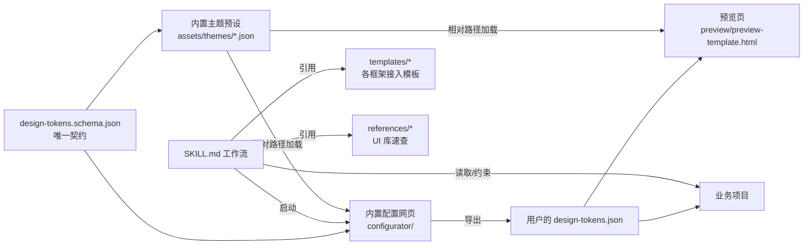

## User Requirements

创建一个名为 `ui-design-guide` 的 Skill，作为"UI 设计开发约束器"，在已有项目中开发 UI 时约束 AI 生成符合所选设计系统的代码。Skill 自带一个内置的可视化配置网页（位于 Skill 目录下 `configurator/`），支持选择主题/字体/圆角/间距并导出 design-tokens JSON；以及一个零构建的静态 HTML 预览页（含运行时主题切换器）。整个 Skill 自包含、可独立分发，不污染业务项目目录。

## Product Overview

整套产物由三部分组成：

1. **Skill 本体**：位于 `.codebuddy/skills/ui-design-guide/`，包含 SKILL.md 工作流 + 主题预设 + 各框架接入模板 + UI 库速查表 + **内置可视化配置网页 (configurator/)** + 预览页模板。
2. **可视化配置网页（内置）**：位于 Skill 目录下 `configurator/`，纯静态 HTML/CSS/JS，可视化调节设计 token 并实时预览组件效果，最终导出 `design-tokens.json`。直接通过相对路径引用同 Skill 内的 `../assets/themes/` 与 `../assets/design-tokens.schema.json`，**不维护任何副本**。
3. **预览页模板**：单文件 HTML，加载 tokens JSON 后即可展示按钮、表单、卡片等基础组件，支持亮/暗主题切换与多预设切换。同样通过相对路径引用 `../assets/themes/`。

## Core Features

- **多端规范**：覆盖 PC Web / H5 移动端 / 微信小程序 / UniApp 的产出约束（统一断点 768/1024/1440、4/8px 基线网格）。
- **多框架接入模板**：首版完整提供 html-tailwind、wechat-miniprogram、uniapp 三套模板；vue/react 提供占位与迭代说明。
- **多 UI 库速查**：tailwindcss 首版完整；shadcn / ant-design / arco-design / tdesign 提供占位速查表。
- **设计系统配置**：定义 `design-tokens.schema.json` 作为唯一契约；内置 6 套主题预设（default-light/dark、apple、material、minimal、cyberpunk）。
- **暗黑模式 / i18n / 可访问性**：双 token 集、文案外置与 RTL 提示、对比度 ≥ AA、键盘可达、ARIA 规范。
- **可视化配置网页（Skill 内置）**：左侧表单（颜色/字体/圆角/间距/阴影）+ 右侧实时预览 + 一键导入预设 + 导出 JSON。位于 `.codebuddy/skills/ui-design-guide/configurator/index.html`，双击或本地静态服务即可启动。
- **静态预览页**：单文件加载 tokens 即可双击打开预览，内置主题/明暗切换器。
- **补充规范**：图标系统、动效时长/缓动、字号阶梯、表单与数据三态（loading/empty/error）、组件命名与 CSS 变量命名约定。

## Tech Stack Selection

- **Skill 文件**：Markdown + YAML frontmatter（与现有 `docs-toc-generator/SKILL.md`、`draft-organizer/SKILL.md` 完全一致的格式）。
- **配置网页**：原生 HTML + CSS + 原生 JS，零构建、双击可开。位置在 Skill 内部 `configurator/`，通过相对路径 `../assets/themes/`、`../assets/design-tokens.schema.json` 引用同 Skill 资源（无副本）。
- **预览页**：单文件 HTML + 内联 JS，通过 `<script>` 引用同目录下的 tokens JSON 或通过 file input 加载。
- **Token 契约**：JSON Schema Draft-07，作为 Skill 与网页/项目之间的唯一接口。
- **样式约定**：CSS Custom Properties（`--color-primary-500` 等）作为 token 落地形态；Tailwind 通过 `theme.extend` 引用同名变量。

## Implementation Approach

**整体策略**：Skill 不生成业务脚手架，只输出"规则 + 资源 + 模板 + 内置工具网页"。AI 在帮用户改 UI 时读取 SKILL.md 与对应 templates/references 进行受约束的代码生成。配置网页内置在 Skill 内部，作为 Skill 的一部分随 Skill 分发，输出物（design-tokens.json）由用户手动放回项目；预览页用同一份 tokens JSON 即可可视化校验效果。

**关键决策**：

1. **以 design-tokens.schema.json 为唯一契约**：所有主题预设、配置网页输出、预览页消费、各框架模板生成都遵循同一 schema，避免格式漂移。
2. **CSS Variables 作为运行时载体**：在小程序、Tailwind、原生 CSS 间获得最大兼容；微信小程序通过 page-level 注入 `--var`。
3. **首版裁剪策略**：Vue/React/Shadcn/AntD/Arco/TDesign 仅放占位 README，标注"v2 迭代"；首版完整覆盖 HTML+Tailwind / 微信小程序 / UniApp + 6 套主题预设。
4. **零构建静态网页**：配置网页内置在 Skill 内部 `configurator/`，纯静态文件双击即用，不引入 Node 工具链；通过相对路径直接消费 `../assets/themes/`，避免预设/schema 出现副本不一致。
5. **避免技术债**：现有仓库 `.codebuddy/skills/` 已有 SKILL.md 模式，严格沿用 frontmatter（name + description）+ 工作流章节结构。

**性能与可靠性**：

- 配置网页所有交互都在前端完成，无网络依赖；token 变更通过 CSS Variable 实时反映到预览区，避免重渲染。
- 预设 JSON 文件均 < 4KB，预览页冷启动 < 50ms。
- Schema 验证在导出前一次性完成，错误聚合提示。

## Implementation Notes

- **沿用现有 Skill 格式**：frontmatter 仅 `name` + `description` 两字段，正文按 Purpose / When to Use / Workflow / Important Notes 分章节，与 `docs-toc-generator/SKILL.md` 对齐。
- **Skill 自包含原则**：所有产物（含配置网页）都放在 `.codebuddy/skills/ui-design-guide/` 目录内，不向 `project/`、`docs/`、`src/` 等业务目录扩散，确保 Skill 可独立拷贝复用。
- **配置网页风格对齐**：参照 `project/charging-sim/` 的 index.html + style.css + app.js 三件套结构与视觉风格。
- **不修改文档站配置**：不改 `docusaurus.config.js`、`sidebars.js`、`src/`、`project/` 等任何已有目录，避免影响博客构建与既有项目。
- **占位文件最小化**：未实现的 templates/references 仅放 README.md 说明状态，避免误导生成。
- **可访问性强约束**：SKILL.md 中明确"颜色对比度 < 4.5:1 必须报警"，由 AI 在生成时自检。
- **多端 Token 注入约定**：
- Web/H5：`:root { --xxx }` 注入，Tailwind `theme.extend` 引用 `var(--xxx)`。
- 小程序：在 `app.wxss` 顶部声明，以 `page` 选择器为根。
- UniApp：通过 `uni.scss` + 条件编译适配。
- **file:// 协议提示**：SKILL.md 与 `configurator/README.md` 均说明：直接双击 index.html 时部分浏览器（如 Chrome）会拦截 `fetch` 本地 JSON，遇到该问题可改用 `<input type="file">` 加载预设，或在 Skill 目录起一个临时静态服务（如 `python3 -m http.server 8000`）。
- **避免泄漏**：预设 JSON 不含任何业务/项目专属数据，纯设计 token。

## Architecture Design



- **Skill 工作流**：识别项目框架 → 读对应 template README → 加载 tokens（项目内或预设；可指引用户用内置 configurator 生成）→ 校验对比度/断点/命名 → 输出受约束的 UI 代码。
- **配置网页架构**：单页 + 表单状态对象 → CSS Variables 注入 → 预览区组件 → JSON 导出/导入 + 通过 `fetch('../assets/themes/*.json')` 加载预设。
- **预览页架构**：URL hash / file input 加载 tokens（或 `fetch('../assets/themes/*.json')` 加载预设）→ 注入 CSS Variables → 渲染基础组件矩阵 + 顶部主题切换器。

## Directory Structure

```
hailaz.github.io/
├── .codebuddy/
│   └── skills/
│       └── ui-design-guide/                              # [NEW] Skill 根目录（自包含，所有产物均在此目录内）
│           ├── SKILL.md                                  # [NEW] Skill 主入口。YAML frontmatter (name=ui-design-guide, description) + 工作流章节：Purpose / When to Use（用户提到 UI 设计/主题/设计系统时触发）/ Workflow（识别端→识别框架→识别 UI 库→加载 tokens→校验→产出代码）/ How to Launch Configurator（提示用户双击 configurator/index.html 或起本地静态服务）/ Constraints（断点/对比度/4-8px 网格/命名/三态/i18n/暗黑模式/动效/图标）/ Important Notes。需明确"开发约束器"定位与各能力交叉清单。
│           ├── README.md                                 # [NEW] Skill 使用说明与版本计划，标注首版范围与迭代项；说明配置网页内置在本 Skill 中。
│           ├── assets/
│           │   ├── design-tokens.schema.json             # [NEW] 唯一契约（全局唯一一份，configurator/ 与 preview/ 均通过相对路径引用）。Draft-07 JSON Schema，定义 color (primary/neutral/semantic 各 50-900 阶梯)、typography (fontFamily/fontSize 阶梯/lineHeight/fontWeight)、spacing (基于 4px 基线)、radius、shadow、breakpoint、motion (duration/easing)、zIndex、modeOverrides (light/dark)。
│           │   ├── tokens-naming-convention.md           # [NEW] CSS 变量与 SCSS/JS token 命名规范，例如 --color-primary-500、--space-4、--radius-md。
│           │   └── themes/                                # [NEW] 唯一权威预设目录，configurator/ 与 preview/ 均通过相对路径加载，无副本。
│           │       ├── default-light.json                # [NEW] 默认亮色主题预设。
│           │       ├── default-dark.json                 # [NEW] 默认暗色主题预设。
│           │       ├── apple-style.json                  # [NEW] Apple HIG 风：圆润、克制、SF 风字体阶梯。
│           │       ├── material-style.json               # [NEW] Material：高对比、阴影分层。
│           │       ├── minimal.json                      # [NEW] 极简单色 + 大留白。
│           │       └── cyberpunk.json                    # [NEW] 暗底 + 霓虹高饱和。
│           ├── configurator/                             # [NEW] 内置可视化配置网页（独立静态页面，零构建）
│           │   ├── index.html                            # [NEW] 三栏布局：左侧表单（颜色 swatch、字体下拉、圆角/间距 slider、阴影选择、断点配置、动效时长）/ 中间实时预览（与 preview-template.html 相同组件矩阵）/ 右侧 JSON 实时输出 + 导出按钮。顶部：预设选择下拉 + 导入 JSON + 暗黑切换。
│           │   ├── style.css                             # [NEW] 配置页样式，与 project/charging-sim 视觉风格一致；预览区用 CSS Variables 驱动。
│           │   ├── app.js                                # [NEW] 状态管理（单一 state 对象）→ 双向绑定表单/CSS Variables/JSON 文本框 → 预设加载（fetch('../assets/themes/*.json')）→ Schema 校验（fetch('../assets/design-tokens.schema.json')）→ 导出下载 design-tokens.json。
│           │   └── README.md                             # [NEW] 网页使用说明：双击 index.html 即用、表单字段含义、导出文件如何放回项目；提示 file:// 协议下若 fetch 被拦截可改用 file input 或 `python3 -m http.server` 启动。
│           ├── templates/
│           │   ├── html-tailwind/
│           │   │   ├── README.md                         # [NEW] HTML+Tailwind 接入步骤、tokens → tailwind.config 映射方法、暗黑模式 class 策略。
│           │   │   ├── tokens-to-css.html                # [NEW] 示例：将 tokens JSON 注入 :root 的最小工作示例。
│           │   │   └── tailwind.config.snippet.js        # [NEW] theme.extend 引用 CSS Variables 的 snippet（注释形式说明，非可执行依赖）。
│           │   ├── wechat-miniprogram/
│           │   │   ├── README.md                         # [NEW] 微信小程序接入：app.wxss 注入 page 级 CSS 变量、rpx 与 spacing 阶梯换算、暗黑模式 prefers-color-scheme 适配。
│           │   │   └── theme.wxss.example                # [NEW] 注入示例。
│           │   ├── uniapp/
│           │   │   ├── README.md                         # [NEW] UniApp 接入：uni.scss 变量映射、条件编译 (#ifdef MP-WEIXIN/H5/APP) 处理差异。
│           │   │   └── uni.scss.example                  # [NEW] 变量映射示例。
│           │   ├── vue/
│           │   │   └── README.md                         # [NEW] 占位。说明"v2 迭代"与待补内容（vite plugin 注入、UnoCSS/Tailwind preset、组件库 theme override）。
│           │   └── react/
│           │       └── README.md                         # [NEW] 占位。说明"v2 迭代"与待补内容（CSS-in-JS / Tailwind / shadcn theme.css 适配）。
│           ├── references/
│           │   ├── tailwindcss.md                        # [NEW] 首版完整。常用类、自定义变量、暗黑模式策略、断点对齐 token 的写法。
│           │   ├── shadcn-ui.md                          # [NEW] 占位 + 速查骨架（v2 迭代）。
│           │   ├── ant-design.md                         # [NEW] 占位 + 速查骨架（v2 迭代）。
│           │   ├── arco-design.md                        # [NEW] 占位 + 速查骨架（v2 迭代）。
│           │   └── tdesign.md                            # [NEW] 占位 + 速查骨架（v2 迭代）。
│           ├── checklists/
│           │   ├── a11y-checklist.md                     # [NEW] 可访问性检查清单：对比度 ≥4.5:1、焦点可见、键盘顺序、ARIA、表单 label。
│           │   ├── responsive-checklist.md               # [NEW] 断点 768/1024/1440、触控热区 ≥44px、横屏适配。
│           │   ├── i18n-checklist.md                     # [NEW] 文案外置、长文本截断、RTL 提示、数字/日期本地化。
│           │   └── states-checklist.md                   # [NEW] loading / empty / error / disabled / readonly 五态规范。
│           └── preview/
│               └── preview-template.html                 # [NEW] 单文件预览页。顶部主题切换器（亮/暗 + 6 预设下拉，下拉项通过 fetch('../assets/themes/*.json') 加载）+ 通过 file input 或 ?theme= 加载 tokens JSON + 注入 :root CSS 变量；展示 Buttons / Inputs / Cards / Tags / Alerts / Tabs / Forms / Empty / Loading / Error 等组件矩阵；提供"导出当前 tokens"按钮。
└── (project/、docs/、src/ 等业务目录均不修改)
```

## Key Code Structures

```
// design-tokens.schema.json (Draft-07，节选关键结构)
{
  "$schema": "http://json-schema.org/draft-07/schema#",
  "type": "object",
  "required": ["meta", "color", "typography", "spacing", "radius", "shadow", "breakpoint", "motion"],
  "properties": {
    "meta":       { "type": "object", "properties": { "name": {"type":"string"}, "version": {"type":"string"}, "mode": {"enum":["light","dark"]} } },
    "color":      { "type": "object" /* primary/neutral/semantic 各 50-900 阶梯 + modeOverrides */ },
    "typography": { "type": "object" /* fontFamily / fontSize 阶梯 / lineHeight / fontWeight */ },
    "spacing":    { "type": "object" /* 4px 基线，0/1/2/3/4/6/8/12/16/24 */ },
    "radius":     { "type": "object" /* none/sm/md/lg/full */ },
    "shadow":     { "type": "object" /* sm/md/lg/xl */ },
    "breakpoint": { "type": "object" /* mobile/tablet/desktop/wide */ },
    "motion":     { "type": "object" /* duration.fast/base/slow + easing.standard/emphasized */ }
  }
}
```

```
# .codebuddy/skills/ui-design-guide/SKILL.md frontmatter
---
name: ui-design-guide
description: "约束并指导多端（PC/H5/小程序/UniApp）多框架（HTML/Vue/React）多 UI 库（Tailwind/Shadcn/AntD/Arco/TDesign）项目的 UI 设计与代码产出，提供设计 token 契约、内置主题预设、可视化配置网页与静态预览页。This skill should be used when the user is developing or refactoring UI code, mentions design system / theme / tokens / dark mode / accessibility / responsive, or wants to apply a unified visual style across pages."
---
```

## Agent Extensions

### Skill

- **skill-creator**
- Purpose: 指导本次新建 `ui-design-guide` Skill 的目录结构、SKILL.md frontmatter 规范与最佳实践，确保与仓库现有 Skill（docs-toc-generator、draft-organizer）格式一致。
- Expected outcome: 产出符合 CodeBuddy Skill 标准的 SKILL.md（YAML frontmatter + 完整工作流章节）以及配套资源目录布局。