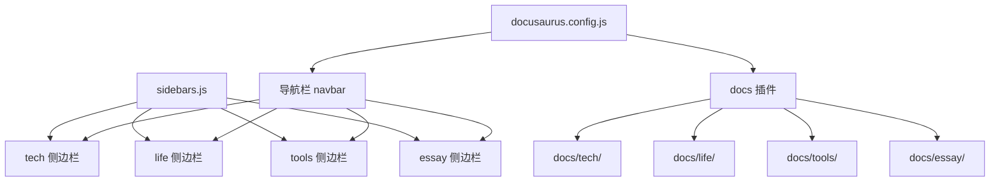
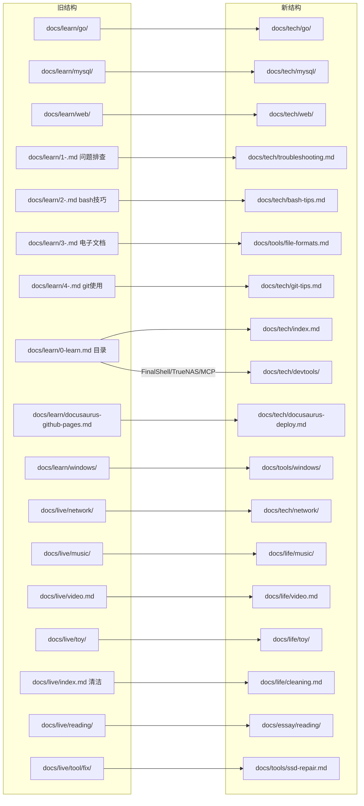

## 产品概述

将"哩度"个人网站从现有的"生活+学习"两大板块重构为"技术、生活、工具、随笔"四大板块。通过重新组织 docs 目录结构、侧边栏配置和导航栏，使内容归类更清晰合理，让访客能快速找到感兴趣的内容。

## 核心功能

### 四大内容板块

- **技术板块**：归纳所有技术相关内容，包括 Go 语言、MySQL、Web 开发、Bash 技巧、Git 使用、Docusaurus 部署指南、OpenWrt/网络配置、TrueNAS、VSCode MCP、FinalShell 等，以及技术文章链接收藏
- **生活板块**：收录日常生活相关内容，包括音乐与尤克里里、影视推荐清单、玩具/创意项目（代码打字机等）、清洁小窍门
- **工具板块**：保留现有独立的 /tools 页面（头像生成、编解码、JSON转结构体等在线工具），同时在 docs 中新增工具文档区，收录 SSD 修复教程、常见电子文档格式说明、Windows 技巧等实用工具型文档
- **随笔板块**：汇集读书笔记、言论摘录、朋友相关记录等个人感悟与随想内容

### 导航栏重构

- 顶部导航栏调整为：技术、生活、工具、随笔、博客、GFLearn、GitHub
- 每个 docs 板块对应独立的侧边栏，使用 autogenerated 模式自动生成
- 保留博客入口，博客板块不做改动

### 文件规范化

- 将 learn/ 目录下 `1-.md`、`2-.md` 等不规范命名的文件重命名为有意义的名称（如 `troubleshooting.md`、`bash-tips.md`）
- 清理空页面（如原 network/index.md、toy/index.md 仅含标题无实质内容的文件），合并或删除冗余内容
- 将 `docs/live/reading/index.md` 中的言论摘录与 `blog/2050-12-31-hailaz.md` 的"一些话"进行去重整合

## 技术栈

- 框架：Docusaurus v2（现有项目，保持不变）
- 配置文件：docusaurus.config.js、sidebars.js
- 侧边栏模式：autogenerated（沿用现有模式）
- 搜索插件：@easyops-cn/docusaurus-search-local（保持不变）
- 部署：GitHub Pages（保持不变）

## 技术架构

### 系统架构

项目为静态文档网站，整体架构不变，仅调整内容组织方式。核心变更集中在 docs 目录结构、侧边栏配置和导航栏配置三个层面。



### 模块划分

- **docs/tech/**：技术文档模块，包含 go/、mysql/、web/、network/、devtools/ 等子目录
- **docs/life/**：生活模块，包含 music/、video/、toy/、cleaning/ 等内容
- **docs/tools/**：工具文档模块，包含 ssd-repair/、windows/、file-formats/ 等实用指南
- **docs/essay/**：随笔模块，包含 reading/（读书笔记）、quotes/（言论摘录）等

### 数据流

内容迁移路径：



## 实现细节

### 核心目录结构

仅展示变更部分：

```
docs/
├── tech/                          # 新：技术板块
│   ├── index.md                   # 改：从 learn/0-learn.md 迁移并精简
│   ├── go/                        # 移：从 learn/go/ 迁移
│   ├── mysql/                     # 移：从 learn/mysql/ 迁移
│   ├── web/                       # 移：从 learn/web/ 迁移
│   ├── network/                   # 移：从 live/network/ 迁移
│   ├── devtools/                  # 新：开发工具相关
│   │   ├── finalshell.md          # 拆：从 learn/0-learn.md 拆出
│   │   ├── truenas.md             # 拆：从 learn/0-learn.md 拆出
│   │   └── vscode-mcp.md          # 拆：从 learn/0-learn.md 拆出
│   ├── troubleshooting.md         # 改：从 learn/1-.md 重命名
│   ├── bash-tips.md               # 改：从 learn/2-.md 重命名
│   ├── git-tips.md                # 改：从 learn/4-.md 重命名
│   └── docusaurus-deploy.md       # 移：从 learn/docusaurus-github-pages.md
├── life/                          # 改：从 live/ 重组
│   ├── index.md                   # 新：生活板块首页
│   ├── music/                     # 保留：从 live/music/ 迁移
│   ├── video.md                   # 保留：从 live/video.md 迁移
│   ├── toy/                       # 保留：从 live/toy/ 迁移
│   └── cleaning.md                # 改：从 live/index.md 中清洁内容迁移
├── tools/                         # 新：工具文档板块
│   ├── index.md                   # 新：工具文档首页
│   ├── ssd-repair.md              # 移：从 live/tool/fix/readme.md
│   ├── windows/                   # 移：从 learn/windows/
│   └── file-formats.md            # 改：从 learn/3-.md 重命名
├── essay/                         # 新：随笔板块
│   ├── index.md                   # 新：随笔首页
│   └── reading/                   # 移：从 live/reading/ 迁移
```

修改的配置文件：

```
sidebars.js                        # 改：四个侧边栏配置
docusaurus.config.js               # 改：导航栏项更新
```

### 关键配置结构

**sidebars.js 新配置：**

```javascript
const sidebars = {
  tech: [{ type: 'autogenerated', dirName: 'tech' }],
  life: [{ type: 'autogenerated', dirName: 'life' }],
  tools: [{ type: 'autogenerated', dirName: 'tools' }],
  essay: [{ type: 'autogenerated', dirName: 'essay' }],
};
```

**docusaurus.config.js 导航栏项：**

```javascript
items: [
  { type: 'docSidebar', position: 'left', sidebarId: 'tech', label: '技术' },
  { type: 'docSidebar', position: 'left', sidebarId: 'life', label: '生活' },
  { type: 'docSidebar', position: 'left', sidebarId: 'tools', label: '工具' },
  { type: 'docSidebar', position: 'left', sidebarId: 'essay', label: '随笔' },
  { to: '/blog', label: '博客', position: 'left' },
  // GFLearn、GitHub 保持不变
]
```

### 技术实现要点

1. **内容迁移策略**：先创建新目录结构，再逐步移动文件，最后删除旧目录。移动时需更新 md 文件中的相对图片路径引用。
2. **learn/0-learn.md 拆分**：该文件内容混杂（技术链接 + FinalShell + TrueNAS + VSCode MCP），需拆分为 tech/index.md（保留技术文章链接和 IP 查询工具）和 devtools/ 下的独立文件。
3. **言论内容去重**：对比 `docs/live/reading/index.md` 和 `blog/2050-12-31-hailaz.md`，将重复的言论摘录统一保留在 essay/reading/ 中，博客文章保持原样。
4. **空页面处理**：删除 network/index.md 和 toy/index.md 中仅含标题的空文件，让 autogenerated 侧边栏自动使用目录中的第一个文档。
5. **图片路径**：所有 md 文件中引用的相对路径图片需随文件一起迁移，确保路径正确。