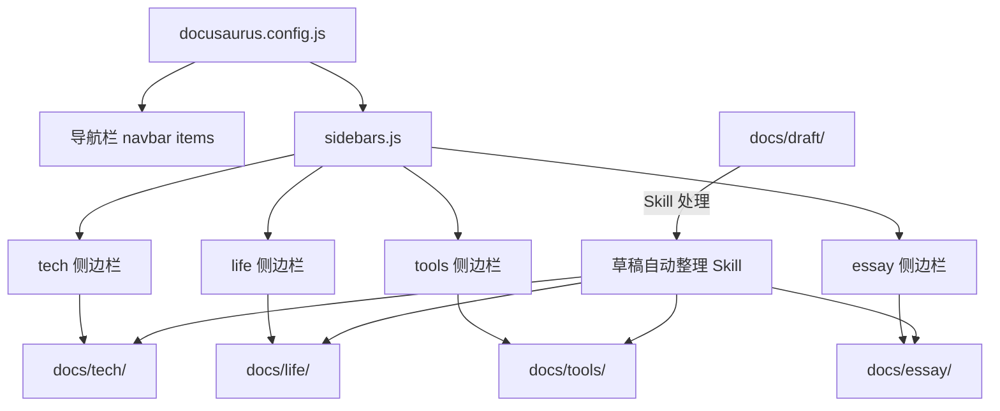

## 产品概述

将个人综合站点"哩度"从原有的"生活 + 学习"两大板块重构为"技术、生活、工具、随笔"四大板块，使内容分类更加清晰合理。同时新增草稿目录和自动整理 Skill，支持随手写内容后自动归类到合适板块。

## 核心功能

1. **四大板块导航重构**：将导航栏从"生活、学习"调整为"技术、生活、工具、随笔"四个板块入口，每个板块对应独立的侧边栏，展示各自目录下自动生成的文档结构。

2. **文档目录迁移**：将现有 `docs/learn/` 和 `docs/live/` 下的内容按主题重新归类到 `docs/tech/`（技术）、`docs/life/`（生活）、`docs/tools/`（工具）、`docs/essay/`（随笔）四个目录中，同时处理图片等资源文件的同步迁移。

3. **草稿目录**：新增 `docs/draft/` 目录，用于存放随手写的临时内容，不出现在网站导航中，仅作为 Skill 的输入来源。

4. **草稿自动整理 Skill**：创建一个 CodeBuddy Skill，能够扫描 `docs/draft/` 目录下的文件，分析内容主题，建议归入对应板块（技术/生活/工具/随笔），自动补充 frontmatter（标题、标签等），并将文件移动到目标目录。支持标准 Markdown 和随手片段等非标准格式。

## 技术栈

- 站点框架：Docusaurus 3.7（已有）
- 语言：JavaScript / Markdown / MDX
- 包管理：Yarn
- 搜索插件：@easyops-cn/docusaurus-search-local
- Skill 运行时：CodeBuddy Skill（YAML + Markdown 规范）

## 技术架构

### 系统架构

当前项目为 Docusaurus 静态站点，架构简单清晰。本次改动不引入新的架构模式，仅在现有配置层面进行调整。



### 模块划分

- **导航配置模块**：`docusaurus.config.js` 中 navbar items 的修改，将两个入口扩展为四个
- **侧边栏配置模块**：`sidebars.js` 中新增 tech、life、tools、essay 四个 autogenerated 侧边栏，移除旧的 live/learn
- **文档内容模块**：四个板块目录 + draft 目录
- **Skill 模块**：`.codebuddy/skills/draft-organizer/` 下的 Skill 定义文件

### 数据流


## 实现细节

### 核心目录结构（仅展示变更部分）

```
project-root/
├── .codebuddy/
│   └── skills/
│       └── draft-organizer/          # 新增：草稿整理 Skill
│           └── skill.md              # Skill 定义文件
├── docs/
│   ├── tech/                         # 新增：技术板块
│   │   ├── go/                       # 从 learn/go/ 迁入
│   │   ├── mysql/                    # 从 learn/mysql/ 迁入
│   │   ├── web/                      # 从 learn/web/ 迁入
│   │   ├── network/                  # 从 live/network/ 迁入
│   │   ├── 0-learn.md                # 从 learn/0-learn.md 迁入（技术目录）
│   │   ├── 1-.md ~ 4-.md             # 从 learn/ 迁入（Bash/Git/问题排查等）
│   │   └── docusaurus-github-pages.md
│   ├── life/                         # 新增：生活板块
│   │   ├── music/                    # 从 live/music/ 迁入
│   │   ├── toy/                      # 从 live/toy/ 迁入
│   │   ├── index.md                  # 从 live/index.md 迁入
│   │   └── video.md                  # 从 live/video.md 迁入
│   ├── tools/                        # 新增：工具板块（文档类工具）
│   │   ├── fix/                      # 从 live/tool/fix/ 迁入
│   │   └── windows/                  # 从 learn/windows/ 迁入
│   ├── essay/                        # 新增：随笔板块
│   │   └── reading/                  # 从 live/reading/ 迁入
│   ├── draft/                        # 新增：临时草稿目录
│   │   └── .gitkeep
│   ├── learn/                        # 删除（内容已迁移）
│   └── live/                         # 删除（内容已迁移）
├── docusaurus.config.js              # 修改：导航栏配置
└── sidebars.js                       # 修改：侧边栏配置
```

### 关键配置变更

**sidebars.js 新结构**：四个 autogenerated 侧边栏分别对应四个板块目录。

```javascript
const sidebars = {
  tech: [{ type: 'autogenerated', dirName: 'tech' }],
  life: [{ type: 'autogenerated', dirName: 'life' }],
  tools: [{ type: 'autogenerated', dirName: 'tools' }],
  essay: [{ type: 'autogenerated', dirName: 'essay' }],
};
```

**docusaurus.config.js navbar items 变更**：将 live/learn 替换为 tech/life/tools-docs/essay 四个 docSidebar 入口，保留博客、在线工具、GFLearn、GitHub 不变。注意"工具"导航在这里指向 `docs/tools/`（文档类工具教程），在线工具页面 `/tools` 路由需改为 `/online-tools` 以避免路由冲突。

```javascript
items: [
  { type: 'docSidebar', position: 'left', sidebarId: 'tech', label: '技术' },
  { type: 'docSidebar', position: 'left', sidebarId: 'life', label: '生活' },
  { type: 'docSidebar', position: 'left', sidebarId: 'tools', label: '工具' },
  { type: 'docSidebar', position: 'left', sidebarId: 'essay', label: '随笔' },
  { to: '/blog', label: '博客', position: 'left' },
  { to: '/online-tools', label: '在线工具', position: 'left' },
  // ... GFLearn, GitHub 保持不变
]
```

### Skill 设计

**draft-organizer Skill** 核心逻辑：

1. 扫描 `docs/draft/` 下所有 `.md` 文件
2. 读取文件内容，通过 AI 分析判断主题归属（技术/生活/工具/随笔）
3. 检查是否已有 frontmatter，缺少则根据内容生成 `title`、`tags` 等字段
4. 向用户展示分类建议和补充的 frontmatter，确认后执行文件移动
5. 支持非标准格式（纯文本片段、无标题的随手记录等）

### 技术实现要点

1. **路由冲突处理**：`docs/tools/` 目录会生成 `/docs/tools/` 路由，而现有的在线工具页面在 `/tools`。需要将 `src/pages/tools.js` 重命名为 `src/pages/online-tools.js`，对应 CSS 文件也一并修改。
2. **资源文件迁移**：文档中引用的图片（`.png`、`.jpg`、`.gif`）需随 Markdown 文件一起迁移到新目录，确保相对路径引用不断裂。
3. **draft 目录排除**：draft 目录不应出现在任何侧边栏和导航中，由于 sidebars.js 只配置了四个板块的 dirName，draft 目录自然不会被包含。
4. **frontmatter 兼容**：现有文档部分有 frontmatter（如 `title`、`id`），部分没有。迁移时保留现有 frontmatter 不变。

## 技术考量

### 兼容性

- 旧链接（`/docs/learn/...`、`/docs/live/...`）迁移后将失效。如有需要可后续通过 Docusaurus 的 `@docusaurus/plugin-client-redirects` 插件配置重定向。
- project/ 目录保持原样不动，作为 staticDirectories 继续提供服务。

### 搜索

- `@easyops-cn/docusaurus-search-local` 会自动索引新目录结构下的文档，无需额外配置。

## Agent Extensions

### Skill

- **skill-creator**
- 用途：按照 CodeBuddy Skill 规范创建 `draft-organizer` Skill，确保 Skill 定义文件格式正确、触发条件合理
- 预期结果：在 `.codebuddy/skills/draft-organizer/` 目录下生成符合规范的 Skill 定义文件

### SubAgent

- **code-explorer**
- 用途：在迁移文档前全面扫描现有 `docs/learn/` 和 `docs/live/` 下所有文件的引用关系和 frontmatter 情况，确保迁移不遗漏
- 预期结果：获取完整的文件清单和引用关系映射，指导精确迁移