# 文档团队 Golang 最佳实践 & CR 案例集

> 摘自：cheaterlin

## 综述

我写过一篇《Code Review 我都 CR 些什么》，讲解了 Code Review 对团队有什么价值，我认为 CR 最重要的原则有哪些。最近我发现:

- 原则不清晰。对于代码架构的原则，编码的追求，我的骨干员工对它的认识也不是很全面。当前还是在 review 过程中我对他们口口相传，总有遗漏。
- 从知道到会做需要时间。我需要反复跟他们补充 review 他们漏掉的点，他们才能完成吸收、内化，在后续的 review 过程中，能自己提出这些 review 的点。

过度文档化是有害的，当过多的内容需要被阅读，工程师们最终就会选择不去读，读了也仅仅能吸收很少一部分。在 google，对于代码细节的理解，更多还是口口相传，在实践中去感受和理解。但是，在腾讯，现在缺乏教练去训练新的种子选手，实现"群体免疫"。适当的文档、文字宣传，是必要的。特此，我就又输出了这一篇文章，尝试从'知名架构原则'、'工程师的自我修养'、'不能上升到原则的几个常见案例'三大模块，把我个人的经验系统地输出，供其他团队参考。
因为我是代码委员会 golang 分会的理事，我的团队当前 90%都是 golang 代码，我的案例都会用 golang 语言。
以及，关于[代码规范](#)要求的格式规范的底线，我这里不再赘述。

## 知名架构原则

后面原则主要受《程序员修炼之道: 通向务实的最高境界》、《架构整洁之道》、《Unix 编程艺术》启发。我不是第一个发明这些原则的人，甚至不是第一个总结出来的人，别人都已经写成书了！务实的程序员对于方法的总结，总是殊途同归。

### 细节即是架构

(下面是原文摘录, 我有类似观点, 但是原文就写得很好, 直接摘录)

```shell
一直以来，设计(Design)和架构(Architecture)这两个概念让大多数人十分迷惑--什么是设计？什么是架构？二者究竟有什么区别？
二者没有区别。一丁点区别都没有！
"架构"这个词往往适用于"高层级"的讨论中，这类讨论一般都把"底层"的实现细节排除在外。而"设计"一词，往往用来指代具体的系统底层组织结构和实现的细节。但是，从一个真正的系统架构师的日常工作来看，这些区分是根本不成立的。
以给我设计新房子的建筑设计师要做的事情为例。新房子当然是存在着既定架构的，但这个架构具体包含哪些内容呢？首先，它应该包括房屋的形状、外观设计、垂直高度、房间的布局，等等。但是，如果查看建筑设计师使用的图纸，会发现其中也充斥着大量的设计细节。譬如，我们可以看到每个插座、开关以及每个电灯具体的安装位置，同时也可以看到某个开关与所控制的电灯的具体连接信息；我们也能看到壁炉的具体位置，热水器的大小和位置信息，甚至是污水泵的位置；同时也可以看到关于墙体、屋顶和地基所有非常详细的建造说明。
总的来说，架构图里实际上包含了所有的底层设计细节，这些细节信息共同支撑了顶层的架构设计，底层设计信息和顶层架构设计共同组成了整个房屋的架构文档。
软件设计也是如此。底层设计细节和高层架构信息是不可分割的。他们组合在一起，共同定义了整个软件系统，缺一不可。所谓的底层和高层本身就是一系列决策组成的连续体，并没有清晰的分界线。
```

我们编写、review 细节代码，就是在做架构设计的一部分。我们编写的细节代码构成了整个系统。我们就应该在细节 review 中，总是带着所有架构原则去审视。你会发现，你已经写下了无数让整体变得丑陋的细节，它们背后，都有前人总结过的架构原则。

### 把代码和文档绑在一起(自解释原则)

写文档是个好习惯。但是写一个别人需要咨询老开发者才能找到的文档，是个坏习惯。这个坏习惯甚至会给工程师们带来伤害。比如，当初始开发者写的文档在一个犄角旮旯(在 wiki 里，但是阅读代码的时候没有在明显的位置看到链接)，后续代码被修改了，文档已经过时，有人再找出文档来获取到过时、错误的知识的时候，阅读文档这个同学的开发效率必然受到伤害。所以，如同 golang 的 godoc 工具能把代码里'按规范来'的注释自动生成一个文档页面一样，我们应该:

- 按照 godoc 的要求好好写代码的注释。
- 代码首先要自解释，当解释不了的时候，需要就近、合理地写注释。
- 当小段的注释不能解释清楚的时候，应该有 doc.go 来解释，或者，在同级目录的 ReadMe.md 里注释讲解。
- 文档需要强大的富文本编辑能力，MarkDown 无法满足，可以写到 wiki 里，同时必须把 wiki 的简单描述和链接放在代码里合适的位置。让阅读和维护代码的同学一眼就看到，能做到及时的维护。

以上，总结起来就是，解释信息必须离被解释的东西，越近越好。代码能做到自解释，是最棒的。

[case, 该工程师最后决定删除这个冗余的目录树描述, 让目录结构自解释](#)
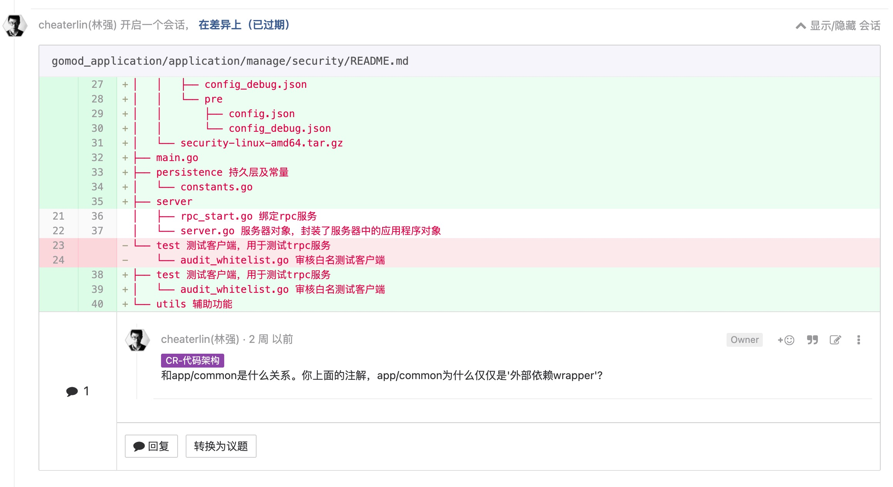

### ETC 价值观(easy to change)

```
ETC是一种价值观念，不是一条原则。价值观念是帮助你做决定的: 我应该做这个，还是做那个？当你在软件领域思考时，ETC是个向导，它能帮助你在不同的路线中选出一条。就像其他一些价值观念一样，你应该让它漂浮在意识思维之下，让它微妙地将你推向正确的方向。
```

敏捷软件工程，所谓敏捷，就是要能快速变更，并且在变更中保持代码的质量。所以，持有 ETC 价值观看待代码细节、技术方案，我们将能更好地编写出适合敏捷项目的代码。
这是一个大的价值观，不是一个基础微观的原则，所以没有例子。本文提到的所有原则，或者接，或间接，都要为 ETC 服务。

### DRY 原则(don not repeat yourself)

在《Code Review 我都 CR 些什么》里面，我已经就 DRY 原则做了深入阐述，这里不再赘述。我认为 DRY 原则是编码原则中最重要的编码原则，没有之一(ETC 是个观念)。不要重复！不要重复！不要重复！

[case](#)
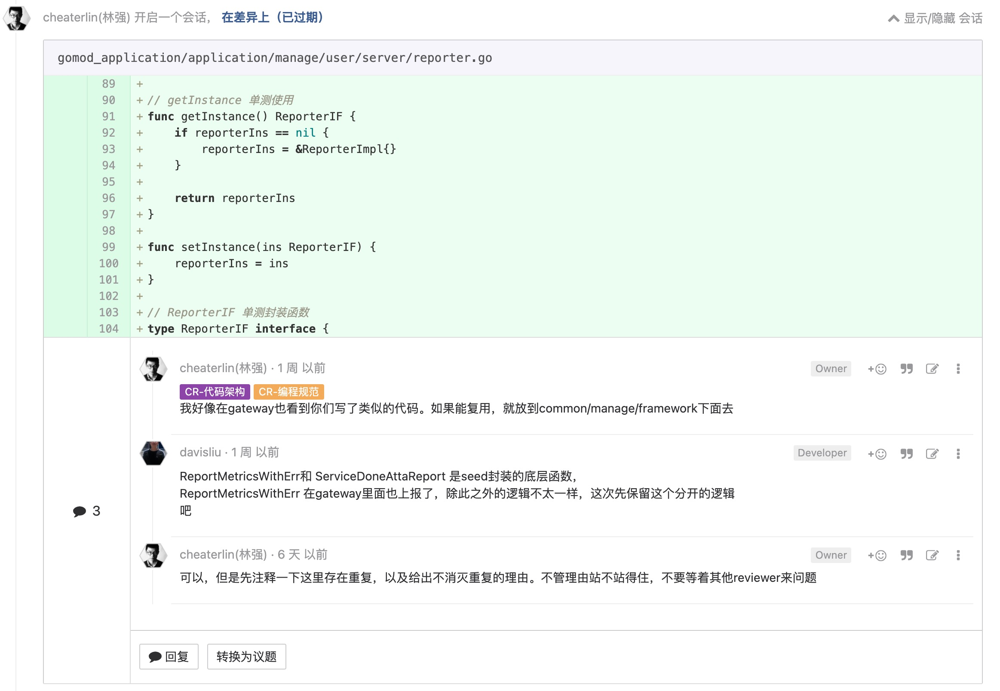

### 正交性原则(全局变量的危害)

'正交性'是几何学中的术语。我们的代码应该消除不相关事物之间的影响。这是一给简单的道理。我们写代码要'高内聚、低耦合'，这是大家都在提的。
但是，你有为了使用某个 class 一堆能力中的某个能力而去派生它么？你有写过一个 helper 工具，它什么都做么？在腾讯，我相信你是做过的。你自己说，你这是不是为了复用一点点代码，而让两大块甚至多块代码耦合在一起，不再正交了？
大家可能并不是不明白正交性的价值，只是不知道怎么去正交。手段有很多，但是首先我就要批判一下 OOP。它的核心是多态，多态需要通过派生/继承来实现。继承树一旦写出来，就变得很难 change，你不得不为了使用一小段代码而去做继承，让代码耦合。你应该多使用组合，而不是继承。以及，应该多使用 DIP(Dependence Inversion Principle)，依赖倒置原则。换个说法，就是面向 interface 编程，面向契约编程，面向切面编程，他们都是 DIP 的一种衍生。写 golang 的同学就更不陌生了，我们要把一个 struct 作为一个 interface 来使用，不需要显式 implement/extend，仅仅需要持有对应 interface 定义了的函数。这种 duck interface 的做法，让 DIP 来得更简单。AB 两个模块可以独立编码，他们仅仅需要一个依赖一个 interface 签名，一个刚好实现该 interface 签名。并不需要显式知道对方 interface 签名的两个模块就可以在需要的模块、场景下被组合起来使用。代码在需要被组合使用的时候才产生了一点关系，同时，它们依然保持着独立。
说个正交性的典型案例。全局变量是不正交的！没有充分的理由，禁止使用全局变量。全局变量让依赖了该全局变量的代码段互相耦合，不再正交。特别是一个 pkg 提供一个全局变量给其他模块修改，这个做法会让 pkg 之间的耦合变得复杂、隐秘、难以定位。
[全局 map case](#)
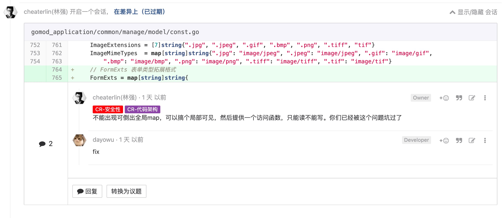

### 单例就是全局变量

这个不需要我解释，大家自己品一品。后面有'共享状态就是不正确的状态'原则，会进一步讲到。我先给出解决方案，可以通过管道、消息机制来替代共享状态/使用全局变量/使用单例。仅仅能获取此刻最新的状态，通过消息变更状态。要拿到最新的状态，需要重新获取。在必要的时候，引入锁机制。

### 可逆性原则

可逆性原则是很少被提及的一个原则。可逆性，就是你做出的判断，最好都是可以被逆转的。再换一个容易懂的说法，你最好尽量少认为什么东西是一定的、不变的。比如，你认为你的系统永远服务于，用 32 位无符号整数(比如 QQ 号)作为用户标识的系统。你认为，你的持久化存储，就选型 SQL 存储了。当这些一开始你认为一定的东西，被推翻的时候，你的代码却很难去 change，那么，你的代码就是可逆性做得很差。书里有一个例证，我觉得很好，直接引用过来。

```
写下这段文字的时间是2019年。自世纪之交以来，我们看到了以下'服务端架构的最佳实践':

* 大铁块
* 大铁块的组合
* 带负载均衡的商用硬件集群
* 将程序运行在云虚拟机中
* 把服务运行在云虚拟机中
* 把云虚拟机换成容器再来一遍
* 基于云的无服务器架构
* 最后，无可避免的，有些任务又回到了大铁块

...(省略了文字)... 你能为这种架构的变化提前准备吗？做不到。你能做的就是让修改更容易一点。将第三方API隐藏在自己的抽象层之后。将代码分解成多个组件: 即使最终会把它们部署到单个大型服务器上，这种方法也比一开始做成庞然大物，然后再切分要容易得多。
```

与其认为决定是被刻在石头上的，还不如把它们想像成写在沙滩的沙子上。一个大浪随时都可能袭来，卷走一切。
腾讯也确实在 20 年内经历了'大铁块'到'云虚拟机换成容器'的几个阶段。几次变化都是伤筋动骨，浪费大量的时间。甚至总会有一些上一个时代残留的服务。就机器数量而论，还不小。一到裁撤季，就很难受。
就最近，我看到某个 trpc 插件，直接从环境变量里读取本机 IP，仅仅因为 STKE(Tencent Kubernetes Engine)提供了这个能力。这个细节设计就是不可逆的，将来会有人为它买单，可能价格还不便宜。
我今天才想起一个事儿。当年 SNG 的很多部门对于 metrics 监控的使用。就潜意识地认为，我们将一直使用['模块间调用监控'组件](http://m.isd.com/)。使用它的 API 是直接把上报通道 DCLog 的 API 裸露在业务代码里的。今天(2020.12.01)，该组件应该已经完全没有人维护、完全下线了，这些核心业务代码要怎么办？有人能对它做出修改么？那，这些部门现在还有 metrics 监控么？答案，可能是悲观的。有人已经已经尝到了可逆性之痛。

### 依赖倒置原则(DIP)

DIP 原则太重要了，我这里单独列一节来讲解。我这里只是简单的讲解，讲解它最原始和简单的形态。
依赖倒置原则，全称是 Dependence Inversion Principle，简称 DIP。考虑下面这几段代码:

```go
package dip

package dip

type Botton interface {
    TurnOn()
    TurnOff()
}

type UI struct {
    botton Botton
}

func NewUI(b Botton) *UI {
    return &UI{botton: b}
}

func (u *UI) Poll() {
    u.botton.TurnOn()
    u.botton.TurnOff()
    u.botton.TurnOn()
}
```

```go
package javaimpl

import "fmt"

type Lamp struct {
}

func NewLamp() *Lamp {
    return &Lamp{}
}

func (*Lamp) TurnOn() {
    fmt.Println("turn on java lamp")
}

func (*Lamp) TurnOff() {
    fmt.Println("turn off java lamp")
}
```

```go
package pythonimpl

import "fmt"

type Lamp struct {
}

func NewLamp() *Lamp {
    return &Lamp{}
}

func (*Lamp) TurnOn() {
    fmt.Println("turn on python lamp")
}

func (*Lamp) TurnOff() {
    fmt.Println("turn off python lamp")
}
```

```go
package main

import (
    "javaimpl"
    "pythonimpl"
    "dip"
)

func runPoll(b dip.Botton) {
    ui := NewUI(b)
    ui.Poll()
}

func main() {
    runPoll(pythonimpl.NewLamp())
    runPoll(javaimpl.NewLamp())
}
```

看代码，main pkg 里的 runPoll 函数仅仅面向 Botton interface 编码，main pkg 不再关心 Botton interface 里定义的 TurnOn、TurnOff 的实现细节。实现了解耦。这里，我们能看到 struct UI 需要被注入(inject)一个 Botton interface 才能逻辑完整。所以，DIP 经常换一个名字出现，叫做依赖注入(Dependency Injection)。

从这个依赖图观察。我们发现，一般来说，UI struct 的实现是要应该依赖于具体的 pythonLamp、javaLamp、其他各种 Lamp，才能让自己的逻辑完整。那就是 UI struct 依赖于各种 Lamp 的实现，才能逻辑完整。但是，我们看上面的代码，却是反过来了。pythonLamp、javaLamp、其他各种 Lamp 是依赖 Botton interface 的定义，才能用来和 UI struct 组合起来拼接成完整的业务逻辑。变成了，Lamp 的实现细节，依赖于 UI struct 对于 Botton interface 的定义。这个时候，你发现，这种依赖关系被倒置了！依赖倒置原则里的'倒置'，就是这么来的。在 golang 里，'pythonLamp、javaLamp、其他各种 Lamp 是依赖 Botton interface 的定义'，这个依赖是隐性的，没有显式的 implement 和 extend 关键字。代码层面，pkg dip 和 pkg pythonimpl、javaimpl 没有任何依赖关系。他们仅仅需要被你在 main pkg 里组合起来使用。
在 J2EE 里，用户的业务逻辑不再依赖低具体低层的各种存储细节，而仅仅依赖一套配置化的 Java Bean 接口。Object 落地存储的具体细节，被做成了 Java Bean 配置，注入到框架里。这就是 J2EE 的核心科技，并不复杂，其实也没有多么'高不可攀'。反而，在'动态代码'优于'配置'的今天，这种通过配置实现的依赖注入，反而有点过时了。

### 将知识用纯文本来保存

这也是一个生僻的原则。指代码操作的数据和方案设计文稿，如果没有充分的必要使用特定的方案，就应该使用人类可读的文本来保存、交互。对于方案设计文稿，你能不使用 office 格式，就不使用(office 能极大提升效率，才用)，最好是原始 text。这是《Unix 编程艺术》也提到了的 Unix 系产生的设计信条。简而言之一句话，当需要确保有一个所有各方都能使用的公共标准，才能实现交互沟通时，纯文本就是这个标准。它是一个接受度最高的通行标准。如果没有必要的理由，我们就应该使用纯文本。

### 契约式设计

如果你对契约式设计(Design by Contract, DBC)还很陌生，我相信，你和其他端的同学(web、client、后端)联调需求应该是一件很花费时间的事情。你自己编写接口自动化，也会是一件很耗费精力的事情。你先看看它的[wiki 解释](https://zh.wikipedia.org/wiki/%E5%A5%91%E7%BA%A6%E5%BC%8F%E8%AE%BE%E8%AE%A1)吧。grpc + grpc-gateway + swagger 是个很香的东西。
代码是否不多不少刚好完成它宣称要做的事情，可以使用契约加以校验和文档化。TDD 就是全程在不断调整和履行着契约。TDD(Test-Driven Development)是自底向上地编码过程，其实会耗费大量的精力，并且对于一个良好的层级架构没有帮助。TDD 不是强推的规范，但是同学们可以用一用，感受一下。TDD 方法论实现的接口、函数，自我解释能力一般来说比较强，因为它就是一个实现契约的过程。
抛开 TDD 不谈。我们的函数、api，你能快速抓住它描述的核心契约么？它的契约简单么？如果不能、不简单，那你应该要求被 review 的代码做出调整。如果你在指导一个后辈，你应该帮他思考一下，给出至少一个可能的简化、拆解方向。

### 尽早崩溃

Erlang 和 Elixir 语言信奉这种哲学。乔-阿姆斯特朗，Erlang 的发明者，《Erlang 程序设计》的作者，有一句反复被引用的话: "防御式编程是在浪费时间，让它崩溃"。
尽早崩溃不是说不容错，而是程序应该被设计成允许出故障，有适当的故障监管程序和代码，及时告警，告知工程师，哪里出问题了，而不是尝试掩盖问题，不让程序员知道。当最后程序员知道程序出故障的时候，已经找不到问题出现在哪里了。
特别是一些 recover 之后什么都不做的代码，这种代码简直是毒瘤！当然，崩溃，可以是早一些向上传递 error，不一定就是 panic。同时，我要求大家不要在没有充分的必要性的时候 panic，应该更多地使用向上传递 error，做好 metrics 监控。合格的 golang 程序员，都不会在没有必要的时候无视 error，会妥善地做好 error 处理、向上传递、监控。
一个死掉的程序，通常比一个瘫痪的程序，造成的损害要小得多。

[崩溃但是不告警,或者没有补救的办法,不可取.尽早崩溃的题外话是,要在问题出现的时候做合理的告警,有预案,不能掩盖,不能没有预案](#)
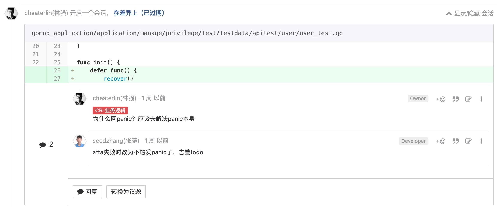

### 解耦代码让改变容易

这个原则，显而易见，大家自己也常常提，其他原则或多或少都和它有关系。但是我也再提一提。我主要是描述一下它的症状，让同学们更好地警示自己'我这两块代码是不是耦合太重，需要额外引入解耦的设计了'。症状如下:

- 不相关的 pkg 之间古怪的依赖关系
- 对一个模块进行的'简单'修改，会传播到系统中不相关的模块里，或是破坏了系统中的其他部分
- 开发人员害怕修改代码，因为他们不确定会造成什么影响
- 会议要求每个人都必须参加，因为没有人能确定谁会受到变化的影响

### 只管命令不要询问

看看如下三段代码:

```go
func applyDiscount(customer Customer, orderID string, discount float32) {
	customer.
		Orders.
		Find(orderID).
		GetTotals().
		ApplyDiscount(discount)
}
```

```go
func applyDiscount(customer Customer, orderID string, discount float32) {
	customer.
		FindOrder(orderID).
		GetTotals().
		ApplyDiscount(discount)
}
```

```go
func applyDiscount(customer Customer, orderID string, discount float32) {
	customer.
		FindOrder(orderID).
		ApplyDiscount(discount)
}
```

明显，最后一段代码最简洁。不关心 Orders 成员、总价的存在，直接命令 customer 找到 Order 并对其进行打折。当我们调整 Orders 成员、GetTotals()方法的时候，这段代码不用修改。还有一种更吓人的写法:

```go
func applyDiscount(customer Customer, orderID string, discount float32) {
	total := customer.
		FindOrder(orderID).
		GetTotals()
	customer.
		FindOrder(orderID).
		SetTotal(total*discount)
}
```

它做了更多的查询，关心了更多的细节，变得更加 hard to change 了。我相信，大家写过类似的代码也不少。特别是客户端同学。
最好的那一段代码，就是只管给每个 struct 发送命令，要求大家做事儿。怎么做，就内聚在和 struct 关联的方法里，其他人不要去操心。一旦其他人操心了，当需要做修改的时候，就要操心了这个细节的人都一起参与进修改过程。

### 不要链式调用方法

看下面的例子:

```go
func amount(customer Customer) float32 {
	return customer.Orders.Last().Totals().Amount
}
```

```go
func amount(totals Totals) float32 {
	return totals.Amount
}
```

第二个例子明显优于第一个，它变得更简单、通用、ETC。我们应该给函数传入它关心的最小集合作为参数。而不是，我有一个 struct，当某个函数需要这个 struct 的成员的时候，我们把整个 struct 都作为参数传递进去。应该仅仅传递函数关心的最小集合。传进去的一整条调用链对函数来说，都是无关的耦合，只会让代码更 hard to change，让工程师惧怕去修改。这一条原则，和上一条关系很紧密，问题常常同时出现。还是，特别是在客户端代码里。

### 继承税(多用组合)

```
继承就是耦合。不仅子类耦合到父类，以及父类的父类等，而且使用子类的代码也耦合到所有祖先类。
有些人认为继承是定义新类型的一种方式。他们喜欢设计图表，会展示出类的层次结构。他们看待问题的方式，与维多利亚时代的绅士科学家们看待自然的方式是一样的，即将自然视为须分解到不同类别的综合体。
不幸的是，这些图表很快就会为了表示类之间的细微差别而逐层添加，最终可怕地爬满墙壁。由此增加的复杂性，可能使应用程序更加脆弱，因为变更可能在许多层次之间上下波动。
因为一些值得商榷的词义消歧方面的原因，C++在20世纪90年代玷污了多重继承的名声。结果，许多当下的OO语言都没有提供这种功能。因此，即使你很喜欢复杂的类型树，也完全无法为你的领域准确地建模。
```

Java 下一切都是类。C++里不使用类还不如使用 C。写 Python、PHP，我们也肯定要时髦地写一些类。写类可以，当你要去继承，你就得考虑清楚了。继承树一旦形成，就是非常 hard to change 的，在敏捷项目里，你要想清楚'代价是什么'，有必要么？这个设计'可逆'么？对于边界清晰的 UI 框架、游戏引擎，使用复杂的继承树，挺好的。对于 UI 逻辑、后台逻辑，可能，你仅仅需要组合、DIP(依赖反转)技术、契约式编程(接口与协议)就够了。写出继承树不是'就应该这么做'，它是成本，继承是要收税的！
在 golang 下，继承税的烦恼被减轻了，golang 从来说自己不是 OO 的语言，但是你 OO 的事情，我都能轻松地做到。
更进一步，OO 和过程式编程的区别到底是什么？
面向过程，面向对象，函数式编程。三种编程结构的核心区别，是在不同的方向限制程序员，来做到好的代码结构(引自《架构整洁之道》):

- 结构化编程是对程序控制权的直接转移的限制。
- 面向对象是对程序控制权的间接转移的限制。
- 函数式编程是对程序中赋值操作的限制。

SOLID 原则(单一功能、开闭原则、里氏替换、接口隔离、依赖反转，后面会讲到)是 OOP 编程的最经典的原则。其中 D 是指依赖倒置原则(Dependence Inversion Principle)，我认为，是 SOLID 里最重要的原则。J2EE 的 container 就是围绕 DIP 原则设计的。DIP 能用于避免构建复杂的继承树，DIP 就是'限制控制权的间接转移'能继续发挥积极作用的最大保障。合理使用 DIP 的 OOP 代码才可能是高质量的代码。
golang 的 interface 是 duck interface，把 DIP 原则更进一步，不需要显式 implement/extend interface，就能做到 DIP。golang 使用结构化编程范式，却有面向对象编程范式的核心优点，甚至简化了。这是一个基于高度抽象理解的极度精巧的设计。google 把 abstraction 这个设计理念发挥到了极致。曾经，J2EE 的 container(EJB, Java Bean)设计是国内 Java 程序员引以为傲'架构设计'、'厉害的设计'。在 golang 里，它被分析、解构，以更简单、灵活、统一、易懂的方式呈现出来。写了多年垃圾 C++代码的腾讯后端工程师们，是你们再次审视 OOP 的时候了。我大学一年级的时候看的 C++教材，终归给我描述了一个美好却无法抵达的世界。目标我没有放弃，但我不再用 OOP，而是更多地使用组合(Mixin)。写 golang 的同学，应该对 DIP 和组合都不陌生，这里我不再赘述。如果有人自傲地说他在 golang 下搞起了继承，我只能说，'同志，你现在站在了广大 gopher 的对立面'。
现在，你站在哲学的云端，鸟瞰了 Structured Programming 和 OOP。你还愿意再继续支付继承税么？

### 共享状态是不正确的状态

你坐在最喜欢的餐厅。吃完主菜，问男服务员还有没有苹果派。他回头一看-陈列柜里还有一个，就告诉你"还有"。点到了苹果派，你心满意足地长出了一口气。与此同时，在餐厅的另一边，还有一个顾客也问了女服务员同样的问题。她也看了看，确认有一个，让顾客点了单。总有一个顾客会失望的。
问题出在共享状态。餐厅里的每一个服务员都查看了陈列柜，却没有考虑到其他服务员。你们可以通过加互斥锁来解决正确性的问题，但是，两个顾客有一个会失望或者很久都得不到答案，这是肯定的。
所谓共享状态，换个说法，就是: 由多个人查看和修改状态。这么一说，更好的解决方案就浮出水面了: 将状态改为集中控制。预定苹果派，不再是先查询，再下单。而是有一个餐厅经理负责和服务员沟通，服务员只管发送下单的命令/消息，经理看情况能不能满足服务员的命令。
这种解决方案，换一个说法，也可以说成"用角色实现并发性时不必共享状态"。对，上面，我们引入了餐厅经理这个角色，赋予了他职责。当然，我们仅仅应该给这个角色发送命令，不应该去询问他。前面讲过了，'只管命令不要询问'，你还记得么。
同时，这个原则就是 golang 里大家耳熟能详的谚语: "不要通过共享内存来通信，而应该通过通信来共享内存"。
作为并发性问题的根源，内存的共享备受关注。但实际上，在应用程序代码共享可变资源(文件、数据库、外部服务)的任何地方，问题都有可能冒出来。当代码的两个或多个实例可以同时访问某些资源时，就会出现潜在的问题。

### 缄默原则

如果一个程序没什么好说，就保持沉默。过多的正常日志，会掩盖错误信息。过多的信息，会让人根本不再关注新出现的信息，'更多信息'变成了'没有信息'。每人添加一点信息，就变成了输出很多信息，最后等于没有任何信息。

- 不要在正常 case 下打印日志。
- 不要在单元测试里使用 fmt 标准输出，至少不要提交到 master。
- 不打不必要的日志。当错误出现的时候，会非常明显，我们能第一时间反应过来并处理。
- 让调试的日志停留在调试阶段，或者使用较低的日志级别，你的调试信息，对其他人根本没有价值。
- 即使低级别日志，也不能泛滥。不然，日志打开与否都没有差别，日志变得毫无价值。

[缄默](#)
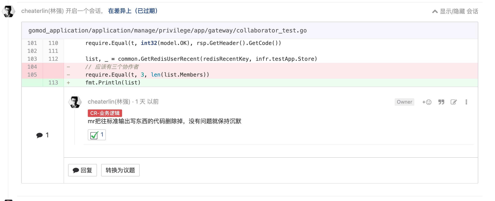

### 错误传递原则

我不喜欢 Java 和 C++的 exception 特性，它容易被滥用，它具有传染性(如果代码 throw 了 excepttion, 你就得 handle 它，不 handle 它，你就崩溃了。可能你不希望崩溃，你仅仅希望报警)。但是 exception(在 golang 下是 panic)是有价值的，参考[微软的文章](https://docs.microsoft.com/en-us/cpp/cpp/errors-and-exception-handling-modern-cpp?view=msvc-160):

```
Exceptions are preferred in modern C++ for the following reasons:

* An exception forces calling code to recognize an error condition and handle it. Unhandled exceptions stop program execution.
* An exception jumps to the point in the call stack that can handle the error. Intermediate functions can let the exception propagate. They don't have to coordinate with other layers.
* The exception stack-unwinding mechanism destroys all objects in scope after an exception is thrown, according to well-defined rules.
* An exception enables a clean separation between the code that detects the error and the code that handles the error.
```

Google 的 C++规范在常规情况禁用 exception，[理由包含如下内容](https://stackoverflow.com/questions/5184115/google-c-style-guides-no-exceptions-rule-stl)：

```
Because most existing C++ code at Google is not prepared to deal with exceptions, it is comparatively difficult to adopt new code that generates exceptions.
```

从 google 和微软的文章中，我们不难总结出以下几点衍生的结论:

- 在必要的时候抛出 exception。使用者必须具备'必要性'的判断能力。
- exception 能一路把底层的异常往上传递到高函数层级，信息被向上传递，并且在上级被妥善处理。可以让异常和关心具体异常的处理函数在高层级和低层级遥相呼应，中间层级什么都不需要做，仅仅向上传递。
- exception 传染性很强。当代码由多人协作，使用 A 模块的代码都必须要了解它可能抛出的异常，做出合理的处理。不然，就都写一个丑陋的 catch，catch 所有异常，然后做一个没有针对性的处理。每次 catch 都需要加深一个代码层级，代码常常写得很丑。

我们看到了异常的优缺点。上面第二点提到的信息传递，是很有价值的一点。golang 在 1.13 版本中拓展了标准库，支持了[Error Wrapping](https://www.flysnow.org/2019/09/06/go1.13-error-wrapping.html)也是承认了 error 传递的价值。
所以，我们认为错误处理，应该具备跨层级的错误信息传递能力，中间层级如果不关心，就把 error 加上本层的信息向上透传(有时候可以直接透传)，应该使用 Error Wrapping。exception/panic 具有传染性。大量使用，会让代码变得丑陋，同时容易滋生可读性问题。我们应该多使用 Error Wrapping，在必要的时候，才使用 exception/panic。每一次使用 exception/panic，都应该被认真审核。需要 panic 的地方，不去 panic，也是有问题的。参考本文的'尽早崩溃'。
额外说一点，注意不要把整个链路的错误信息带到公司外，带到用户的浏览器、native 客户端。至少不能直接展示给用户看到。

[错误链](#)
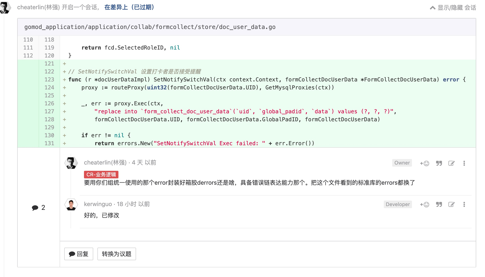

### SOLID

SOLID 原则，是由以下几个原则的集合体:

- SRP: 单一职责原则
- OCP: 开闭原则
- LSP: 里氏替换原则
- ISP: 接口隔离原则
- DIP: 依赖反转原则

这些年来，这几个设计原则在很多不同的出版物里都有过详细描述。它们太出名了，我这里就不更多地做详解了。
我这里想说的是，这 5 个原则环环相扣，前 4 个原则，要么就是同时做到，要么就是都没做到，很少有说，做到其中一点其他三点都不满足。ISP 就是做到 LSP 的常用手段。ISP 也是做到 DIP 的基础。只是，它刚被提出来的时候，是主要针对'设计继承树'这个目的的。现在，它们已经被更广泛地使用在模块、领域、组件这种更大的概念上。
SOLI 都显而易见，DIP 原则是最值得注意的一点，我在其他原则里也多次提到了它。如果你还不清楚什么是 DIP，一定去看明白。这是工程师最基础、必备的知识点之一了。
要做到 OCP 开闭原则，其实，就是要大家要通过后面讲到的'不要面向需求编程'才能做好。如果你还是面向需求、面向 UI、交互编程，你永远做不到开闭，并且不知道如何才能做到开闭。
如果你对这些原则确实不了解，建议读一读《架构整洁之道》。该书的作者 Bob 大叔，就是第一个提出 SOLID 这个集合体的人(20 世纪 80 年代末，在 USENET 新闻组)。

### 一个函数不要出现多个层级的代码

```go
// IrisFriends 拉取好友
func IrisFriends(ctx iris.Context, app *app.App) {
	var rsp sdc.FriendsRsp
	defer func() {
		var buf bytes.Buffer
		_ = (&jsonpb.Marshaler{EmitDefaults: true}).Marshal(&buf, &rsp)
		_, _ = ctx.Write(buf.Bytes())
	}()
	common.AdjustCookie(ctx)
	if !checkCookie(ctx) {
		return
	}

	// 从cookie中拿到关键的登陆态等有效信息
	var session common.BaseSession
	common.GetBaseSessionFromCookie(ctx, &session)
	// 校验登陆态
	err := common.CheckLoginSig(session, app.ConfigStore.Get().OIDBCmdSetting.PTLogin)
	if err != nil {
		_ = common.ErrorResponse(ctx, errors.PTSigErr, 0, "check login sig error")
		return
	}
	if err = getRelationship(ctx, app.ConfigStore.Get().OIDBCmdSetting, NewAPI(), &rsp); err != nil {
		// TODO:日志
	}
	return
}
```

上面这一段代码，是我随意找的一段代码。逻辑非常清晰，因为除了最上面 defer 写回包的代码，其他部分都是顶层函数组合出来的。阅读代码，我们不会掉到细节里出不来，反而忽略了整个业务流程。同时，我们能明显发现它没写完，以及 common.ErrorResponse 和 defer func 两个地方都写了回包，可能出现发起两次 http 回包。TODO 也会非常显眼。
想象一下，我们没有把细节收归进 checkCookie()、getRelationship()等函数，而是展开在这里，但是总函数行数没有到 80 行，表面上符合规范。但是实际上，阅读代码的同学不再能轻松掌握业务逻辑，而是同时在阅读功能细节和业务流程。阅读代码变成了每个时刻心智负担都很重的事情。
显而易见，单个函数里应该只保留某一个层级(layer)的代码，更细化的细节应该被抽象到下一个 layer 去，成为子函数。

### Unix 哲学基础

《Code Review 我都 CR 些什么》讲解了很多 Unix 的设计哲学。这里不再赘述，仅仅列举一下。大家自行阅读和参悟，并且运用到编码、review 活动中。

- 模块原则: 使用简洁的接口拼合简单的部件
- 清晰原则: 清晰胜于技巧
- 组合原则: 设计时考虑拼接组合
- 分离原则: 策略同机制分离，接口同引擎分离
- 简洁原则: 设计要简洁，复杂度能低则低
- 吝啬原则: 除非确无它法，不要编写庞大的程序
- 透明性原则: 设计要可见，以便审查和调试
- 健壮原则: 健壮源于透明与简洁
- 表示原则: 把知识叠入数据以求逻辑质朴而健壮
- 通俗原则: 接口设计避免标新立异
- 缄默原则: 如果一个程序没什么好说，就保持沉默
- 补救原则: 出现异常时，马上退出并给出足量错误信息
- 经济原则: 宁花机器一分，不花程序员一秒
- 生成原则: 避免手工 hack，尽量编写程序去生成程序
- 优化原则: 雕琢前先得有原型，跑之前先学会走
- 多样原则: 绝不相信所谓"不二法门"的断言
- 扩展原则: 设计着眼未来，未来总比预想快

## 工程师的自我修养

下面，是一些在 review 细节中不能直接使用的原则。更像是一种信念和自我约束。带着这些信念去编写、review 代码，把这些信念在实践中传递下去，将是极有价值的。

### 偏执

对代码细节偏执的观念，是我自己提出的新观点。在当下研发质量不高的腾讯，是很有必要普遍存在的一个观念。
在一个系统不完善、时间安排荒谬、工具可笑、需求不可能实现的世界里，让我们安全行事吧。就像伍迪-艾伦说的:"当所有人都真的在给你找麻烦的时候，偏执就是一个好主意。"
对于一个方案，一个实现，请不要说出"好像这样也可以"。你一定要选出一个更好的做法，并且一直坚持这个做法，并且要求别人也这样做。既然他来让你 review 了，你就要有自己的偏执，你一定要他按照你觉得合适的方式去做。当然，你得有说服得了自己，也说服得了他人的理由。即使，只有一点点。偏执会让你的世界变得简单，你的团队的协作变得简单。特别当你身处一个编码质量低下的团队的时候。你至少能说，我是一个务实的程序员。
[偏执的 case, 这里其实原始代码看起来也不差, 但是我就是要他改得更好](#)
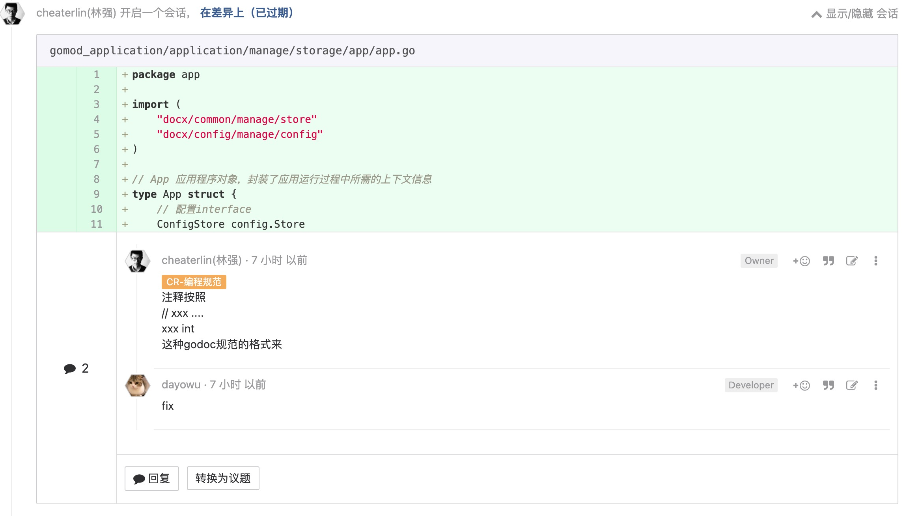

### 控制软件的熵是软件工程的重要任务之一

熵是个物理学概念，大家可能看过诺兰的电影《信条》。简单来说，熵可以理解为'混乱程度'。我们的项目，在刚开始的几千行代码，是很简洁的。但是，为什么到了 100w 行，我们常常就感觉'太复杂了'？比如 QQ 客户端，最近终于在做大面积重构，但是发现无数 crash。其中一个重要原因，就是'混乱程度'太高了。'混乱程度'，理解起来还是比较抽象，它有很多其他名字。'hard code 很多'、'特殊逻辑很多'、'定制化逻辑很多'。再换另一个抽象的说法，'我们面对一类问题，采取了过多的范式和特殊逻辑细节去实现它'。
熵，是一点点堆叠起来的，在一个需求的 2000 行代码更改中，你可能就引入了一个不同的范式，打破了之前的通用范式。在微观来看，你觉得你的代码是'整洁干净'的。就像一个已经穿着好看的红色风衣的人，你隔一天让他接着穿上一条绿色的裤子，这还干净整洁么？熵，在不断增加，我们需要做到以下几点，不然你的团队将在希望通过重构来降低项目的熵的时候尝到恶果，甚至放弃重构，让熵不断增长下去。

- 如果没有充分的理由，始终使用项目规范的范式对每一类问题做出解决方案。
- 如果业务发展发现老的解决方案不再优秀，做整体重构。
- 项目级主干开发，对重构很友好，让重构变得可行。(客户端很容易实现主干开发)。
- 务实地讲，重构已经不可能了。那么，你们可以谨慎地提出新的一整套范式。重建它。
- 禁止 hardcode，特殊逻辑。如果你发现特殊逻辑容易实现需求，否则很难。那么，你的架构已经出现问题了，你和你的团队应该深入思考这个问题，而不是轻易加上一个特殊逻辑。

[case](#)
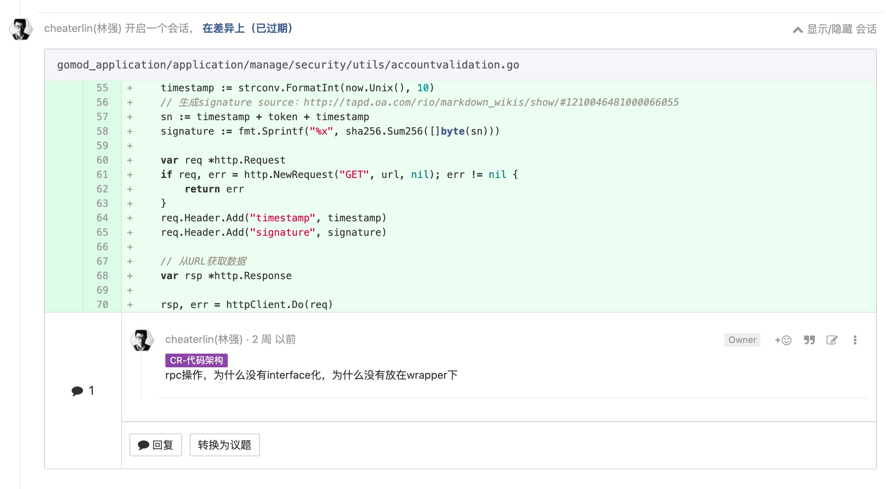
[case](#)
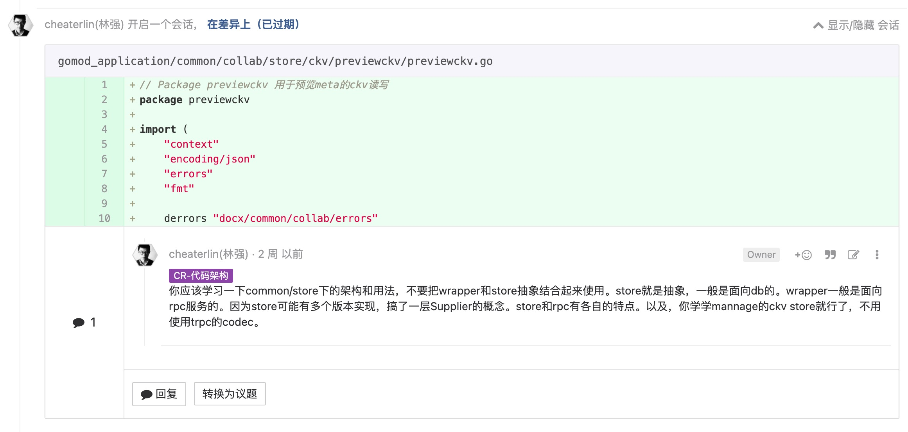

### 为测试做设计

现在我们在做'测试左移'，让工程师编写自动化测试来保证质量。测试工程师的工作更多的是类似 google SET(Software Engineer In Test, 参考《google 软件测试之道》)的工作。工作重心在于测试编码规范、测试编码流程、测试编码工具、测试平台的思考和建设。测试代码，还是得工程师来做。
为方法写一个测试的考虑过程，使我们得以从外部看待这个方法，这让我们看起来是代码的客户，而不是代码的作者。
很多同学，就感觉很难受。对，这是必然的。因为你的代码设计的时候，并没有把'容易测试'考虑进去，可测试性不强。如果工程师在开发逻辑的过程中，就同时思考着这段代码怎样才能轻松地被测试。那么，这段写就的代码，同时可读性、简单性都会得到保障，经过了良好的设计，而不仅仅是'能工作'。
我觉得，测试获得的主要好处发生在你考虑测试及编写测试的时候，而不是在运行测试的时候！在编码的时候同时让思考怎么测试的思维存在，会让编写高质量的代码变得简单，在编码时就更多地考虑边界条件、异常条件，并且妥善处理。仅仅是抱有这个思维，不去真地编写自动化测试，就能让代码的质量上升，代码架构的能力得到提升。
硬件工程出 bug 很难查，bug 造成的成本很高，每次都要重新做一套模具、做模具的工具。所以硬件工程往往有层层测试，极早发现问题，尽量保证简单且质量高。我们可以在软件上做同样的事情。与硬件工程师一样，从一开始就在软件中构建可测试性，并且尝试将每个部分连接在一起之前，对他们进行彻底的测试。
这个时候，有人就说，TDD 就是这样，让你同时思考编码架构和测试架构。我对 TDD 的态度是: 它不一定就是最好的。测试对开发的驱动，绝对有帮助。但是，就像每次驱动汽车一样，除非心里有一个目的地，否则就可能会兜圈子。TDD 是一种自底向上的编程方法。但是，适当的时候使用自顶向下设计，才能获得一个最好的整体架构。很多人处理不好自顶向下和自底向上的关系，结果在使用 TDD 的时候发现举步维艰、收效甚微。
以及，如果没有强大的外部驱动力，"以后再测"实际上意味着"永远不测"。大家，务实一点，在编码时就考虑怎么测试。不然，你永远没有机会考虑了。当面对着测试性低的代码，需要编写自动化测试的时候，你会感觉很难受。

### 尽早测试, 经常测试, 自动测试

一旦代码写出来，就要尽早开始测试。这些小鱼的恶心之处在于，它们很快就会变成巨大的食人鲨，而捕捉鲨鱼则相当困难。所以我们要写单元测试，写很多单元测试。
事实上，好项目的测试代码可能会比产品代码更多。生成这些测试代码所花费的时间是值得的。从长远来看，最终的成本会低得多，而且你实际上有机会生产出几乎没有缺陷的产品。
另外，知道通过了测试，可以让你对代码已经"完成"产生高度信心。

### 项目中使用统一的术语

如果用户和开发者使用不同的名称来称呼相同的事物，或者更糟糕的是，使用相同的名称来代指不同的事物，那么项目就很难取得成功。
DDD(Domain-Driven Design)把'项目中使用统一的术语'做到了极致，要求项目把目标系统分解为不同的领域(也可以称作上下文)。在不同的上下文中，同一个术语名字意义可能不同，但是要项目内统一认识。比如证券这个词，是个多种经济权益凭证的统称，在股票、债券、权证市场，意义和规则是完全不同的。当你第一次听说'涡轮(港股特有金融衍生品，是一种股权)'的时候，是不是瞬间蒙圈，搞不清它和证券的关系了。买'涡轮'是在买什么鬼证劵？
在软件领域是一样的。你需要对股票、债券、权证市场建模，你就得有不同的领域，在每个领域里有一套词汇表(实体、值对象)，在不同的领域之间，同一个概念可能会换一个名字，需要映射。如果你们既不区分领域，甚至在同一个领域还对同一个实体给出不同的名字。那，你们怎么确保自己沟通到位了？写成代码，别人如何知道你现在写的'证券'这个 struct 具体是指的什么？

### 不要面向需求编程

需求不是架构；需求无关设计，也非用户界面；需求就是需要的东西。需要的东西是经常变化的，是不断被探索，不断被加深认识的。产品经理的说辞是经常变化的。当你面向需求编程，你就是在依赖一个认识每一秒都在改变的女/男朋友。你将身心俱疲。
我们应该面向业务模型编程。我在《Code Review 我都 CR 些什么》里也提到了这一点，但是我当时并没有给出应该怎么去设计业务模型的指导。我的潜台词就是，你还是仅仅能凭借自己的智力和经验，没有很多方法论工具。
现在，我给你推荐一个工具，DDD(Domain-Driven Design)，面向领域驱动设计。它能让你对业务更好地建模，让对业务建模变成一个可拆解的执行步骤，仅仅需要少得多的智力和经验。区分好领域上下文，思考明白它们之间的关系，找到领域下的实体和值对象，找到和模型贴合的架构方案。这些任务，让业务建模变得简单。
当我们面向业务模型编程，变更的需求就变成了--提供给用户他所需要的业务模型的不同部分。我们不再是在不断地 change 代码，而是在不断地 extend 代码，逐渐做完一个业务模型的填空题。

### 写代码要有对于'美'的追求

google 的很多同学说(至少 hankzheng 这么说)，软件工程=科学+艺术。当前腾讯，很多人，不讲科学。工程学，计算机科学，都不管。就喜欢搞'巧合式编程'。刚好能工作了，打完收工，交付需求。绝大多数人，根本不追求编码、设计的艺术。对细节的好看，毫无感觉。对于一个空格、空行的使用，毫无逻辑，毫无美感。用代码和其他人沟通，连基本的整洁、合理都不讲。根本没想过，别人会看我的代码，我要给代码'梳妆打扮'一下，整洁大方，美丽动人，还极有内涵。'窈窕淑女，君子好逑'，我们应该对别人慷慨一点，你总是得阅读别人的代码的。大家都对美有一点追求，就是互相都慷慨一些。
很无奈，我把对美的追求说得这么'卑微'。必须要由'务实的需要'来构建必要性。而不是每个工程师发自内心的，像对待漂亮的异性、好的音乐、好的电影一样的发自内心的需要它。认为代码也是取悦别人、取悦自己的东西。
如果我们想做一个有尊严、有格调的工程师，我们就应该把自己的代码、劳动的产物，当成一件艺术品去雕琢。务实地追求效率，同时也追求美感。效率产出价值，美感取悦自己。不仅仅是为了一口饭，同时也把工程师的工作当成自己一个快乐的源头。工作不再是 overhead，而是 happiness。此刻，你做不到，但是应该有这样的追求。当我们都有了这样的追求，有一天，我们会能像 google 一样做到的 。

[换行](#)
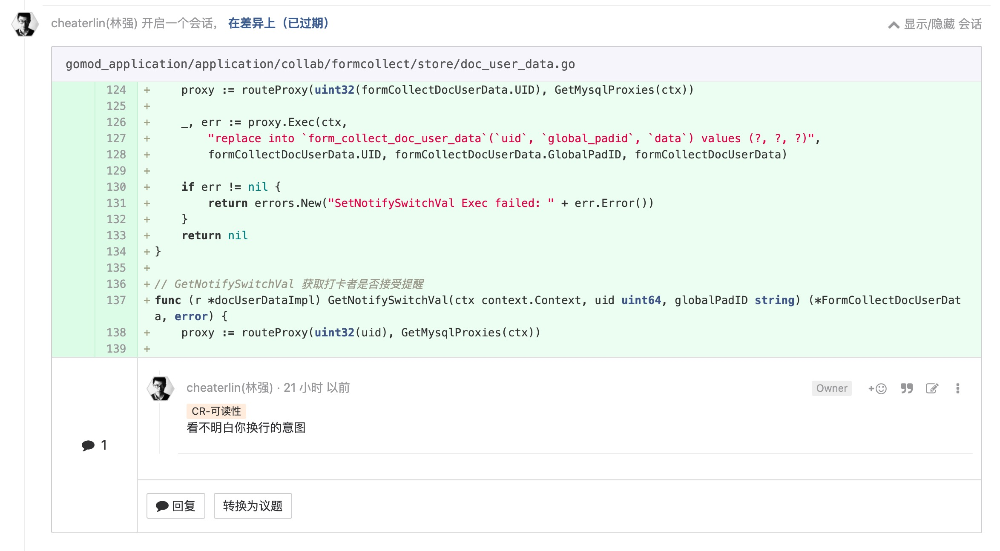

[换行](#)
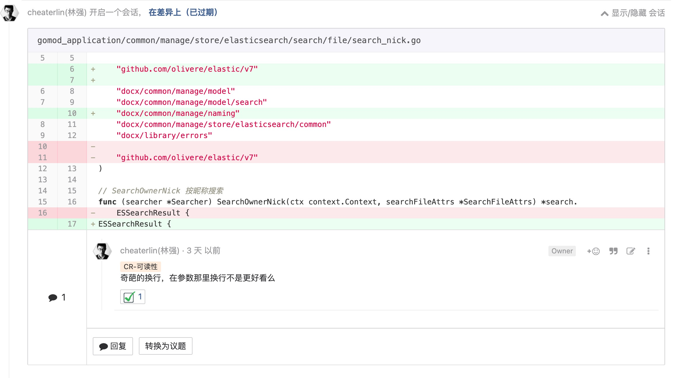

[换行](#)


### 应用程序框架是实现细节

以下是《整洁架构之道》的原文摘抄:

```
我们与框架作者之间的关系是非常不对等的。我们要采用某个框架就意味着自己要遵守一大堆约定，但框架作者却完全不需要为我们遵守什么约定。
请仔细想想这一关系，当我们决定采用一个框架时，就需要完整地阅读框架作者提供的文档。在这个文档中，框架作者和框架其他用户对我们提出进行应用整合的一些建议。一般来说，这些建议就是在要求我们围绕着框架来设计自己的优秀的系统架构。譬如，框架作者会建议我们基于框架中的基类来创建一些派生类，并在业务对象中引入一些框架的工具。框架作者还会不停地催促我们将应用与框架结合得越紧密越好。
对框架作者来说，应用程序与自己的框架耦合是没有风险的。毕竟作为作者，他们对框架有着绝对的控制权，强耦合是应该的。
与此同时，作者当然是非常希望我们的应用与其框架紧密结合的，因为这意味着脱离框架会很困难。作为框架作者来说，没有什么比让一堆用户心甘情愿地基于他的框架基类来构建派生类更自豪的事情了。
换句话说，框架作者想让我们与框架订终身--这相当于我们要对他们的框架做一个巨大而长期的承诺，而在任何情况下框架作者都不会对我们做出同样的承诺。这种婚姻是单向的。我们要承担所有的风险，而框架作者则没有任何风险。

解决方案是：请不要嫁给框架！
我们可以使用框架--但要时刻警惕，别被它拖住。我们应该将框架作为架构最外圈的一个实现细节来使用，不要让它进入内圈。
如果框架要求我们根据它们的基类来创建派生类，就请不要这样做！我们可以创造一些代理类，同时把这些代理类当作业务逻辑的插件来管理。
另外，不要让框架污染我们的核心代码，应该依据依赖关系原则(DIP)，将它们当作核心代码的插件来管理。
以Spring为例，它作为一个依赖注入框架是不错的。也许我们会需要用Spring来自动连接应用程序中的各种依赖关系。这不要紧，但是千万别在业务对象里到处写@autowired注释。业务对象应该对Spring完全不知情才对。
反之，我们也可以利用Spring将依赖关系注入到Main组件中，毕竟Main组件作为系统架构中最低层、依赖最多的组件，它依赖于Spring并不是问题。
```

对，DIP 大发神威。我觉得核心做法就是:

- 核心代码应该通过 DIP 来让它不要和具体框架绑定！它应该使用 DIP(比如代理类)，抽象出一个防腐层，让自己的核心代码免于腐坏。
- 选择一个框架，你不去做防腐层(主要通过 DIP)，你就是单方面领了结婚证，你只有义务，没有权利。同学们要想明白。同学们应该对框架本身是否优秀，是否足够组件化，它本身能否在项目里做到可插拔，做出思考和设计。

trpc-go 对于插件化这事儿，做得还不错，大家会积极地使用它。trpc-cpp 离插件化非常远，它自己根本就成不了一个插件，而是有一种要强暴你的感觉，你能凭直觉明显地感觉到不愿意和它订终身。例如，trpc-cpp 甚至强暴了你构建、编译项目的方式。当然，这很多时候是 c++语言本身的问题。
‘解耦’、'插件化’就是 golang 语言的关键词。大家开玩笑说，c++已经被委员会玩坏了，加入了太多特性。less is more, more means nothing。c++从来都是让别的工具来解决自己的问题，trpc-cpp 可能把自己松绑定到 bazel 等优秀的构建方案。寻求优秀的组件去软绑定，提供解决方案，是可行的出路。我个人喜欢 rust。但是大家还是熟悉 cpp，我们确实需要一个投入更多人力做得更好的 trpc-cpp。

### 一切都应该是代码(通过代码去显式组合)

Unix 编程哲学告诉我们: 如果有一些参数是可变的，我们应该使用配置，而不是把参数写死在代码里。在腾讯，这一点做得很好。但是，大人，现在时代又变了。
J2EE 框架让我们看到，组件也可以是通过配置 Java Bean 的形式注入到框架里的。J2EE 实现了把组件也配置化的壮举。
但是，时代变了！你下载一个 golang 编译器，你进入你下载的文件里去看，会发现你找不到任何配置文件。这是为什么？
两个简单，但是很多年都被人们忽略的道理:

- 配置即隐性耦合。配置只有和使用配置的代码组合使用，它才能完成它的工作。它是通过把'一个事情分开两个步骤'来换取动态性。换句话说，它让两个相隔十万八千里的地方产生了耦合！作为工程师，你一开始就要理解双倍的复杂度。配置如何使用、配置的处理程序会如何解读配置。
- 代码能够有很强的自解释能力，工程师们更愿意阅读可读性强的代码，而不是编写得很烂的配置文档。配置只能通过厚重的配置说明书去解释。当你缺乏完备的配置说明书，配置变成了地狱。

golang 的编译器是怎么做的呢？它会在代码里给你设定一个通用性较强的默认配置项。同时，配置项都是集中管理的，就像管理配置文件一样。你可以通过额外配置一个配置文件或者命令行参数，来改变编译器的行为。这就变成了，代码解释了每一个配置项是用来做什么的。只有当你需要的时候，你会先看懂代码，然后，当你有需求的时候，通过额外的配置去改变一个你有预期的行为。
逻辑变成了。一开始，所有事情都是解耦的。一件事情都只看一块代码就能明白。代码有较好的自解释性和注解，不再需要费劲地编写撇脚的文档。当你明白之后，你需要不一样的行为，就通过额外的配置来实现。关于怎么配置，代码里也讲明白了。
对于 trpc-go 框架，以及一众插件，优先考虑配置，然后才是代码去指定，部分功能还只能通过配置去指定，我就很难受。我接受它，就得把一个事情放在两个地方去完成:

- 需要在代码里 import 插件包。
- 需要在配置文件里配置插件参数。

既然不能消灭第一步，为什么不能是显式 import，同时通过代码+其他自定义配置管理方案去完成插件的配置？当然，插件，直接不需要任何配置，提供代码 Option 去改变插件的行为，是最香的。这个时候，我就真的能把 trpc 框架本身也当成一个插件来使用了。

### 封装不一定是好的组织形式

封装(Encapsulation)，是我上学时刚接触 OOP，惊为天人的思想方法。但是，我工作了一些年头了，看过了不知道多少腐烂的代码。其中一部分还需要我来维护。我看到了很多莫名其妙的封装，让我难受至极。封装，经常被滥用。
封装的时候，我们一定要让自己的代码，自己就能解释自己是按照下面的哪一种套路在做封装:

- 按层封装
- 按功能封装
- 按领域封装
- 按组件封装

或者，其他能被命名到某种有价值的类型的封装。你要能说出为什么你的封装是必要的，有价值的。必要的时候，你必须要封装。比如，当你的 golang 函数达到了 80 行，你就应该对逻辑分组，或者把一块过于细节化却功能单一的较长的代码独立到一个函数。同时，你又不能胡乱封装，或者过度封装。是否过度，取决于大家的共识，要 reviwer 能认可你这个封装是有价值的。当然，你也会成为 reviewer，别人也需要获得你的认可。缺乏意图设计的封装，是破坏性的。这会使其他人在面对这段代码时，畏首畏尾，不敢修改它。形成一个腐烂的肉块，并且，这种腐烂会逐渐蔓延开来。
所以，所有细节都是关键的。每一块砖头都被精心设计，才能构建一个漂亮的项目！

### 所有细节都应该被显式处理

这是一个显而易见的道理。但是很多同学却毫无知觉。我为需要深入阅读他们编写的代码的同学默哀一秒。当有一个函数 func F() error，我仅仅是用 F()，没有用变量接收它的返回值。你阅读代码的时候，你就会想，第一开发者是忘记了 error handling 了，还是他思考过了，他决定不关注这个返回值？他是设计如此，还是这里是个 bug？他人即地狱，维护代码的苦难又多了一分。
我们对于自己的代码可能会给别人带来困扰的地方，都应该显式地去处理。就像写了一篇不会有歧义的文章。如果就是想要忽略错误，'_ = F()'搞定。我将来再处理错误逻辑，'_ = F() // TODO 这里需要更好地处理错误'。在代码里，把事情讲明白，所有人都能快速理解他人的代码，就能快速做出修改的决策。'猜测他人代码的逻辑用意'是很难受且困难的，他人的代码也会在这种场景下，产生被误读。
[case](#)
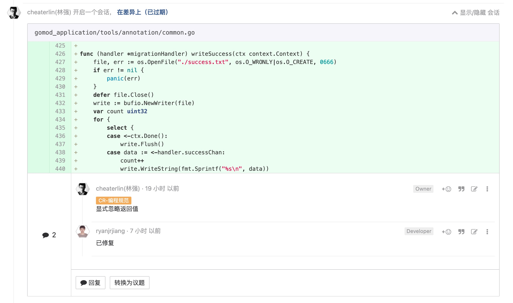

## 不能上升到原则的一些常见案例

### 合理注释一些并不'通俗'的逻辑和数值

和'所有细节都应该被显式处理'一脉相承。所有他人可能要花较多时间猜测原因的细节，都应该在代码里提前清楚地讲明白。请慷慨一点。也可能，三个月后的将来，是你回来 eat your own dog food。
[case](#)
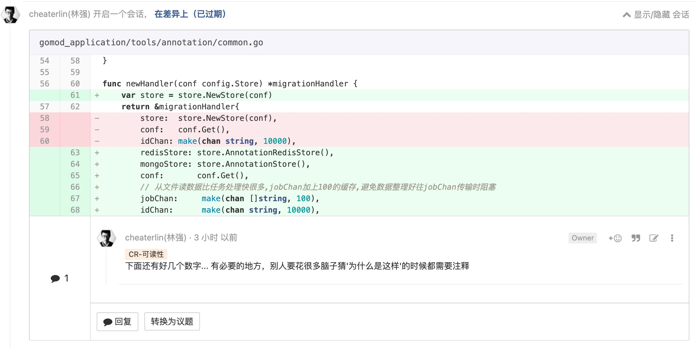

### 习惯留下 TODO

要这么做的道理很简单。便于所有人能接着你开发。极有可能就是你自己接着自己开发。如果没有标注 TODO 把没有做完的事情标示出来。可能，你自己都会搞忘自己有事儿没做完了。留下 TODO 是很简单的事情，我们为什么不做呢？
[case](#)


### 不要丢弃错误信息

即'错误传递原则'。这里给它换个名字--你不应该主动把很多有用的信息给丢弃了。
[case](#)
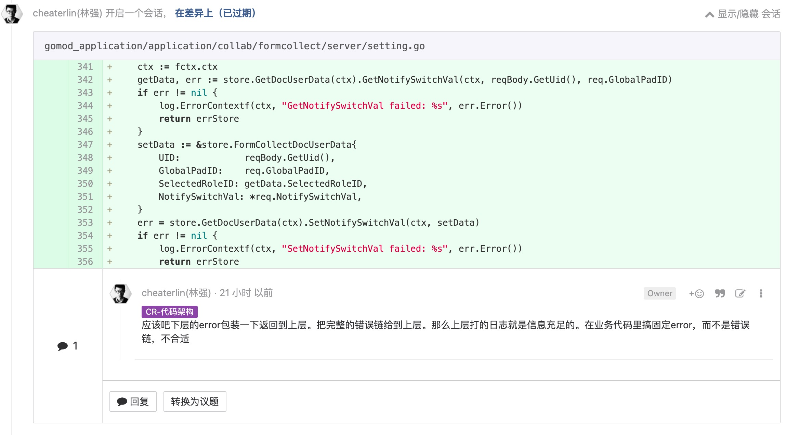

### 自动化测试要快

在 google，自动化测试是硬性要求在限定时间内跑完的。这从细节上保障了自动化测试的速度，进而保障了自动化测试的价值和可用性。你真的需要 sleep 这么久？应该认真考量。考量清楚了把原因写下来。当大家发现总时长太长的时候，可以选择其中最不必要的部分做优化。
[case](#)
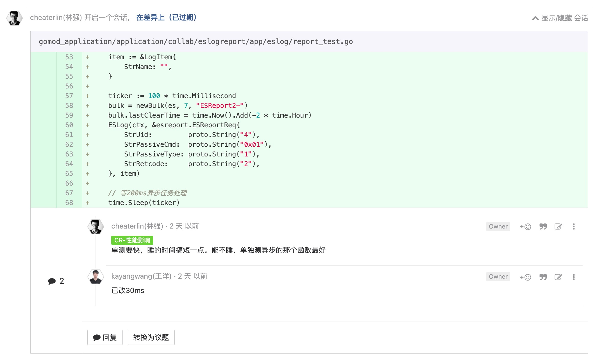

### 历史有问题的代码, 发现了问题要及时 push 相关人主动解决

这是'控制软件的熵是软件工程的重要任务之一'的表现之一。我们是团队作战，不是无组织无记录的部队。发现了问题，就及时抛出和解决。让伤痛更少，跑得更快。
[case](#)
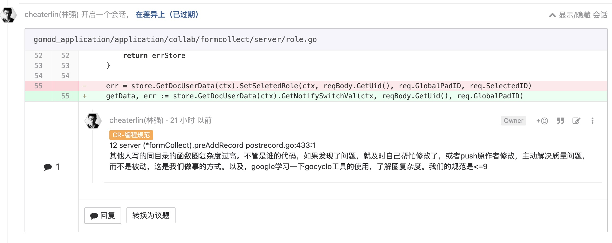

### less is more

less is more. 《Code Review 我都 CR 些什么》强调过了，这里不再强调。
[less is more](#)


### 如果打了错误日志, 有效信息必须充足, 且不过多

和'less is more'一脉相承。同时，必须有的时候，就得有，不能漏。
[日志](#)
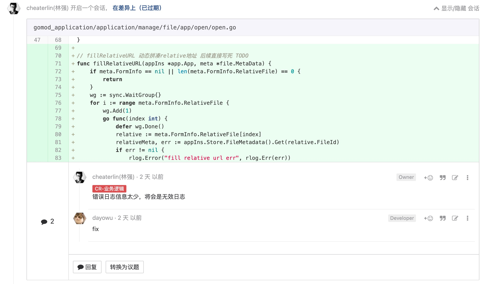

### 注释要把问题讲清楚, 讲不清楚的日志等于没有

是个简单的道理，和'所有细节都应该被显式处理'一脉相承。
[日志](#)
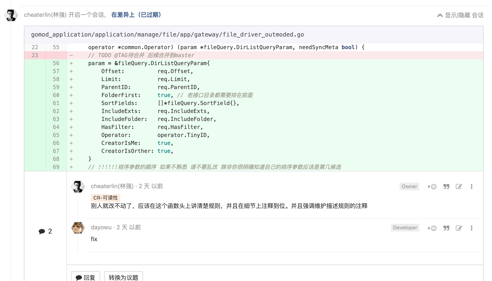

### MR 要自己先 review, 不要浪费 reviewer 的时间

你也会成为 reviewer，节省他人的时间，他人也节省你的时间。缩短交互次数，提升 review 的愉悦感。让他人提的 comment 都是'言之有物'的东西，而不是一些反反复复的最基础的细节。会让他人更愉悦，自己在看 comment 的时候，也更愉悦，更愿意去讨论、沟通。让 code review 成为一个技术交流的平台。
[时间](#)
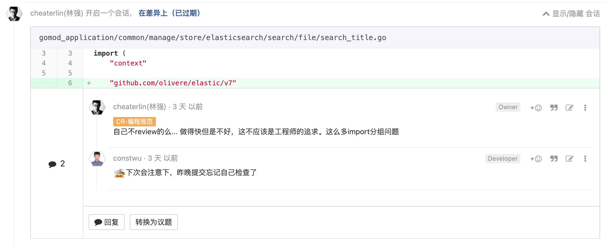

### 要寻找合适的定语

这个显而易见。但是，同学们就是爱放纵自己？
[定语](#)
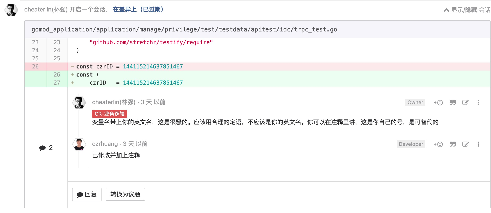

### 不要出现特定 IP,或者把什么可变的东西写死

这个和'ETC'一脉相承，我觉得也是显而易见的东西。但是很多同学还是喜欢放纵自己？
[写死](#)
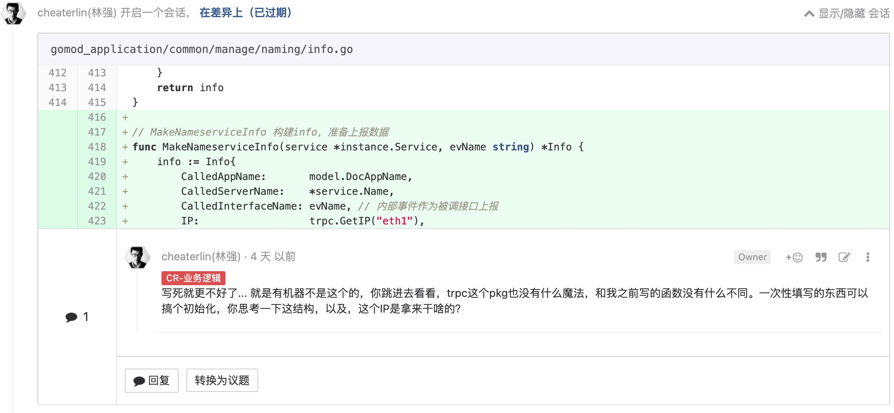

### 使用定语, 不要 1、2、3、4

这个存粹就是放纵自己了。当然，也会有只能用 1、2、3、4 的时候。但是，你这里，是么？多数时候，都不会是。
[数字](#)


### 有必要才使用 init

这，也显而易见。init 很方便，但是，它也会带来心智负担。
[init](#)
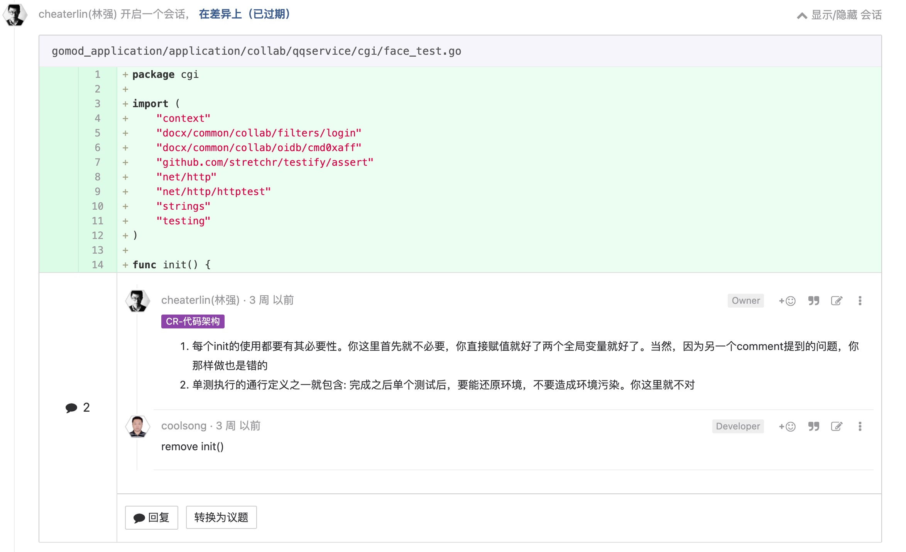

### 要关注 shadow write

这个很重要，看例子就知道了。但是大家常常忽略，特此提一下。
[shadow](#)


### 能不耦合接收器就别耦合

减少耦合是我们保障代码质量的重要手段。请把 ETC 原则放在自己的头上漂浮着，时刻带着它思考，不要懒惰。熟能生巧，它并不会成为心智负担。反而常常会在你做决策的时候帮你快速找到方向，提升决策速度。
[接收器](#)
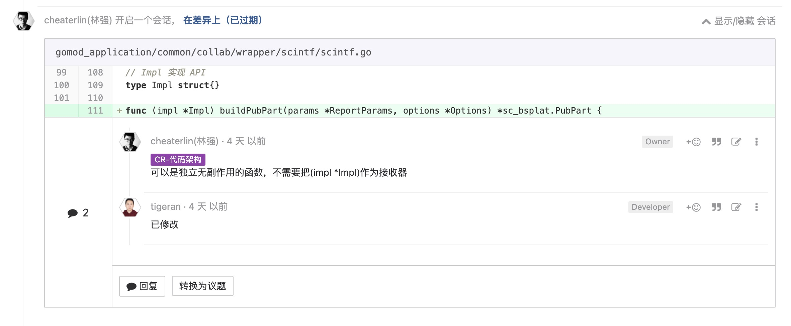

### 空实现需要注明空实现就是实现

这个和'所有细节都应该被显式处理'一脉相承。这个理念，我见过无数种形式表现出来。这里就是其中一种。列举这个 case，让你印象再深刻一点。
[空实现](#)
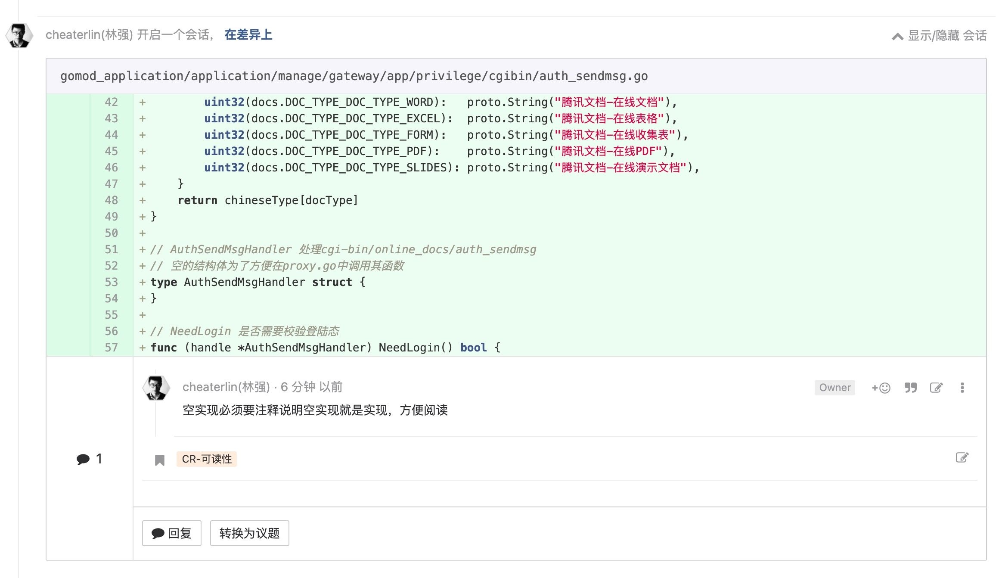

### 看错题集没多少有用, 我们需要教练和传承

上面我列了很多例子。是我能列出来的例子中的九牛一毛。但是，我列一个非常庞大的错题集没有任何用。我也不再例举更多。只有当大家信奉了敏捷工程的美。认可好的代码架构对于业务的价值，才能真正地做到举一反三，理解无数例子，能对更多的 case 自己做出合理的判断。同时，把好的判断传播起来，做到"群体免疫"，最终做好 review，做好代码质量。

## 展望

希望本文能帮助到需要做好 CR、做好编码，需要培养更多 reviwer 的团队。让你门看到很多原则，吸收这些原则和理念。去理解、相信这些理念。在 CR 中把这些理念、原则传播出去。成为别人的临时教练，让大家都成为合格的 reviwer。加强对于代码的交流，飞轮效应，让团队构建好的人才梯度和工程文化。

写到最后，我发现，我上面写的这些东西都不那么重要了。你有想把代码写得更利于团队协作的价值观和态度，反而是最重要的事情。上面讲的都仅仅是写高质量代码的手段和思想方法。当你认可了'应该编写利于团队协作的高质量代码'，并且拥有对'不利于团队代码质量的代码'嫉恶如仇的态度。你总能找到高质量代码的写法。没有我帮你总结，你也总会掌握！

## 拾遗

如果你深入了解 DDD，就会了解到'[六边形架构](https://insights.thoughtworks.cn/from-sandwich-to-hexagon/)'、'[CQRS(Command Query Responsibility Segregation，查询职责分离)架构](https://zhuanlan.zhihu.com/p/38968012)'、'[事件驱动架构](https://developer.ibm.com/zh/technologies/messaging/articles/advantages-of-an-event-driven-architecture/)'等关键词。这是 DDD 构建自己体系的基石，这些架构及是细节又是顶层设计。你也值得了解一下。我这里就不过多地展开了。
