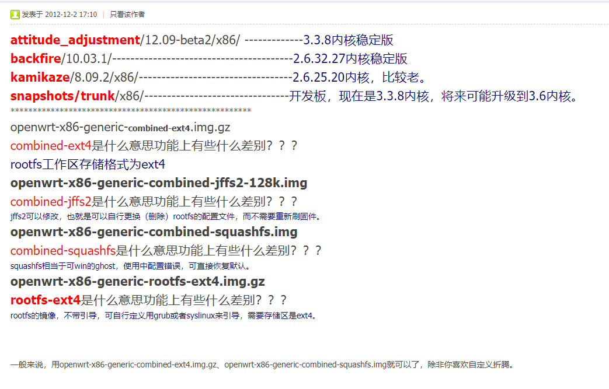

# 固件

https://github.com/haiibo/OpenWrt/tree/X86_64

# 固件命名区别



https://www.cnblogs.com/andyzjb/p/15587004.html

```
openwrt-x86-generic-combined-ext4.img.gz<br>
combined-ext4 是什么意思功能上有些什么差别？？？ rootfs 工作区存储格式为 ext4<br>
openwrt-x86-generic-combined-jffs2-128k.img combined-jffs2 是什么意思功能上有些什么差别？？？ jffs2 可以修改，也就是可以自行更换（删除）rootfs 的配置文件，而不需要重新刷固件。 openwrt-x86-generic-combined-squashfs.img<br>
combined-squashfs 是什么意思功能上有些什么差别？？？ squashfs 相当于可 win 的 ghost，使用中配置错误，可直接恢复默认。 openwrt-x86-generic-rootfs-ext4.img.gz<br>
rootfs-ext4 是什么意思功能上有些什么差别？？？ rootfs 的镜像，不带引导，可自行定义用 grub 或者 syslinux 来引导，需要存储区是 ext4。

combined-ext4.img.gz（rootfs 工作区存储格式为 ext4。）
combined-squashfs.img.gz（squashfs 相当于可以恢复出厂设置的固件，如果使用中配置错误，可直接恢复默认设置。）
generic-rootfs.tar.gz（rootfs 的镜像，不带引导，可自行定义用 grub 或者 syslinux 来引导。）
rootfs-ext4.img.gz（rootfs 的镜像，不带引导，可自行定义用 grub 或者 syslinux 来引导，需要存储区是 ext4。）
rootfs-squashfs.img.gz（rootfs 的镜像，不带引导，可自行定义用 grub 或者 syslinux 来引导，如果使用中配置错误，可直接恢复默认设置。）
```

```
build.config
332 KB
1 hour ago
config.buildinfo
25.4 KB
1 hour ago
mini-openwrt-x86-64-generic-rootfs.tar.gz
189 MB
4 hours ago
mini-openwrt-x86-64-generic-squashfs-combined-efi.img.gz
149 MB
4 hours ago
mini-openwrt-x86-64-generic-squashfs-combined.img.gz
149 MB
4 hours ago
openwrt-imagebuilder-x86-64.Linux-x86_64.tar.xz
448 MB
1 hour ago
openwrt-x86-64-generic-kernel.bin
5.06 MB
1 hour ago
openwrt-x86-64-generic-rootfs.tar.gz
431 MB
1 hour ago
openwrt-x86-64-generic-squashfs-combined-efi.img.gz
333 MB
1 hour ago
openwrt-x86-64-generic-squashfs-combined.img.gz
333 MB
1 hour ago
openwrt-x86-64-generic-squashfs-rootfs.img.gz
328 MB
1 hour ago
openwrt-x86-64-generic.manifest
28.8 KB
1 hour ago
Packages.tar.gz
408 MB
1 hour ago
profiles.json
3.01 KB
1 hour ago
sha256sums
922 Bytes
1 hour ago
Source code
(zip)
Aug 22, 2022
Source code
(tar.gz)
Aug 22, 2022
```

```
127.0.0.1 ad.mi.com
127.0.0.1 ad.xiaomi.com
127.0.0.1 ad1.xiaomi.com
127.0.0.1 tat.pandora.xiaomi.com
127.0.0.1 api.ad.xiaomi.com
127.0.0.1 t7z.cupid.ptqy.gitv.tv
127.0.0.1 ad.xiaomi.com
127.0.0.1 api.ad.xiaomi.com
127.0.0.1 sdkconfig.ad.xiaomi.com
127.0.0.1 stat.pandora.xiaomi.com
127.0.0.1 upgrade.mishop.pandora.xiaomi.com
127.0.0.1 logonext.tv.kuyun.com
127.0.0.1 config.kuyun.com
127.0.0.1 mishop.pandora.xiaomi.com
127.0.0.1 dvb.pandora.xiaomi.com
127.0.0.1 api.ad.xiaomi.com
127.0.0.1 de.pandora.xiaomi.com
127.0.0.1 data.mistat.xiaomi.com
127.0.0.1 jellyfish.pandora.xiaomi.com
127.0.0.1 gallery.pandora.xiaomi.com
127.0.0.1 bss.pandora.xiaomi.com
127.0.0.1 gvod.aiseejapp.atianqi.com
127.0.0.1 sdkauth.hpplay.cn
127.0.0.1 adeng.hpplay.cn
127.0.0.1 ad.hpplay.cn
127.0.0.1 conf.hpplay.cn
127.0.0.1 fix.hpplay.cn
127.0.0.1 adcdn.hpplay.cn
127.0.0.1 sl.hpplay.cn
127.0.0.1 rp.hpplay.cn
127.0.0.1 h5.hpplay.com.cn
127.0.0.1 hpplay.cdn.cibn.cc
127.0.0.1 sdkauth.hpplay.cn
127.0.0.1 imdns.hpplay.cn
127.0.0.1 vipauth.hpplay.cn
127.0.0.1 rp.hpplay.cn
127.0.0.1 sl.hpplay.cn
127.0.0.1 519332DA.rtc.youme.im
127.0.0.1 hotupgrade.hpplay
127.0.0.1 pin.hpplay.cn
127.0.0.1 tvapp.hpplay.cn
127.0.0.1 hpplay.cdn.cibn.cc
127.0.0.1 image.hpplay.cn
127.0.0.1 gslb.hpplay.cn
127.0.0.1 rp.hpplay.cn
127.0.0.1 cdn.hpplay.com.cn
127.0.0.1 h5.hpplay.com.cn
127.0.0.1 adeng.hpplay.cn
127.0.0.1 conf.hpplay.cn
127.0.0.1 adcdn.hpplay.cn
127.0.0.1 g.dtv.cn.miaozhen.com
127.0.0.1 android.bugly.qq.com
127.0.0.1 alog.umeng.com
127.0.0.1 hotupgrade.hpplay.cn
127.0.0.1 pin.hpplay.cn

```
