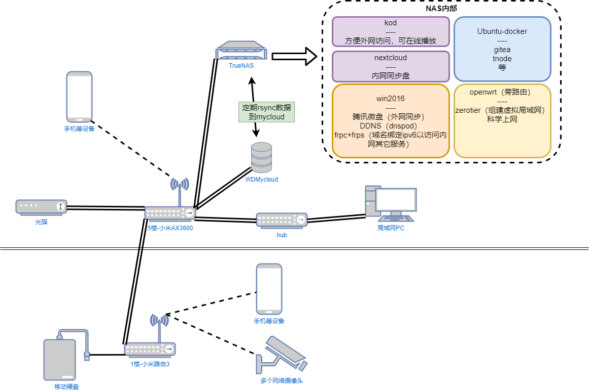
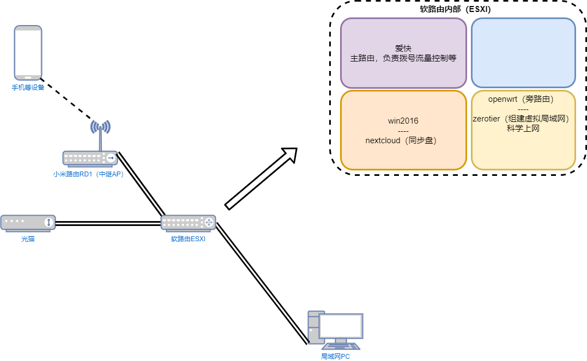

简单介绍家中搭建的网络情况

## 家



## 出租屋



## Windows 静态路由
```shell
# 管理员命令提示符
route -p add 192.168.30.0 mask 255.255.255.0 192.168.50.1
route -p add 192.168.192.0 mask 255.255.255.0 192.168.50.1
# 查看路由表
route print
```