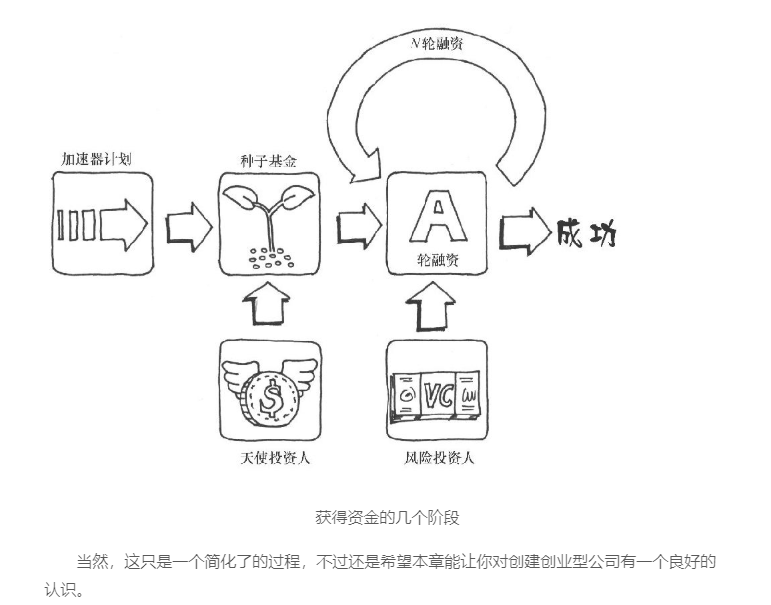

### 第1章　为何这本书与你先前读过的任何书籍都迥然不同

因为成为一个优秀的软件开发人员，不应该只有代码。

## 第一篇：职业

### 第2章　从非同凡响开始：绝不要做他人都在做的事

转变工作心态，公司只是其中一个客户，想清楚自己能提供什么样的服务。

### 第3章　思考未来：你的目标是什么

[计划](https://wiki.goframe.org/pages/viewpage.action?pageId=7302528)

### 第4章　人际交往能力：远比你想象的重要

每个人都有自己的中心，尝试进到别人的中心思考；既要避免争吵，也要远离泥潭。

### 第5章　破解面试之道

刷存在感，建立声望，从敌人内部突破（内推）。当然这一切都要在技术达标的基础上进行，在相同的硬实力下，软实力会成为加分项，主观能动性也是加分项。

### 第6章　就业选择：列出你的选择

雇员

### 第7章　你是哪类软件开发人员

专业：后端开发，主要是web api，
其它广泛：前端开发、NAS、嵌入式，还有很多零散知识网络、硬件、电脑安装、电脑系统重装、手机刷机
TODO：自我认识，专业选择

### 第8章　公司与公司是不一样的

|公司规模 |优点 |缺点 |
|:--|
|小公司 |承担多种职责，灵活的角色转换 对工作的影响较大 回报潜力大 |没法安静地坐下来写代码 工作在众目睽睽之下 稳定性差 |
|中等规模公司 |工作稳定 加班较少 |变化很慢低下 没有机会使用前沿技术 |
|大公司 |完备的流程和规范 培训机会多 大型有影响力的项目 |充斥着官僚主义作风 可能只负责代码库的一小部分 很难获得关注 |

希望的环境：富有挑战性，并有人能并肩前进。

### 第9章　攀登晋升阶梯

- 承担责任，别人都不肯接手的东西会是一个机会
- 引人注目，勤总结，让别人知道你在做什么
- 保持学习，并分享
- 解决问题，而不只是提出问题
- 没有机会，离开是更好的选择

### 第10章　成为专业人士

把专业当成一种习惯，习惯是不容易增减的。
保持专业底线，否则越来越没有底线。
要为专业说不，而不是不断妥协。

### 第11章　赢得自由——如何辞职

已读，以后复读

### 第12章　成为自由职业者：开启自己的一片天地

最好的情形是工作任务已经提前安排妥当，或者处于工作太多不得不推掉一些的状态。
“吸引式营销”基本上就是让潜在的客户主动送上门，而不是你去找他们。你要做的事情就是免费提供有价值的东西。
表12-1 全职雇员与自由职业者对比

|全职雇员的薪酬 |自由职业者的薪酬 |
|:--|
|每小时50美元 －无 |每小时100美元 － 自主就业税 － 办公设备 － 会计或者记账员 － 非计费时间 |
|实际收入=每小时50美元 |实际收入=每小时50美元 |

### 第13章　创建你的第一个产品

通常的误区，做一个产品再找用户。
更好的方法是，针对特定用户的需求开发产品。
测试市场，讲解产品，之后看是否有人原因为此提前买单（可随时退款）。

### 第14章　你打算开始创业吗

- 外部投资创业
- 自力更生创业

无论你的整体退出策略是什么，了解这一点非常重要——获得外部投资的创业公司通常都抱有希望未来有一天可以获得巨额回报的目的。所以，如果你为人保守，你并不适合创立这类公司。创业型公司通常就是为了等待“全垒打[1]**”的机会。

### 第15章　远程工作的生存策略

- 时间管理，规划时间工作，并在该时间内保持专注，而不是认为自己可以利用零散时间
- 自我激励，培养工作习惯，并远离所有诱惑，不要相信自己能抵御诱惑，尝试15分钟专注模式
- 孤独感，如果你不喜欢孤独感，走出去，与他人交流，能避免疯掉

### 第16章　假装自己能成功

遇到困难时，相信自己有能力解决，即使当前不具备解决的能力，但慢慢地肯定能解决。注意不是不懂装懂！
想想曾经遇到的困难，最终也是一一被解决

### 第17章　单调乏味的简历——如何修改

- A：专业的事情，交给专业的人（还必须熟悉你的行业的人）去做，提供足够的资料展现自己。
- B：自己写，看下方提示

改善简历的提示

|提示 |好处 |
|:--|
|把简历放到网上 |确保雇主能够很容易访问你的简历。如果你申请Web开发的职位，这一点尤其重要 |
|简历要有创意 |简历样式不落俗套，别人一眼扫过去就会被深深吸引 |
|使用“行动-结果”的描述 |你的简历应该展现你都做了哪些工作及相应的结果。这样你的潜在雇主既能了解你会干什么，还能了解你能取得的成果，以及雇用你会给他们带来的收益 |
|校对 |即使是聘请专业的简历写手，你也要通篇校对。简历里有错别字或拼写错误会让人觉得你粗心大意 |

### 第18章　请勿陷入对技术的狂热之中

技术具有时间局限性，没有最好只有更好。
保持对技术的开放心态，不要轻视。

## 第二篇：自我营销

重新理解营销
营销追求的是“实现价值在先，要求回报在后”。

### 第19章　针对“码农”的营销基础课

|方式 |描述 |
|:--|
|博客 播客 视频 给杂志投稿 书籍 代码营 技术会议 |你自己的博客，以及你在别人的博客上发表的特邀文章 创建自己的播客频道，同时接受其他播客频道的访谈 在YouTube这样的视频网站上上传自己的分享内容和课程主题视频 给软件开发相关的杂志写文章 著书或者自出版 大多数代码营都允许参加者自由发言 拓展社交网络的好方法，如果能在研讨会上发言尤佳 |

### 第20章　打造引人注目的品牌

品牌是对产品或服务的一整套预期。商标仅仅是品牌的视觉符号而已。
“电梯内销售概要”是指用两到三句话概括一个产品、一个提案或一个项目，向潜在的买家或赞助人做介绍。

### 第21章　创建大获成功的博客

即使不看其它优点，有一点也很重要，写博客能提升表达能力。
写博客的效果在于频率高低，在于是否能够持之以恒，以较好的质量输出。
内容，有价值的内容。
不要太担心你的文笔如何，不要太在意别人的想法。
创建一个流动的博客文章主题列表。每当有新想法，就把它添加到这个列表中。在需要写新博文的时候，文章主题就能够信手拈来。

### 第22章　你的主要目标：为他人增加价值

>**不要努力成为一个成功的人，而要努力成为一个有价值的人。**
——阿尔伯特·爱因斯坦

#### 把你工作成果的90%都做成免费的

帮助别人越多，面对的问题和情况越多，就能结交的人也越多。总是帮助他人解决问题的人，在解决他们自己的问题的时候会是更加轻松自如，而当他们真遇到障碍的时候，总是会有好多人伸出援手。

### 第23章　善于运用社交媒体

|方式 |内容 |
|:--|
|博客文章 |转帖一些博客文章，或者自己的博客 |
|新闻报道 |转载一些有趣的文章，尽量与你的细分领域有关，或者与软件开发相关 |
|励志名言 |名人名言，特别是鼓舞人心、非常流行的名言警句 |
|技巧、小窍门 |任何你所了解的特殊技巧或者知识，别人会很欣赏 |
|幽默故事 |发一点儿幽默故事挺不错的，但是一定要确保确实好笑，另外千万别冒犯别人 |
|吸引人的问题 |这是一个很棒的吸引你的听众并和他们互动的方法 |
|自己的一些推广活动 |别太多，并且跟其他内容混合在一起 |

### 第24章　演讲、报告和培训：做“说话的极客”

先从小群体开始，循序渐进。
你要记住，作为人类，我们拥有良好的适应能力。只要你把一件事情重复足够多次，你自然就会接纳它。伞兵们第一次跳出机舱的时候都很害怕，但是经过多次成功跳伞之后，恐惧最终都会消失。如果你一直坚持在公共场合发表演说，你一定会应对自如，恐惧感终将消散。
TODO

### 第25章　著书立说，吸引追随者

TODO

### 第26章　百折不挠，越挫越勇

人们在第一次时，总会觉得不适，但次数多了，就会适应，人的适应能力是很强的。
在我的职业生涯中，我一共错失了9 000多次投篮，输掉了近300场比赛。我本来有26次绝杀的机会却投球不进。我失败了一次又一次。这就是我能够成功的原因。
——迈克尔·乔丹

## 第三篇：学习

**教育就是当一个人把在学校所学全部忘光之后剩下的东西。**
——阿尔伯特•爱因斯坦

### 第27章　学习怎样学习：如何自我教育

纸上得来终觉浅,绝知此事要躬行
捷径：学习，实践，教育。

### 第28章　我的“十步学习法”

用20%内容，达80%效果

### 第29章　第 1 步到第 6 步：这些步骤只做一次

#### 第1步：了解全局

搞清楚，学的是什么，有什么，整体的轮廓。

#### 第2步：确定范围

选择一个范围，一个你能掌握的范围，需要具体的。还要考虑使用的时间，需要与时间匹配。

#### 第3步：定义目标

一个检验学习效果的目标，这个目标是具体的，标准的，能判断的。

#### 第4步：寻找资源

通过各种途径，找到学习所需的资源。尽可能多，而不是单一的，可以避免产生偏见。

#### 第5步：创建学习计划

学习路径（大纲），可参考书籍目录（多种对比）。

#### 第6步：筛选资源

过滤出比较有用的资源，可通过评价等进行筛选。

### 第30章　第7步到第10步：循环往复

步骤7到步骤10的目标是通过“学习—实践—掌握—教授”（LDLT）的方式真正领会知识。

#### 第7步：开始学习，浅尝辄止

掌握基本知识即可动手，通读反而使行动过晚。
想象你买了一台游戏机，我想也不会把说明书全看一遍。一般都是遇到问题才看对应章节。

#### 第8步：动手操作，边玩边学

一般学习，人们总会预设条件进行。可以尝试跳出这些既有的路径，自己进行探索，遇到问题，记录问题，解决问题，回过头时，会发现掌握得更多。就像那句，知其然，知其所以然。

#### 第9步：全面掌握，学以致用

解决记录的问题。

#### 第10步：乐为人师，融会贯通

你告诉我的，我都忘了。你教会我的，我都记得。让我乐在其中，我就一定能学会。
——本杰明·富兰克林
尝试将你学会的知识传授给他人，你会发现，其实你并不是完全掌握，直至你把他人教会。

##### 教授知识的途径

- 撰写博客文章
- 创建YouTube视频教程
- 发表演讲
- 与朋友或爱人进行对话探讨
- 在在线论坛上回答问题

#### 最后的思考

上面的步骤不一定时候你，但是关键是步骤背后的理念。

### 第31章　寻找导师：找到你的尤达

##### 寻找导师时的检查单

- 他们做到了我想要去做的？
- 他们曾经帮助他人做到了我想做的？
- 他们现在取得了什么可以展示的成就？
- 你能和这个人和睦相处？他充满智慧吗？

TODO有需要再复读

### 第32章　开山收徒：成为尤达一样的大师

我们在生活中都需要别人的帮助以看到自己看不到的东西，因为当遇到涉及自身的问题和麻烦的时候，我们都会有些目光短浅。
你指导的每一个人，就好比是你埋下的种子。种下的种子足够多，终有一粒会长成参天大树，为你遮风挡雨。

##### 做导师的好处

- 帮助他人时的成就感。
- 深入学习和领悟知识的途径。
- 你的徒弟有朝一日会帮到你。
- 自身的成长。帮助别人成长的过程也就是自己成长的过程。

那些因为懒惰不愿意付出而向你寻求帮助的人，不配做你的门徒。

### 第34章　你需要一个学位吗，还是可以对此忽略不计

我不想在这里过分强调学位的重要性，但我希望你能明白，没有学位会限制你的选择。在这个大前提下，我确信，学位并不是成功的必备条件。
在软件开发领域，能力最为重要。与一纸学历证明相比，如果你能写好代码，能解决问题，能证明自己有此能力，你就能走得更远。
自学的时候，注意知识体系，避免产生漏洞。
表34-1 学位的好处和缺点

|学位的好处 |学位的缺点 |
|:--|
|接受有关软件开发方面的全面的系统教育 |花费原本可以赚钱的时间去学习 |
|无需经验就可以入行 |可能会受困于思维定势，难以打破 |
|有更多选择，更容易转到行政或管理岗位 | |

当年选择了一个低一级的学历，那就注定需要更努力。相信时间会证明一切。

如果学历不够，就使用工作经验，作品，代码贡献。

另外，可以选择认证证书。

### 第35章　发现自己的知识短板

我们能发现并消除的知识短板越多，长久来看我们从中受益越多。
有时候，我们并不是不知道自己的短板，只是选择了无视或者掩饰。
但也有的短板是我们自己无法清楚意识到的。

通常，短板会使你的工作效率降低，每次遇到都需要花费时间去重新摸索。这样就会产生很多重复性的劳动。

另一种识别知识短板的方法就是，时刻都要试图了解自己不理解或不清楚的事物。你可以维护一份清单，列出自己需要去研究或者自己不清楚的所有事物，追踪有哪些主题总是不断出现在这个清单上。

剩下就是好好学习，解决短板。

## 第四篇：生产力

做该做的工作

### 第36章　一切始于专注

产量多只表明生产效率高，只有完成正确的工作才会成为高效的人。
就像CPU执行前的上下文切换一样，人脑切换任务也需要进行环境切换。
专注会使思考更加高效。

拿开那些能使你分心的因数

### 第37章　我的私房“生产力提升计划”

TODO
劳逸结合

### 第38章　番茄工作法

TODO

### 第39章　我的“定额工作法”：我是如何做到超额完成工作的

##### 定额工作法的规则

- 挑选一项重复性任务。
- 明确有效时限，在此期间该任务被重复执行。
- 明确在给定的有效时限内该任务应该完成的次数的定额。
- 给自己承诺：一定要达成定额。
- 调整。调高或者调低定额，但是不能在有效时间段之内调整。

### 第40章　对自己负责

如果你想不再依赖别人的影响，获得稳定、可预测的结果，你就要学会对自己负责。
要培养“对自己负责”的精神，首先要让自己的生活井然有序。如果不知道应该做的事情是什么，就不能真正为自己所做的任何事情承担责任。
请别人来监督自己履行责任，完成自己的承诺，并没有坏处。找到责任监督伙伴——理想情况下，最好是跟你有类似目标的人，这样会很有帮助。

### 第41章　要不要多任务并行

多任务导致效率低下的根本原因似乎在于，我们根本没有能力真正去践行多任务并行。
如果你每天都因为有多个任务要完成就深陷多任务并行的泥潭，最好学会如何批量处理这些任务，一次性完成一系列互相关联的任务，而不是将它们拆分完成。
将一项不费脑筋的任务和一项一定程度上需要精神专注才能完成的任务组合起来。

### 第42章　职业倦怠：我已找到解药

作为人类，我们往往会对刚出现的新鲜事物激动不已。但是之后，因为对它们习以为常了，我们要么把这它们看作是理所当然的，要么会心生厌烦。

采取行动

>- 想一想以前都有哪些项目是你付出努力却没有最终完成而半途而废了。是什么原因让你放弃的？你现在对这件事儿有什么感受？
>
- 下次开始新项目的时候，下定决心：你一定会完成，或者完全掌握。设定规则和约束条件，强迫自己穿过那堵不可避免的墙。
- 如果你正面临职业生涯或者个人生活中的一堵墙，试着去穿越它。想想在墙的另一侧会有怎样的收获等着你。想象自己的动机和兴趣终将获得回报。

### 第43章　时间是怎样被浪费掉的

##### 一些常见的时间杀手

- 看电视。
- 社交媒体。
- 新闻网站。
- 不必要的会议。
- 烹饪。
- 玩电子游戏（尤其是网络游戏）。
- 工间喝咖啡休息。

为了享受快乐有意识地做这些事情，就不是浪费时间，只要你是因为喜欢才特意做这些事情，而不是为了逃避自己应该完成的实际工作。

尝试跟踪时间花费

### 第44章　形成惯例的重要性

生产力的真正秘诀在于：长期坚持做一些小事。

地雷：注意不要过于沉迷于惯例

>你应该有自己遵循的惯例，但是也要有一定的灵活性。你可能会打乱一天的日程安排。不要忘记会有像车坏了这种不可预测的事件发生，车坏了可能会打乱你的例行安排。你需要学会从容应对这些事情。

### 第45章　培养习惯：刷新你的代码

**成就我们的恰恰就是那些不断重复做的事情。因此，优秀不是一种行为，而是一种习惯。**
——亚里士多德
然而，奇怪的是，可变化的奖励要比已知的标准奖励更让人着迷。
要找出坏习惯，最好的办法就是设法找到日常生活中令你感到内疚的事情或惯例。什么事情你想停下来却又总是推迟到另一天？
有时候，你甚至会发现，所谓的“奖励”不过是个幻象——一个你期望能够实现却从未兑现的承诺。例如，许多人都有买彩票的习惯，因为他们认为自己会中奖，尽管他们从未中过奖。

### 第46章　分解任务：如何吃掉一头大象

要吃掉一头大象，每次吃一口。
——克雷顿·艾布拉姆斯（Creighton Abrams）
分解任务，使每个任务都有明确的目标。

### 第47章　努力工作的价值，以及为什么你总是逃避努力工作

**赛跑比的是谁耐力更长久，而不是看谁冲刺更有力。**
——约翰·杰克斯，《北与南》（North and South）

### 第48章　任何行动都比不采取行动好

但是，为什么还有那么多人选择不采取行动呢？
我知道，对我来说原因很简单——恐惧。我斗胆猜测你的原因也一样。恐惧出错，恐惧把事情搞砸了，恐惧后果不可估量或失败，恐惧改变，恐惧做不一样的事情。
也许你想学弹吉他，也许你现在工作不开心想找个新工作，也许你的财务状况需要进行大的调整。无论你在逃避什么，无论是什么在困扰着你，都不要拒绝采取行动。当下就是行动的时刻。当下就是决策的时刻。
通常，无所作为就像坐在一辆停着的汽车上转动方向盘。你有转过停着的汽车的方向盘吗？这并不容易。但是，当车子开起来的时候再去转方向盘就容易多了。

## 第五篇：理财

**金钱只是一种工具。它会带你去往任何你想去的地方，但不会取代你成为司机。**
——爱思•然德（Ayn Rand）

### 第49章　怎样支配你的薪水

事实证明，赚钱多并不能让一个人在财务上更精明。
所谓资产，是指实用价值高于维护成本的东西。也就意味着，一样东西如果有资格被定义为“资产”，必须能够带来比自身成本更高的价值。
如果你用自己工作赚来的钱去购买不需要辛苦工作就能够增值的资产，那么你最终只需要做相同或更少的工作就能赚到更多的钱。

### 第50章　怎样进行薪酬谈判

薪资结构包含福利。
不轻易透露自己的预期。
清楚自己的价值。
保持自信，不要傲慢。

### 第51章　期权：所有乐趣之所在

还是很难理解

### 第52章　房地产投资面面观

要考虑的事情太多，需要复读

### 第53章　你真的了解自己的退休计划吗

现在先存钱，再慢慢研究投资。

### 第54章　债务的危害：社保债务[1]代价昂贵

认清债务的利率，以及和存款的利差。
如果有债务，利率高的优先还清。
避免所有不必要的债务，不要为买而买，即使利率为0。先存钱再买。
当然也有例外的债务，利用债务赚钱，可以理解为投资，但这种机会极少。

### 第55章　额外馈赠：我是如何做到33岁退休的

他的故事。

## 第六篇：健身

**人的身体就是人的灵魂的最好写照。**
——路德维希•维特根斯坦
身体是革命的本钱。

### 第56章　为什么需要破解自己的健康密码

**健身不仅是保持健康体魄的关键要素之一，也是灵活的、具有创造性的脑力活动的基础。**
——约翰·肯尼迪
不要让自己醒悟得太晚，从现在起就认真对待。不要等到出了健康问题才开始关心自己的健康。

### 第57章　设定你的健身标准

没有目标，那努力也是徒劳。
一个明确的目标才能至于与自己扯皮。

#### 采取行动

- 确定一个大的健身目标，写下来。
- 接着，列出一系列切合实际的里程碑来实现这一目标。
- 确定自己实现第一个里程碑要采取的行动。

### 第58章　热力学、热量和你

采取行动

>- 跟踪至少3天你摄入的卡路里总量，这会让你正确了解自己的热量摄入。在进行跟踪记录之前，做一个估算，然后看看是否与实际结果接近。
>
- 计算一下你的新陈代谢率，并使用哈里斯-本尼迪克特公式近似计算每天燃烧的热量的近似值。将这一数值与每天摄入的卡路里数量进行比较。看看自己的重量是在增加还是在减少。
- 不论是要减肥还是要增重，利用这些信息制订一个基础计划，要同时考虑热量和运动量两个方面。

### 第59章　动力：让你的屁股离开椅子

激励，适合自己的激励。
不要先激励在行动，要先行动再激励。
不知道能不能利用沉没成本？
找个伴或许是个好方法。

##### 人生格言

- 善始善终。
- 成功者决不放弃，而放弃者永远不会成功。
- 一分耕耘，一分收获。
- 时间短暂，如果想在生命中做某件事，现在就去做。
- 一切都会过去。
- 坚持到底就是胜利。

### 第60章　如何增长肌肉：书呆子也能拥有强健的肌肉

还记得我说过肌肉在各个方面具有适应性吗？肌肉如何适应主要由举重方式决定。现在你已经知道什么是重复次数、什么是组，我们可以谈谈你如何利用重复次数和组通过举重训练来实现不同的目标。

#### 力量

如果你的重复次数较少，而每组之间的休息时间较长，你基本上是在增强力量。随着肌肉增强，力量也会自然而然地增强，但是同样大小的肌肉在力量上的差别是很悬殊的。所以，肌肉的力量增强并不一定意味着肌肉一定会增大，或者至少不会和其他令肌肉增大的锻炼方法的效果一样。
通常情况下，如果你的目标是增强力量，那么每次练习的重复次数是1～6。但是只限制重复次数还是不够的，每次重复练习中你都要举起自己能举起的最大重量。判断的方法是，如果你的目标是重复4次，那你的身体无法支撑你在第五次重复的时候举起这个重量。

#### 规模

你想实现的下一个目标，也许也是最常见的目标，就是增大肌肉。肌肉增大也被称为肌肉膨胀。肌肉增大主要是通过中等的重复次数和适量的休息间隔实现的。为了最大程度地增大肌肉，你应该试着重复8～12次。同样，在这几次重复中，你也要举起自己能举起的最大重量。如果重复次数更多，在精疲力竭之前肌肉就会有酸痛感。俗语说“一分耕耘，一分收获”。

#### 耐力

最后，你可能会对提升肌肉的耐力感兴趣。我敢肯定你已经猜到了该如何做到这一点——进一步增加重复次数。如果每次练习你的重复次数很高而休息的时间相当短，你就会最大程度地提升肌肉的耐力。这就意味着，你的身体在负重的情况不容易产生疲劳。
为了提升肌肉的耐力，你需要将重复次数提高到12次以上。你可能会重复20次或者更多次以提升肌肉耐力。但是请注意，如果专注于提升肌肉耐力，你可能看不到肌肉增加，甚至可能看到肌肉缩小。想一想短跑运动员和长跑运动员在身体上的差异，你就知道为什么了。

### 第61章　如何获得完美腹肌

需要整体减脂，身体会积极阻止你减脂。

### 第62章　启动跑步程序

跑步很简单，每个人都可以。

### 第63章　站立式办公及其他窍门

略过。

### 第64章　高科技健身装备：极客现身

一些数据记录工具，如计步，体重，体脂。
无线耳机，智能手表等

## 第七篇：精神

**如果你不征服自己，你就会被自己征服。**
——拿破仑•希尔

### 第65章　心灵是如何影响身体的

有信心不一定会赢，但没信心一定会输。
**信念决定思想，**
**思想决定言语，**
**言语决定行动，**
**行动决定习惯，**
**习惯决定价值，**
**价值决定命运。**
——圣雄甘地

### 第66章　拥有正确的心态：重新启动

生活中遇到的每种状况本身并没有好与坏，好与坏取决于你怎么去理解。
尝试拥有积极的想法。
记录你的想法，判断他是积极的还是消极的。

### 第67章　构建一个积极的自我形象——规划你的大脑

**那些不能激励自己的人一定是甘于平庸的人，无论他们的其他才能有多么令人印象深刻。**
——Andrew Carnegie
自我形象有可能是假的。
潜意识的能量如此强大，它让你如此坚守自己的自我形象。
你可以决定自己能成为怎样的人，虽然这很难。

### 第68章　爱情与恋爱：计算机无法牵着你的手

这是一个关于人类如何追求爱情和伴侣的不可思议的问题。这其实就是一场猫捉老鼠的游戏。在任何给定的时间，都是一方在追另一方在跑。只要双方偶尔切换一下角色其实就没问题了。但是，如果一个人总是在追，另一个人就会跑得越来越远。
你要有一定的自信，做到相互吸引，而不是死缠烂打。
不要还怕失败，想想那些销售人员，如果失败一次就放弃了，早就饿死了。
所有那些拒绝最终都会把你带到一个想和你在一起的人那里，这总比和不想和你在一起的人在一起要好很多。无论如何，这不就是最重要的吗？

采取行动

>- 回想一下你都是怎样流露出“绝望”这种情感的。看看你和别人在你的社交媒体上的沟通内容，你是如何与朋友互动的，你的言语和表达是自信的还是空虚的？什么样的无形特质对你最有吸引力？你又厌烦什么无形特质？
>
- 你的交际圈有多宽？你给自己足够的机会寻找“真爱”了吗？走出去，去和别人接触，花点儿时间感受一下这是一种怎样的感觉。一旦你意识到这种感觉不错，接近他人时就会更加自信，因为你不害怕后果。
- 切实做一些事来提升自信心，比如，开始执行一个健身计划或者涉及一些会让你对自己感觉更好的其他活动。

### 第69章　我的私房成功书单

#### 自我提升和励志类图书

##### Steven Pressfield的The War of Art［Black Irish Books，2002］

我总是会从我最喜欢的一本书开始介绍。这本书解决了我工作以来长时间困扰着我的一个问题：为什么让自己坐下来开始做事是如此困难。
在这本书里，Pressfield提到，当我们坐下来打算做一些有意义的事时，我们都会面对一股神秘的力量。他说这股力量就是阻碍我们尝试从低使命感向高使命感转变的神秘的、矛盾的破坏者。
只要确定了我们面对的这个共同敌人，我们就能开始获得力量去克服它。如果你有拖延症，或者你需要寻找向前的动力去做你觉得自己应该做的事情，你会发现这本书非常有用。

##### Dale Carnegie的《人性的弱点》（How to Win Friends and Influence People）［Gallery Books，1998再版］

这本书是我读过的对我影响最大的另一本书。这本书在许多方面改变了我的个人观点，帮我在与人接触方面获得了成功——在阅读这本书之前这些对我而言是不可想象的。
读这本书之前，我坚信通过负强化[^[1]^](https://wiki.goframe.org/part0086_split_003.html#anchor691)可以改变他人的行为。我迫使自己将自己的严格的纪律标准强加给别人。我相信，当别人出错时，告诉他们错在哪里是很重要的。惩罚的威胁是激励人的最好办法。
读完这本书之后，我的看法发生了180°的改变。我认为负强化几乎是完全无用的——让别人做你想做的事情的唯一方法就是让他们自己也想做这件事。
如果你必须在这个书单中选出一本书去阅读，那么就是这本书了。我坚信每个人都应该读这本书。我至少读了十几遍，每次重读都会令我获得新的见解。

##### Napoleon Hill的 《思考致富》 （Think and Grow Rich） ［Wilder Publications，2007］

在我第一次试着读这本书的时候，我倍感沮丧。第二次读的时候，稍微进步了一点，但还是觉得它和我个人的喜好相去甚远。最终，在和推荐这本书的很多成功人士交谈之后，在得知有些人将他们的成功完全归功于这本书之后，我决定再读一遍。
这本书有点儿奇怪。从根本上讲，它声称，如果你相信一件事能成功，只要坚持并强化这个信念，最终它就会变成现实。我提醒你，这种方法没有太多的科学依据。这本书甚至没打算尝试用科学来作解释，不过，无论这种方法的原理是什么，我已经在自己的生活中见证了这种方法是有效的，而且很多其他人也发誓说这种方法是有效的。
“策划小组”这个概念就出自于这本书。这本书还有很多其他重要的概念，能帮你学习怎样改变自己的信念，这对你的生活会有巨大的影响。

##### Maxwell Maltz的《心理控制方法》（Psycho-Cybernetics）［Pocket Books，1989再版］

这本书在很多方面让我联想到《思考致富》，但它是《思考致富》的科学版。这本书是由整形外科医生写的，他发现，人们整容之后，其性格实际上也会发生变化。这促使他去研究自我形象，并有了一些重大发现，他发现自我形象有将我们的生活向好的方面或者不好的方面发生彻底改变的能力。
我发现，这本书对于描述思维是如何运作的，以及思维是如何影响我们身体的，有一些非常好的洞察力。这本书提供了各种方法的实际应用来让你的态度、你的自我形象和你的信念向积极的方向转变。

##### Norman Vincent Peale的《积极思考就是力量》（The Power of Positive Thinking）［Touchstone，2003再版］

这是一本带有宗教色彩的书，所以要事先提醒一下，但是这本书的全部内容都非常强大。积极思考的观念对你的生活会产生深远的影响，这一点我坚决赞成。如果你想养成更加积极的态度，这本书肯定能帮到你。

##### Ayn Rand的《阿特拉斯耸耸肩》（Atlas Shrugged）［Signet，2005再版］

你会对这本书又爱又恨，但无论哪一种，它都会给你带来思考。这本书是虚构的，约1 200页，但是对生活、经济、工作都提出了非常严肃的疑问。

#### 软件开发类图书

##### Steve McConnell的 《代码大全》 （Code Complete） ［Microsoft Press，2004］

这本书完全改变了我写代码的方式。在我第一次读完这本书之后，我感觉我完全理解了什么是好的代码。书中所有例子是用C++写的，但是编码概念可以应用到任何一种编程语言上。
这本书是编写好的代码和构建代码结构的入门级指导大全。尽管有很多软件开发类图书都在关注高层设计，但这本书是我能找到的唯一一本关注细节的书，例如，如何命名一个变量，如何构建算法里面的代码结构。
如果我有一家软件开发公司，这本书将会成为我雇用的所有软件开发人员的必读书。这绝对是我读过的最有影响力的软件开发书。

##### Robert Martin的《代码整洁之道》（Clean Code: A Handbook of Agile Software Craftmanship）［Prentice Hall，2008］

读这本书绝对是一种享受。《代码大全》教我如何编写好的代码，《代码整洁之道》提炼了知识并帮助我理解如何把这些知识用到完整的代码库和程序设计上。
这是我认为任何软件开发人员都需要读的另一本书。这本书中的概念将帮你成为一名更好的开发人员，同时还能帮你理解为什么简单和易于理解比整洁的代码更重要。

##### Eric Freeman、Elisabeth Robson、Bert Bates和Kathy Sierra的 《Head First设计模式》（Head First Design Patterns）［O’Reilly Media，2004］

我推荐这本书而不是推荐经典的《设计模式》（Design Patterns），这会让人觉得有点儿奇怪，但这本书比《设计模式》更容易让人理解。
不要误会我，《设计模式》是一本很好的书，它介绍了软件开发领域经典的设计模式思想，但是《Head First设计模式》对这些经典的设计模式思想做了更好的解释。如果你只想读一本设计模式的书，就读这本吧。

#### 投资类图书

##### Gary Keller的The Millionaire Real Estate Investor［McGraw-Hill，2005］

如果我只能推荐一本关于房地产投资的书，那么就是这本了。这本书解释了为什么房地产投资是一个好主意，以及如何从中获得丰厚的收益，它给你提供了一个切实可行的计划。
这本书包含了很多图表，展示了房地产是如何通过长期投资来盈利的，同时书中绝对没有“夸夸其谈”的内容。

##### Robert Kiyosaki的《富爸爸，穷爸爸》（Rich Dad,Poor Dad）［Demco Media，2000］

这是另外一本改变我生活的书，它改变了我对金钱和财富的看法。这本书改变了我对钱是如何运作的认识，改变了我对“拥有一份工作”以及“为别人工作意味着什么”的看法。读完这本书之后，我清楚地理解了建立资产和减少自己的开销有多么重要。
我对这本书唯一不满意的地方就是，它没有明确告诉你要“如何做”。同时，这本书里有不少有价值的建议——我强烈推荐Kiyosaki的整个“富爸爸”系列。

##### Kerry Given的No-Hype Options Trading: Myths, Realities, and Strategies That Really__Work［Wiley，2011］

很多理财方面的书里承诺的回报和主张的观点既荒谬又无耻，但是这本书不是。相反，它道出了事实，并帮助你切实了解期权交易是如何运作的，提供了可用来赚钱的实用策略，以及这些策略将引发的固有风险。如果想学习期权交易或者只是想更好地了解期权交易，强烈推荐这本书。

----
[[1]](https://wiki.goframe.org/part0086_split_001.html#ac691)　 负强化又叫消极强化，即利用强化物抑制不良行为重复出现的管理手段，负强化包括批评、惩罚、处分、降职、降薪等。通过负强化可以使人感到物质利益的损失和精神上的痛苦，从而主动放弃不良行为。——译者注

### 第70章　积极面对失败

**跌倒七次，爬起来八次。**
——日本谚语
我们都被告之，并且倾向于认为，失败是一件不好的事情。我们没有看到，失败的阴影中暗含着一线曙光，我们只把失败看作是终点—— 失败这个词本身暗示着死胡同、绝望的终点，而不是通往成功之路上的一个暂时壁垒。
不要把失败看得太重。
如果成功太容易，那成功的成就感就不高。
将失败换成试错，理解起来就简单得多了。
学会拥抱失败，对于程序员来说，也很好理解，单元测试就是一个方式。设定各种失败的条件去对程序进行测试，提高程序的鲁棒性。人也一样，把自己放到一个不舒服的环境下，当你适应了，就成长了。
走出去，有目的地去把自己放在那些不可避免地会导致某种失败的困境中。但关键是不要放弃——让失败点亮通往成功的道路。去经历尽可能多的失败吧，畏惧失败本身才会让你失去克服困难的能力。
我要留给你最后一句关于失败的话，摘自Napoleon Hill的《思考致富》一书：
“大多数伟大的人取得的最大成功与他们所经历的最大失败只有一步之遥。”

### 第71章　结束语

没有人可以垄断真理。现实中，很大程度上，正是你自己发现了真理。这并不意味着你可以忽视这世界上的公认真理、只管自行其是，但这意味着你可以决定你想要过怎样的生活，你该怎样去生活。

## 附录

### 附录A　如果你能写代码，你就能理解金融

### 附录B　股市是如何运作的：系统的游戏规则

### 附录C　垃圾进来，垃圾出去：饮食和营养基础知识

没有所谓的垃圾食品，身体会吸收自己需要的营养。
之所以会得病，是因为缺少某种营养，而你没有吃进去。

### 附录D　如何吃出健康来：比萨并不是一个食物组

抛开剂量讲毒性都是耍流氓，按照需求摄入营养才能见效，例如增肌则多摄入蛋白质。
