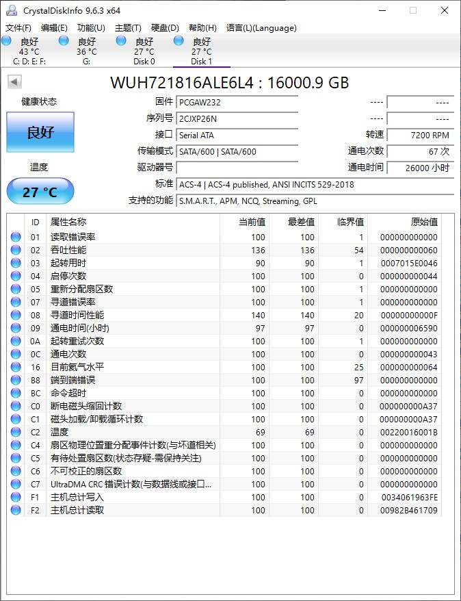

## 机械硬盘

### 二手盘测试

2025 年 4 月 购入两个 WUH721816ALE6L4 16T 用于替换 NAS 中的 4T 硬盘。

CnystalDiskInfo 看 SMART 信息，没有明显问题，温度正常。

#### 磁盘扫描

推荐使用 Victoria 进行全盘扫描，能够查看不同耗时的块数量。

16T 全盘扫描耗时约 22 小时（一般约 1 小时/TB），未发现坏道。

扫描时速度缓慢下降是正常现象，因为盘片内外圈的线[速度不同](https://tieba.baidu.com/p/7733482018?pn=1)。

