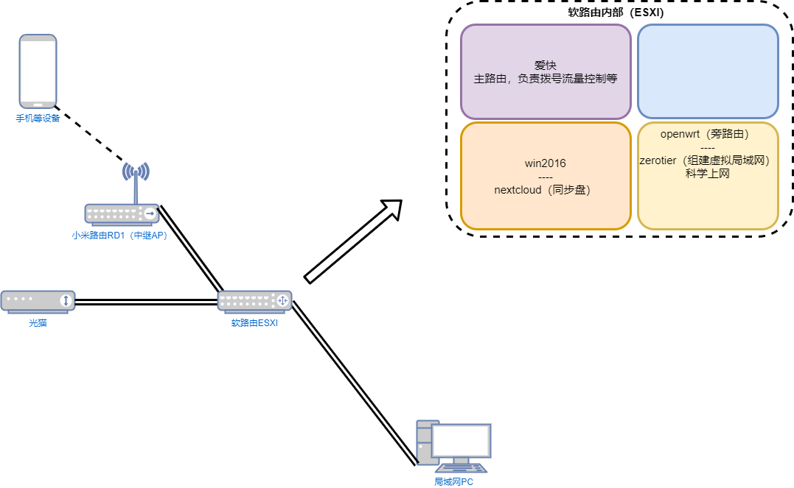

简单介绍家中搭建的网络情况

## 家


## 出租屋



## Windows 静态路由

```shell
# 管理员命令提示符
route -p add 192.168.30.0 mask 255.255.255.0 192.168.50.1
route -p add 192.168.192.0 mask 255.255.255.0 192.168.50.1
# 查看路由表
route print
```

## TrueNAS zerotier 配置

在 TrueNAS 中设置转发
> 在菜单 - 系统 - 高级配置 - 系统控制
>
> net.ipv4.ip_forward = 1
>
> net.ipv4.conf.all.src_valid_mark = 1

```shell
# 允许从 ztklhqrale 到 br0 的转发
iptables -I FORWARD -i ztklhqrale -o br0 -j ACCEPT

# 允许从 br0 到 ztklhqrale 的转发（回程流量）
iptables -I FORWARD -i br0 -o ztklhqrale -j ACCEPT

# 添加 NAT 规则以允许流量转发
iptables -t nat -A POSTROUTING -o br0 -s 192.168.192.0/24 -d 192.168.30.0/24 -j MASQUERADE

# 一行命令完成上述三步
iptables -I FORWARD -i ztklhqrale -o br0 -j ACCEPT && iptables -I FORWARD -i br0 -o ztklhqrale -j ACCEPT && iptables -t nat -A POSTROUTING -o br0 -s 192.168.192.0/24 -d 192.168.30.0/24 -j MASQUERADE

# 删除上述规则（如果需要）
iptables -D FORWARD -i ztklhqrale -o br0 -j ACCEPT
iptables -D FORWARD -i br0 -o ztklhqrale -j ACCEPT
    
# 查看当前的 FORWARD 规则
iptables -L FORWARD -v --line-numbers

# 查看当前的 NAT 规则
iptables -t nat -L -v -n
```
